# Documentación Técnica - Joinly Frontend

Plataforma de gestión de suscripciones compartidas desarrollada con Angular 21, utilizando standalone components, signals, SCSS con arquitectura ITCSS y metodología BEM.

## Índice

- [Características del Proyecto](#características-del-proyecto)
- [Stack Tecnológico](#stack-tecnológico)
- [Requisitos Previos](#requisitos-previos)
- [Instalación y Configuración](#instalación-y-configuración)
- [Comandos de Desarrollo](#comandos-de-desarrollo)
- [Arquitectura del Proyecto](#arquitectura-del-proyecto)
- [1. Principios de Diseño](#1-principios-de-diseño)
  - [1.1 Principios de comunicación visual](#11-principios-de-comunicación-visual)
  - [1.2 Metodología CSS](#12-metodología-css)
  - [1.3 Organización de archivos](#13-organización-de-archivos)
  - [1.4 Sistema de Design Tokens](#14-sistema-de-design-tokens)
  - [1.5 Mixins y Funciones](#15-mixins-y-funciones)
  - [1.6 ViewEncapsulation en Angular](#16-viewencapsulation-en-angular)
- [2. HTML Semántico y Estructura](#2-html-semántico-y-estructura)
  - [2.1 Elementos semánticos utilizados](#21-elementos-semánticos-utilizados)
  - [2.2 Jerarquía de headings](#22-jerarquía-de-headings)
  - [2.3 Estructura de formularios](#23-estructura-de-formularios)
  - [2.4 Resumen](#24-resumen)
  - [2.5 Formularios Reactivos Implementados](#25-formularios-reactivos-implementados)
  - [2.6 Sistema de Validadores](#26-sistema-de-validadores)
  - [2.7 Guia de Uso de FormArray](#27-guia-de-uso-de-formarray)
  - [2.8 Ejemplos de Validacion Asincrona](#28-ejemplos-de-validacion-asincrona)
- [3. Componentes](#3-componentes)
  - [3.1 Componentes Compartidos](#31-componentes-compartidos)
  - [3.2 Catálogo de Componentes](#32-catálogo-de-componentes)
  - [3.3 Ejemplos de Uso](#33-ejemplos-de-uso)
- [4. Servicios](#4-servicios)
  - [4.1 ThemeService](#41-themeservice)
  - [4.2 ModalService](#42-modalservice)
  - [4.3 AlertService](#43-alertservice)
  - [4.4 Arquitectura de Servicios](#44-arquitectura-de-servicios)
- [5. Arquitectura de Eventos](#5-arquitectura-de-eventos)
  - [5.1 Estrategias de Event Binding](#51-estrategias-de-event-binding)
  - [5.2 Manipulación del DOM](#52-manipulación-del-dom)
  - [5.3 Gestión de Eventos del Usuario](#53-gestión-de-eventos-del-usuario)
  - [5.4 Patrones de Eventos en el Proyecto](#54-patrones-de-eventos-en-el-proyecto)
- [6. Sistema de temas](#6-sistema-de-temas)
  - [6.1 Variables de tema](#61-variables-de-tema)
  - [6.2 El Theme Switcher (Cambiador de tema)](#62-el-theme-switcher-cambiador-de-tema)
  - [6.3 Transiciones suaves](#63-transiciones-suaves)
  - [6.4 Cómo usar las variables de tema en tus componentes](#64-cómo-usar-las-variables-de-tema-en-tus-componentes)
  - [6.5 Capturas de pantalla - Comparativo visual](#65-capturas-de-pantalla-comparativo-visual)
  - [6.6 Accesibilidad y contraste](#66-accesibilidad-y-contraste)
  - [6.7 Resumen de implementación](#67-resumen-de-implementación)
- [7. Responsive Design](#7-responsive-design)
  - [7.1 Breakpoints Definidos](#71-breakpoints-definidos)
  - [7.2 Estrategia Responsive: Mobile-First](#72-estrategia-responsive-mobile-first)
  - [7.3 Container Queries](#73-container-queries)
  - [7.4 Adaptaciones Principales](#74-adaptaciones-principales)
  - [7.5 Paginas Implementadas](#75-paginas-implementadas)
  - [7.6 Testing Responsive](#76-testing-responsive)
- [8. Optimización Multimedia y Animaciones CSS](#8-optimización-multimedia-y-animaciones-css)
  - [8.1 Formatos de Imagen Elegidos](#81-formatos-de-imagen-elegidos)
  - [8.2 Herramientas de Optimización Utilizadas](#82-herramientas-de-optimización-utilizadas)
  - [8.3 Resultados de Optimización](#83-resultados-de-optimización)
  - [8.4 Tecnologías Responsive Implementadas](#84-tecnologías-responsive-implementadas)
  - [8.5 Animaciones CSS Optimizadas](#85-animaciones-css-optimizadas)
  - [8.6 FeatureImageComponent](#86-featureimagecomponent)
  - [8.7 Integración con Arquitectura](#87-integración-con-arquitectura)
  - [8.8 Resultados Esperados](#88-resultados-esperados)
- [Recursos Adicionales](#recursos-adicionales)

---

## Características del Proyecto

- **Standalone Components** - Arquitectura Angular sin módulos
- **Angular Signals** - Reactividad moderna con signal, computed y effect
- **Diseño Responsivo** - Enfoque Mobile-first adaptable a todos los dispositivos
- **ViewEncapsulation None** - Control total sobre estilos globales
- **Arquitectura ITCSS** - Estilos organizados por especificidad creciente
- **Metodología BEM** - Nomenclatura CSS clara y mantenible
- **Design Tokens** - Sistema de variables CSS para consistencia visual
- **Tema Claro/Oscuro** - Detección automática con persistencia en localStorage
- **Accesibilidad WCAG 2.1** - Nivel AA con navegación por teclado y ARIA
- **Componentes Interactivos** - Modal, Accordion, Tabs, Tooltips, Alertas
- **TypeScript Strict** - Tipado estricto para mayor seguridad

---

## Stack Tecnológico

| Tecnología | Versión | Propósito |
|------------|---------|-----------|
| **Angular** | 21.0 | Framework principal |
| **TypeScript** | 5.x | Lenguaje de programación |
| **SCSS** | - | Preprocesador CSS |
| **RxJS** | - | Programación reactiva |
| **Angular Router** | - | Enrutamiento SPA |
| **Angular Forms** | - | Formularios reactivos |
| **Vitest** | - | Testing framework |
| **ESLint** | - | Linter de código |

---

## Requisitos Previos

- **Node.js** 18 o superior
- **npm** 9 o superior (o yarn como alternativa)
- **Angular CLI** (se instala automáticamente con las dependencias)

Verificación de versiones:

```bash
node -v    # Debe mostrar v18.x o superior
npm -v     # Debe mostrar v9.x o superior
```

---

## Instalación y Configuración

### 1. Clonar el Repositorio y Navegar al Directorio

```bash
cd frontend
```

### 2. Instalar Dependencias

Con npm:

```bash
npm install
```

O con yarn:

```bash
yarn install
```

---

## Comandos de Desarrollo

### Servidor de Desarrollo

Iniciar el servidor de desarrollo:

```bash
npm start
```

O directamente con Angular CLI:

```bash
ng serve
```

La aplicación estará disponible en `http://localhost:4200/`. El servidor se recarga automáticamente al detectar cambios en los archivos fuente.

**Opciones adicionales:**

```bash
# Abrir automáticamente en el navegador
ng serve --open

# Usar otro puerto
ng serve --port 4300

# Modo producción (optimizado)
ng serve --configuration production
```

### Build de Producción

```bash
ng build --configuration production
```

O con el script npm:

```bash
npm run build
```

Los archivos compilados se almacenan en el directorio `dist/`.

**Optimizaciones aplicadas:**
- Minificación de JavaScript y CSS
- Tree shaking
- Lazy loading de módulos
- AOT compilation
- Optimización de imágenes
- Code splitting

### Testing

Ejecutar tests unitarios con Vitest:

```bash
npm test
```

O directamente:

```bash
ng test
```

---

## Arquitectura del Proyecto

### Estructura de Directorios

```
frontend/
  src/
    app/
      components/
        shared/              # Componentes reutilizables
          accordion/         # Accordion expandible
          alert/             # Componente de alerta
          alert-container/   # Contenedor de alertas
          avatar/            # Avatar de usuario
          breadcrumbs/       # Migas de pan
          button/            # Botón con variantes
          card/              # Tarjeta contenedora
          form-checkbox/     # Checkbox de formulario
          form-input/        # Input de formulario
          form-radio-group/  # Grupo de radios
          form-select/       # Select de formulario
          form-textarea/     # Textarea de formulario
          icon/              # Sistema de iconos SVG
          modal/             # Modal con focus trap
          tabs/              # Sistema de pestañas
          theme-toggle/      # Interruptor de tema
          tooltip/           # Directiva de tooltips
          index.ts           # Barrel exports
      pages/                 # Páginas/Vistas
        style-guide/         # Guía de estilos interactiva
      layout/                # Componentes de layout
        header/              # Cabecera con menú hamburguesa
        footer/              # Pie de página
        main/                # Contenedor principal
        index.ts             # Barrel exports
      services/              # Servicios de estado
        alert.ts             # Gestión de alertas
        modal.ts             # Gestión de modales
        theme.ts             # Gestión de tema claro/oscuro
      app.config.ts          # Configuración de la app
      app.routes.ts          # Definición de rutas
      app.ts                 # Componente principal
    styles/                  # Estilos globales (ITCSS)
      main.scss              # Archivo principal
      00-settings/           # Variables, tokens
        _variables.scss
        _css-variables.scss
      01-tools/              # Mixins, funciones
        _mixins.scss
      02-generic/            # Reset, normalize
        _reset.scss
      03-elements/           # Estilos base HTML
        _base.scss
        _encabezados.scss
      04-layout/             # Grid, flex, containers
        _rejilla.scss
        _flex.scss
        _contenedor.scss
      05-components/         # Estilos de componentes globales
        _card-icon.scss
      06-utilities/          # Clases de utilidad
        _tipografia.scss
        _sombras.scss
    index.html               # HTML principal
    main.ts                  # Punto de entrada
    styles.scss              # Importa main.scss
  public/                    # Archivos públicos
  angular.json               # Configuración Angular
  tsconfig.json              # Configuración TypeScript
  package.json               # Dependencias
```

### Standalone Components

Este proyecto utiliza la nueva arquitectura de Angular sin módulos (NgModules). Cada componente es independiente y declara sus propias dependencias.

**Ejemplo:**

```typescript
import { Component } from '@angular/core';
import { CommonModule } from '@angular/common';
import { RouterLink } from '@angular/router';

@Component({
  selector: 'app-header',
  standalone: true,
  imports: [CommonModule, RouterLink],
  templateUrl: './header.html',
  styleUrls: ['./header.scss']
})
export class HeaderComponent { }
```

### Rutas

Las rutas se definen en `app.routes.ts`:

```typescript
import { Routes } from '@angular/router';

export const routes: Routes = [
  { path: '', component: HomeComponent },
  { path: 'style-guide', component: StyleGuideComponent },
  { path: '**', redirectTo: '' }
];
```

---

## 1. Principios de Diseño

### 1.1 Principios de comunicación visual

Los principios de comunicación visual son las reglas fundamentales que guían cada decisión de diseño en Joinly. No son arbitrarios: cada uno tiene un propósito claro orientado a mejorar la experiencia del usuario, facilitar la comprensión de la interfaz y reforzar la identidad de marca. A continuación, explicamos cómo aplicamos estos cinco principios en nuestra aplicación.

### 1.1.1 Jerarquía

La jerarquía visual establece el orden de importancia de los elementos en pantalla, guiando al usuario sobre qué debe ver primero y qué es secundario.

**Aplicación en Joinly:**

- **Tamaño y peso tipográfico:** Los títulos principales como "Familia López" o "Spotify Family" utilizan un tamaño de fuente mayor (entre 24px y 32px) y peso **bold**, mientras que los metadatos como "Gestiona suscripciones o crea alguna" emplean un tamaño menor (14px-16px) y peso regular en color gris atenuado. Esta diferenciación permite al usuario identificar instantáneamente el contexto de la página.

- **Jerarquía cromática en botones:** Implementamos una escala clara de importancia mediante el color:
  - **Acciones principales:** Botones rellenos con colores vibrantes (naranja `#F97316` para acciones de creación como "Crear suscripción", "Crear"; morado `#8B5CF6` para acciones de autenticación como "Registrar").
  - **Acciones secundarias:** Botones con fondo blanco, borde gris y texto oscuro ("Cancelar", "Copiar"), que visualmente "retroceden" frente a los botones principales.

Esta diferenciación reduce la carga cognitiva del usuario, ya que intuitivamente sabe qué botón cumple la acción esperada.

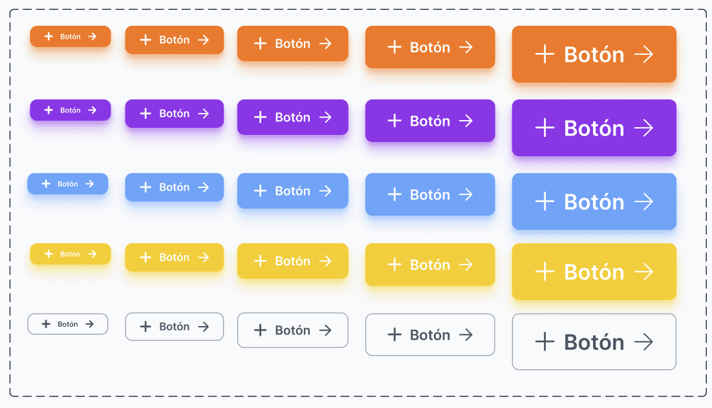

### 1.1.2 Contraste

El contraste garantiza la legibilidad y accesibilidad del contenido, además de crear separaciones visuales claras entre secciones.

**Aplicación en Joinly:**

- **Texto sobre fondos:** Utilizamos texto oscuro (gris oscuro `#1F2937` o negro) sobre tarjetas blancas (`#FFFFFF`), asegurando una ratio de contraste superior a 4.5:1, cumpliendo con las pautas WCAG 2.1 de accesibilidad nivel AA. Esto garantiza que usuarios con dificultades visuales puedan leer el contenido sin esfuerzo.

- **Delimitación de secciones:** El footer emplea un fondo azul oscuro/negro (`#0F172A`) que contrasta drásticamente con el cuerpo de la página (fondo off-white `#FFFBF5`). Este contraste extremo actúa como un "cierre visual", indicando claramente al usuario que ha llegado al final del contenido principal.

- **Estados de elementos:** Los badges de estado ("Disponible", "Admin", "Retenido") utilizan fondos de color con texto en contraste:
  - Verde para disponibilidad
  - Naranja para estados de administrador
  - Azul para estados de pago retenido

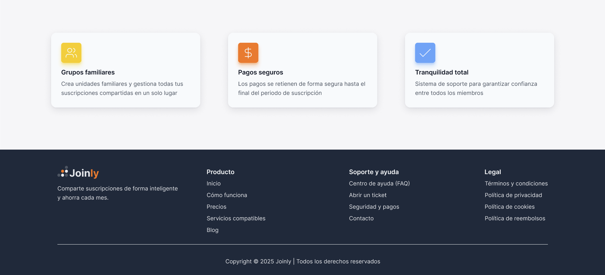

### 1.1.3 Alineación

La alineación crea orden visual y conexiones implícitas entre elementos, facilitando el escaneo de información.

**Aplicación en Joinly:**

- **Alineación a la izquierda:** Todos los formularios, títulos y bloques de texto siguen una alineación predominante a la izquierda. Esta decisión se basa en el **patrón de lectura en F** (F-Pattern), documentado por estudios de eye-tracking de Nielsen Norman Group, que demuestra que los usuarios occidentales escanean las páginas formando una letra "F" imaginaria, comenzando por la esquina superior izquierda.

- **Consistencia en Header y Footer:** Los elementos de navegación del header (logo, menú, botones de acción, avatar) y las columnas del footer están distribuidos mediante un sistema de rejilla (CSS Grid/Flexbox) con espaciados consistentes. El logo siempre ancla el extremo izquierdo, mientras que las acciones del usuario (notificaciones, perfil) se ubican en el extremo derecho, siguiendo convenciones UX establecidas.

- **Formularios estructurados:** En los modales de creación (grupo, suscripción, login), cada campo mantiene una alineación vertical perfecta: etiqueta → input → siguiente campo, creando un flujo de lectura predecible y reduciendo errores de entrada.


### 1.1.4 Proximidad

La proximidad agrupa elementos relacionados, ayudando al cerebro a procesar la información como unidades lógicas en lugar de elementos aislados.

**Aplicación en Joinly:**

- **Tarjetas de suscripción:** Dentro de cada card, los elementos relacionados se agrupan físicamente:

  - Nombre del servicio ("Spotify Family") + icono de miembros en la parte superior
  - Precio ("3,00€") + fecha de renovación + badge de estado en la parte inferior

  Estos elementos comparten un contenedor blanco con padding interno consistente (`16px-24px`), separándolos visualmente del resto de la interfaz mediante espacio negativo (whitespace).

- **Formularios:** La etiqueta (label) se posiciona inmediatamente encima de su input correspondiente (separación de `4px-8px`), mientras que campos diferentes mantienen una separación mayor (`16px-24px`). Esta diferencia de espaciado comunica visualmente qué label pertenece a qué campo sin necesidad de líneas o bordes adicionales.

- **Sección de miembros:** El avatar, nombre de usuario, email y badge de rol ("Admin") se agrupan horizontalmente en una misma fila, indicando que toda esa información pertenece a un único usuario.

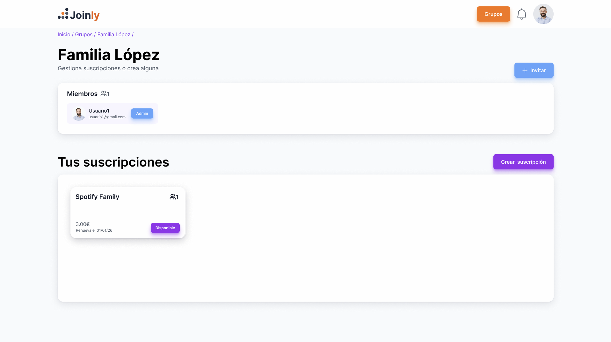

### 1.1.5 Repetición

La repetición crea consistencia y refuerza la identidad de marca. En términos técnicos, implementamos esto mediante **Design Tokens**: valores reutilizables para colores, espaciados, radios de borde y sombras.

**Aplicación en Joinly:**

- **Radio de borde (border-radius):** Todos los elementos interactivos comparten valores consistentes:

  - Botones: `8px` de radio para esquinas suavemente redondeadas
  - Tarjetas (Cards): `12px-16px` para un aspecto amigable y moderno
  - Inputs: `8px` para mantener coherencia con los botones

- **Sistema de sombras (elevation):** Las tarjetas utilizan una sombra sutil y consistente (`box-shadow: 0 1px 3px rgba(0,0,0,0.1)`) que crea una sensación de "elevación" sobre el fondo off-white sin resultar intrusiva. Esta misma sombra se repite en modales y dropdowns.

- **Espaciados (spacing):** Implementamos una escala de espaciado basada en múltiplos de 4px (`4px, 8px, 16px, 24px, 32px`), garantizando ritmo visual y consistencia en toda la aplicación.

- **Paleta cromática reducida:** Limitamos los colores de acento a dos tonos principales (naranja y morado) más sus variantes, evitando el ruido visual y creando una identidad reconocible. El usuario aprende rápidamente que "naranja = acción relacionada con grupos/suscripciones" y "morado = autenticación".

Esta repetición sistemática permite que nuevos usuarios comprendan intuitivamente la interfaz: si un elemento se ve como un botón, se comportará como un botón. Si una tarjeta tiene sombra, es interactiva o contiene información agrupada.

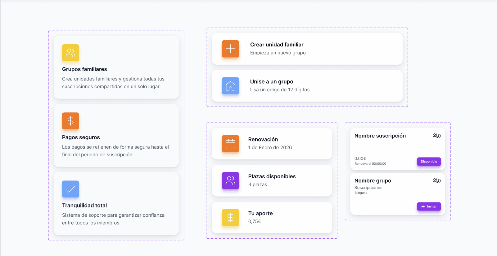

### 1.1.6 Resumen

| Principio      | Implementación en Joinly                                                              |
| -------------- | ------------------------------------------------------------------------------------- |
| **Jerarquía**  | Tamaños tipográficos diferenciados + botones primarios (color) vs secundarios (borde) |
| **Contraste**  | Texto oscuro sobre blanco + footer oscuro como cierre visual                          |
| **Alineación** | Alineación izquierda (patrón F) + grid consistente en header/footer                   |
| **Proximidad** | Agrupación en tarjetas + labels pegados a inputs                                      |
| **Repetición** | Design tokens: border-radius, shadows, spacing y colores consistentes                 |

Estos principios no son reglas aisladas, sino que trabajan en conjunto. Una tarjeta bien diseñada aplica los cinco: tiene jerarquía interna (título vs metadatos), contraste adecuado, alineación consistente, agrupa elementos relacionados por proximidad y repite los mismos estilos que otras tarjetas de la aplicación.

---

## 1.2 Metodología CSS

### 1.2.1 Introducción a BEM

**BEM** (Block, Element, Modifier) es una metodología de nomenclatura para clases CSS desarrollada por Yandex que proporciona una convención clara y predecible para nombrar selectores. En Joinly, adoptamos BEM como estándar porque resuelve problemas fundamentales del CSS a escala:

- **Evita conflictos de especificidad:** Al usar clases planas (sin anidamiento excesivo), eliminamos las guerras de especificidad donde un selector `.card .title` compite con `.section .card .title`.
- **Código autodocumentado:** Una clase como `.subscription-card__price--highlighted` comunica instantáneamente su propósito sin necesidad de buscar en el código fuente.
- **Escalabilidad:** Permite que múltiples desarrolladores trabajen en el mismo proyecto sin pisar el trabajo del otro.

**La sintaxis BEM se estructura así:**

```
.bloque {}
.bloque__elemento {}
.bloque--modificador {}
.bloque__elemento--modificador {}
```

| Componente   | Símbolo                 | Propósito                               |
| ------------ | ----------------------- | --------------------------------------- |
| **Block**    | (ninguno)               | Componente independiente y reutilizable |
| **Element**  | `__` (doble guion bajo) | Parte interna que depende del bloque    |
| **Modifier** | `--` (doble guion)      | Variación de apariencia o estado        |

### 1.2.2 Ejemplo Práctico: Tarjeta de Estadísticas

En la vista de detalle de una suscripción ("Spotify Family"), encontramos tres tarjetas que muestran información resumida: **Renovación**, **Plazas disponibles** y **Tu aporte**. Estas tarjetas comparten la misma estructura pero muestran datos diferentes.

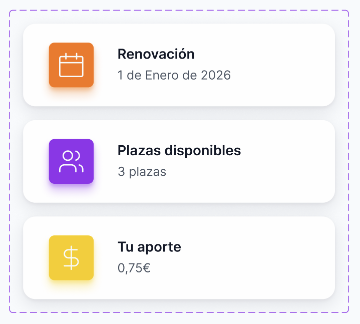

**Estructura HTML con BEM:**

```html
<article class="stat-card">
  <div class="stat-card__icon stat-card__icon--calendar">
    <svg><!-- icono de calendario --></svg>
  </div>
  <div class="stat-card__content">
    <span class="stat-card__title">Renovación</span>
    <span class="stat-card__value">1 de Enero de 2026</span>
  </div>
</article>

<article class="stat-card">
  <div class="stat-card__icon stat-card__icon--users">
    <svg><!-- icono de usuarios --></svg>
  </div>
  <div class="stat-card__content">
    <span class="stat-card__title">Plazas disponibles</span>
    <span class="stat-card__value">3 plazas</span>
  </div>
</article>

<article class="stat-card">
  <div class="stat-card__icon stat-card__icon--money">
    <svg><!-- icono de dinero --></svg>
  </div>
  <div class="stat-card__content">
    <span class="stat-card__title">Tu aporte</span>
    <span class="stat-card__value">0,75€</span>
  </div>
</article>
```

**Estilos SCSS correspondientes:**

```scss
// === BLOQUE: Contenedor principal ===
.stat-card {
  display: flex;
  align-items: center;
  gap: 16px;
  padding: 16px 24px;
  background-color: #ffffff;
  border: 1px solid #e5e7eb;
  border-radius: 12px;

  // === ELEMENTO: Contenedor del icono ===
  &__icon {
    display: flex;
    align-items: center;
    justify-content: center;
    width: 48px;
    height: 48px;
    border-radius: 8px;

    // === MODIFICADORES: Variantes de color según el tipo ===
    &--calendar {
      background-color: #fef3c7; // Amarillo suave
      color: #f59e0b;
    }

    &--users {
      background-color: #dbeafe; // Azul suave
      color: #3b82f6;
    }

    &--money {
      background-color: #fef3c7; // Amarillo suave
      color: #f59e0b;
    }
  }

  // === ELEMENTO: Contenedor de texto ===
  &__content {
    display: flex;
    flex-direction: column;
    gap: 4px;
  }

  // === ELEMENTO: Título descriptivo ===
  &__title {
    font-size: 14px;
    font-weight: 500;
    color: #1f2937;
  }

  // === ELEMENTO: Valor principal ===
  &__value {
    font-size: 16px;
    font-weight: 400;
    color: #6b7280;
  }
}
```

**Análisis del ejemplo:**

- **`.stat-card`** es el **Bloque**: representa el componente completo y autónomo. Puede existir en cualquier parte de la aplicación.
- **`.stat-card__icon`**, **`.stat-card__title`**, **`.stat-card__value`** son **Elementos**: solo tienen sentido dentro del contexto de `.stat-card`. Fuera de él, no tendrían propósito.
- **`.stat-card__icon--calendar`** es un **Modificador**: altera el color de fondo del icono sin cambiar su estructura. Podemos añadir `--users`, `--money`, etc., para otras variantes.

### 1.2.3 Ejemplo Práctico: Sistema de Botones

Los botones en Joinly siguen un patrón consistente con variaciones para diferentes contextos: acciones principales (crear, registrar), acciones secundarias (cancelar) y acciones de peligro (eliminar).

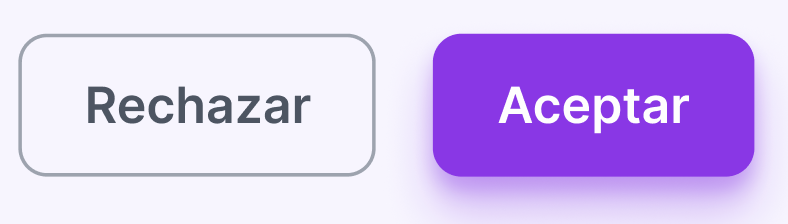
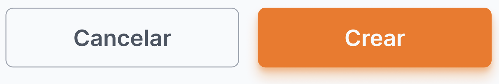

**Estructura HTML con BEM:**

```html
<!-- Botón primario naranja (Crear grupo, Crear suscripción) -->
<button class="btn btn--primary">Crear</button>

<!-- Botón primario morado (Autenticación) -->
<button class="btn btn--primary btn--purple">Registrar</button>

<!-- Botón secundario con borde (Cancelar) -->
<button class="btn btn--outline">Cancelar</button>

<!-- Botón con icono -->
<button class="btn btn--primary btn--icon">
  <svg><!-- icono de + --></svg>
  Invitar
</button>

<!-- Botón de ancho completo (para móviles o modales) -->
<button class="btn btn--primary btn--full">Empezar ahora</button>
```

**Estilos SCSS correspondientes:**

```scss
// === BLOQUE: Estilos base compartidos por TODOS los botones ===
.btn {
  display: inline-flex;
  align-items: center;
  justify-content: center;
  gap: 8px;
  padding: 12px 24px;
  font-size: 14px;
  font-weight: 600;
  border-radius: 8px;
  border: 2px solid transparent;
  cursor: pointer;
  transition: all 0.2s ease;

  &:disabled {
    opacity: 0.5;
    cursor: not-allowed;
  }

  // === MODIFICADOR: Botón primario (acción principal) ===
  &--primary {
    background-color: #f97316; // Naranja Joinly
    color: #ffffff;
    border-color: #f97316;

    &:hover:not(:disabled) {
      background-color: #ea580c;
      border-color: #ea580c;
    }
  }

  // === MODIFICADOR: Variante morada (autenticación) ===
  &--purple {
    background-color: #8b5cf6;
    border-color: #8b5cf6;

    &:hover:not(:disabled) {
      background-color: #7c3aed;
      border-color: #7c3aed;
    }
  }

  // === MODIFICADOR: Botón con solo borde (acción secundaria) ===
  &--outline {
    background-color: #ffffff;
    color: #374151;
    border-color: #d1d5db;

    &:hover:not(:disabled) {
      background-color: #f9fafb;
      border-color: #9ca3af;
    }
  }

  // === MODIFICADOR: Ancho completo ===
  &--full {
    width: 100%;
  }

  // === MODIFICADOR: Con icono ===
  &--icon {
    svg {
      width: 16px;
      height: 16px;
    }
  }
}
```

**Análisis del ejemplo:**

- **`.btn`** define los estilos **base** que comparten todos los botones: padding, tipografía, border-radius, transiciones.
- Los **modificadores** (`--primary`, `--outline`, `--purple`) alteran **únicamente la apariencia** (colores), no la estructura.
- Los modificadores son **acumulables**: un botón puede ser `.btn .btn--primary .btn--full .btn--icon` simultáneamente.
- El estado `:disabled` se maneja dentro del bloque base, aplicándose automáticamente a todas las variantes.

### 1.2.4 Beneficios de BEM en Angular

#### Legibilidad inmediata del código

Al revisar el HTML de un componente, BEM permite entender la estructura sin consultar los estilos:

```html
<!-- Sin BEM: ¿Qué es esto? -->
<div class="card highlighted">
  <div class="icon orange"></div>
  <span class="title">...</span>
</div>

<!-- Con BEM: Autodocumentado -->
<div class="subscription-card subscription-card--featured">
  <div class="subscription-card__icon subscription-card__icon--netflix"></div>
  <span class="subscription-card__title">...</span>
</div>
```

#### Integración con la arquitectura de componentes Angular

Aunque Angular proporciona **encapsulación de estilos** mediante `ViewEncapsulation`, BEM aporta beneficios adicionales:

| Característica                  | ViewEncapsulation              | BEM                 |
| ------------------------------- | ------------------------------ | ------------------- |
| Aislamiento de estilos          | Sí (Automático)                | Sí (Por convención) |
| Reutilización entre proyectos   | No (Limitada)                  | Sí (Total)          |
| Claridad en componentes grandes | No (Se pierde contexto)        | Sí (Siempre claro)  |
| Estilos globales/compartidos    | Parcial (Requiere `::ng-deep`) | Sí (Natural)        |

En Joinly, usamos BEM incluso con encapsulación porque:

- Facilita el trabajo con **estilos globales** (tipografía, botones, layouts) definidos en `src/styles/`.
- Permite **copiar componentes** entre proyectos sin preocuparse por colisiones.
- Mantiene **disciplina de equipo** en proyectos colaborativos.

#### Prevención del "Spaghetti CSS"

Sin una metodología clara, el CSS tiende a degradarse:

```scss
// MAL - CSS sin metodología: difícil de mantener
.dashboard .card .header .title { ... }
.dashboard .card.active .header .title { ... }
.dashboard .sidebar .card .title { ... } // ¿Conflicto?

// BIEN - CSS con BEM: predecible y escalable
.dashboard-card__title { ... }
.dashboard-card__title--active { ... }
.sidebar-card__title { ... } // Sin conflicto posible
```

#### Mantenimiento a largo plazo

Cuando necesites modificar un componente meses después:

- **Sin BEM:** Debes rastrear selectores anidados, verificar especificidad, temer efectos secundarios.
- **Con BEM:** Buscas `.subscription-card__price`, lo modificas, y sabes que solo afectará a ese elemento específico.

### 1.2.5 Resumen

| Concepto     | Símbolo | Ejemplo en Joinly                                                             |
| ------------ | ------- | ----------------------------------------------------------------------------- |
| **Block**    | —       | `.stat-card`, `.btn`, `.subscription-card`                                    |
| **Element**  | `__`    | `.stat-card__icon`, `.btn__text`, `.subscription-card__price`                 |
| **Modifier** | `--`    | `.btn--primary`, `.stat-card__icon--calendar`, `.subscription-card--featured` |

BEM no es solo una convención de nombres: es una **filosofía de componentización** que nos obliga a pensar en piezas reutilizables, independientes y predecibles. En un proyecto Angular como Joinly, donde los componentes crecen y evolucionan, BEM actúa como una guía que mantiene el código CSS tan organizado como nuestros componentes TypeScript.

---

## 1.3 Organización de archivos

### 1.3.1 Arquitectura ITCSS

**ITCSS** (Inverted Triangle CSS) es una metodología de organización de archivos CSS creada por Harry Roberts que estructura el código en capas ordenadas por especificidad, de menor a mayor. El nombre "Triángulo Invertido" hace referencia a la forma visual de esta arquitectura: las capas superiores son amplias y genéricas (afectan a todo el proyecto), mientras que las capas inferiores son estrechas y específicas (afectan a componentes puntuales).

En Joinly, implementamos ITCSS para resolver tres problemas fundamentales del CSS a escala:

1. **Control de especificidad:** Cada capa tiene un nivel de especificidad predefinido. Las capas inferiores nunca deben tener menor especificidad que las superiores, evitando conflictos de cascada.
2. **Eliminación de `!important`:** Al respetar el orden de capas, los estilos se sobrescriben de forma natural siguiendo la cascada CSS, sin necesidad de forzar prioridades.
3. **Mantenibilidad:** Cualquier desarrollador puede localizar rápidamente dónde vive cada tipo de estilo.

---

### 1.3.2 Estructura de directorios

```
src/styles/
  00-settings/
      _variables.scss
  01-tools/
      _mixins.scss
  02-generic/
      _reset.scss
  03-elements/
      _base.scss
      _encabezados.scss
      _enlaces.scss
      _formularios.scss
      _index.scss
      _listas.scss
      _multimedia.scss
  04-layout/
      _contenedor.scss
      _flex.scss
      _index.scss
      _rejilla.scss
  main.scss
```

La numeración de las carpetas (`00-`, `01-`, `02-`...) no es decorativa: garantiza que cualquier herramienta de ordenación alfabética mantenga el orden correcto de especificidad.

### 1.3.3 Explicación capa por capa

#### 00-settings (Configuración)

**Propósito:** Almacenar los Design Tokens del proyecto: variables de colores, tipografía, espaciados, breakpoints y cualquier valor reutilizable.

**Característica clave:** Esta capa **no genera CSS compilado**. Solo contiene declaraciones de variables SCSS que serán consumidas por las capas posteriores.

**Contenido en Joinly:**

| Archivo           | Descripción                                                                                                                                                                        |
| ----------------- | ---------------------------------------------------------------------------------------------------------------------------------------------------------------------------------- |
| `_variables.scss` | Paleta de colores (`$color-primary`, `$color-secondary`), escalas tipográficas (`$font-size-base`), espaciados (`$spacing-unit`), radios de borde, sombras, breakpoints responsive |

**Ejemplo conceptual:**

```scss
// 00-settings/_variables.scss

// Colores de marca
$color-primary: #f97316; // Naranja Joinly
$color-secondary: #8b5cf6; // Morado autenticación
$color-background: #fffbf5; // Off-white
$color-surface: #ffffff; // Tarjetas

// Tipografía
$font-family-base: "Inter", sans-serif;
$font-size-base: 16px;

// Espaciados (escala de 4px)
$spacing-unit: 4px;
$spacing-sm: $spacing-unit * 2; // 8px
$spacing-md: $spacing-unit * 4; // 16px
$spacing-lg: $spacing-unit * 6; // 24px

// Bordes
$border-radius-sm: 8px;
$border-radius-md: 12px;
```

#### 01-tools (Herramientas)

**Propósito:** Contener mixins, funciones y placeholders de SCSS que encapsulan lógica reutilizable.

**Característica clave:** Al igual que Settings, esta capa **no genera CSS visible** por sí misma. Solo define herramientas que serán invocadas en capas posteriores.

**Contenido en Joinly:**

| Archivo        | Descripción                                                                                                                |
| -------------- | -------------------------------------------------------------------------------------------------------------------------- |
| `_mixins.scss` | Mixins para media queries responsive, truncado de texto, centrado flex, generación de sombras, transiciones estandarizadas |

**Ejemplo conceptual:**

```scss
// 01-tools/_mixins.scss

// Mixin para media queries mobile-first
@mixin respond-to($breakpoint) {
  @if $breakpoint == "tablet" {
    @media (min-width: 768px) {
      @content;
    }
  } @else if $breakpoint == "desktop" {
    @media (min-width: 1024px) {
      @content;
    }
  }
}

// Mixin para truncar texto con ellipsis
@mixin text-truncate {
  overflow: hidden;
  text-overflow: ellipsis;
  white-space: nowrap;
}

// Mixin para centrado flex
@mixin flex-center {
  display: flex;
  align-items: center;
  justify-content: center;
}
```

#### 02-generic (Genéricos)

**Propósito:** Primera capa que genera CSS real. Aquí se normalizan los estilos del navegador para que todos los browsers partan de la misma base visual.

**Característica clave:** Especificidad muy baja (selectores de elemento o universal). Afecta a todo el documento de forma global.

**Contenido en Joinly:**

| Archivo       | Descripción                                                                                                                  |
| ------------- | ---------------------------------------------------------------------------------------------------------------------------- |
| `_reset.scss` | Reset CSS que elimina márgenes, paddings y estilos por defecto del navegador. Establece `box-sizing: border-box` globalmente |

**Ejemplo conceptual:**

```scss
// 02-generic/_reset.scss

*,
*::before,
*::after {
  box-sizing: border-box;
  margin: 0;
  padding: 0;
}

html {
  font-size: 100%;
  -webkit-font-smoothing: antialiased;
  -moz-osx-font-smoothing: grayscale;
}

body {
  min-height: 100vh;
  line-height: 1.5;
}

img,
picture,
video,
canvas,
svg {
  display: block;
  max-width: 100%;
}

button {
  font: inherit;
  cursor: pointer;
}
```

#### 03-elements (Elementos)

**Propósito:** Definir estilos para etiquetas HTML puras, sin clases. Esta capa establece la apariencia base de los elementos nativos en Joinly.

**Característica clave:** Selectores de tipo (`h1`, `a`, `input`). Especificidad baja pero mayor que Generic. Aquí no usamos clases.

**Contenido en Joinly:**

| Archivo             | Descripción                                                     |
| ------------------- | --------------------------------------------------------------- |
| `_base.scss`        | Estilos globales del `body`: fuente base, color de texto, fondo |
| `_encabezados.scss` | Estilos para `h1` a `h6`: tamaños, pesos, márgenes              |
| `_enlaces.scss`     | Estilos para `a`: color, hover, focus, decoración               |
| `_formularios.scss` | Estilos para `input`, `textarea`, `select`, `label`             |
| `_listas.scss`      | Estilos para `ul`, `ol`, `li`                                   |
| `_multimedia.scss`  | Estilos para `img`, `video`, `figure`, `figcaption`             |
| `_index.scss`       | Archivo barril que importa todos los parciales de la capa       |

**Ejemplo conceptual:**

```scss
// 03-elements/_encabezados.scss
@use "../00-settings/variables" as *;

h1,
h2,
h3,
h4,
h5,
h6 {
  font-family: $font-family-base;
  font-weight: 700;
  line-height: 1.2;
  color: $color-text-primary;
}

h1 {
  font-size: 2rem;
} // 32px
h2 {
  font-size: 1.5rem;
} // 24px
h3 {
  font-size: 1.25rem;
} // 20px
```

```scss
// 03-elements/_enlaces.scss
@use "../00-settings/variables" as *;

a {
  color: $color-primary;
  text-decoration: none;
  transition: color 0.2s ease;

  &:hover {
    color: darken($color-primary, 10%);
    text-decoration: underline;
  }

  &:focus-visible {
    outline: 2px solid $color-primary;
    outline-offset: 2px;
  }
}
```

#### 04-layout (Estructura)

**Propósito:** Definir patrones de estructura macro: sistemas de rejilla (Grid), contenedores, utilidades Flexbox y wrappers de página.

**Característica clave:** Primera capa donde utilizamos clases. La especificidad aumenta respecto a Elements porque ahora seleccionamos por `.clase` en lugar de por etiqueta.

**Contenido en Joinly:**

| Archivo            | Descripción                                                               |
| ------------------ | ------------------------------------------------------------------------- |
| `_contenedor.scss` | Clase `.container` con ancho máximo y centrado horizontal                 |
| `_rejilla.scss`    | Sistema de grid con clases como `.grid`, `.grid--cols-2`, `.grid--cols-3` |
| `_flex.scss`       | Utilidades flexbox: `.flex`, `.flex--center`, `.flex--between`            |
| `_index.scss`      | Archivo barril que importa todos los parciales de la capa                 |

**Ejemplo conceptual:**

```scss
// 04-layout/_contenedor.scss
@use "../00-settings/variables" as *;

.container {
  width: 100%;
  max-width: 1200px;
  margin-inline: auto;
  padding-inline: $spacing-md;
}

.container--narrow {
  max-width: 800px;
}

.container--wide {
  max-width: 1400px;
}
```

```scss
// 04-layout/_rejilla.scss
@use "../00-settings/variables" as *;
@use "../01-tools/mixins" as *;

.grid {
  display: grid;
  gap: $spacing-md;

  &--cols-2 {
    grid-template-columns: repeat(2, 1fr);
  }

  &--cols-3 {
    grid-template-columns: repeat(3, 1fr);
  }
}
```

### 1.3.4 El archivo main.scss

El archivo `main.scss` actúa como punto de entrada que orquesta la importación de todas las capas en el orden correcto. El orden de importación es **crítico**: si importamos `03-elements` antes de `00-settings`, la compilación fallará porque las variables referenciadas aún no existirían.

```scss
// main.scss
// =========================================
// JOINLY - Punto de entrada de estilos
// =========================================
// Las capas se importan en orden ascendente de especificidad.
// NO alterar el orden de importación.

// -----------------------------------------
// 00 - SETTINGS: Variables y tokens
// No genera CSS, solo define valores
// -----------------------------------------
@use "00-settings/variables";

// -----------------------------------------
// 01 - TOOLS: Mixins y funciones
// No genera CSS, solo define lógica
// -----------------------------------------
@use "01-tools/mixins";

// -----------------------------------------
// 02 - GENERIC: Reset y normalización
// Primera capa que genera CSS real
// Especificidad: *, elemento
// -----------------------------------------
@use "02-generic/reset";

// -----------------------------------------
// 03 - ELEMENTS: Estilos de etiquetas HTML
// Especificidad: elemento (h1, a, input)
// -----------------------------------------
@use "03-elements/index";

// -----------------------------------------
// 04 - LAYOUT: Estructura y rejillas
// Especificidad: .clase
// -----------------------------------------
@use "04-layout/index";
```

### 1.3.5 Flujo de especificidad

El siguiente diagrama ilustra cómo la especificidad aumenta progresivamente a través de las capas:

```
          ESPECIFICIDAD BAJA
                  
                  
     
           00-settings           Variables (no compila)
           01-tools              Mixins (no compila)
     
                  
     
           02-generic            *, html, body
     
                  
     
           03-elements           h1, a, input, p
     
                  
     
           04-layout             .container, .grid
     
                  
                  
          ESPECIFICIDAD ALTA
```

Cada capa puede sobrescribir estilos de las capas superiores sin conflictos, porque la cascada CSS respeta naturalmente el orden de aparición cuando la especificidad es igual o mayor.

### 1.3.6 Beneficios de ITCSS

| Beneficio          | Descripción                                                                         |
| ------------------ | ----------------------------------------------------------------------------------- |
| **Predecibilidad** | Sabemos exactamente dónde buscar cada tipo de estilo                                |
| **Escalabilidad**  | Podemos añadir nuevas capas (05-components, 06-utilities) sin romper lo existente   |
| **Colaboración**   | Múltiples desarrolladores pueden trabajar en capas diferentes sin conflictos        |
| **Depuración**     | Los problemas de especificidad se identifican rápidamente por la capa donde ocurren |
| **Rendimiento**    | El orden optimizado reduce la probabilidad de estilos duplicados o redundantes      |

Esta arquitectura, combinada con la metodología BEM para nombrar clases, proporciona un sistema robusto y mantenible para gestionar los estilos de Joinly a medida que el proyecto crece.

---

## 1.4 Sistema de Design Tokens

Los **Design Tokens** son los valores atómicos que constituyen la "única fuente de verdad" del sistema de diseño de Joinly. Representan decisiones de diseño codificadas como variables reutilizables: colores, tipografía, espaciados, sombras y breakpoints. En lugar de dispersar valores hexadecimales o píxeles por todo el código, centralizamos estas decisiones en el archivo `_variables.scss`, garantizando consistencia y facilitando cambios globales.

En Joinly implementamos una **estrategia híbrida**: utilizamos CSS Custom Properties (variables nativas de CSS) para tokens que pueden cambiar dinámicamente o heredarse, combinadas con variables SCSS para valores que necesitan evaluarse en tiempo de compilación (como breakpoints en media queries).

### 1.4.1 Paleta de Colores

La paleta cromática de Joinly está diseñada para equilibrar la expresividad de marca con la funcionalidad y accesibilidad. Cada color tiene un propósito definido.

#### Colores de Marca (Primarios)

| Token                       | Valor     | Uso                                                                                                       |
| --------------------------- | --------- | --------------------------------------------------------------------------------------------------------- |
| `--color-naranja-principal` | `#F97316` | Acciones primarias relacionadas con grupos y suscripciones: "Crear grupo", "Crear suscripción", "Invitar" |
| `--color-naranja-oscuro`    | `#EA580C` | Estado hover de botones naranja                                                                           |
| `--color-morado-principal`  | `#9333EA` | Acciones de autenticación y branding: "Registrar", "Iniciar sesión"                                       |
| `--color-morado-oscuro`     | `#7C3AED` | Estado hover de botones morados                                                                           |

**Justificacion de la combinacion Naranja/Morado:**

La eleccion de esta dupla cromatica responde a criterios tanto psicologicos como funcionales:

- **Naranja (`#F97316`):** Transmite energia, entusiasmo y accion. Es un color calido que invita a la interaccion sin resultar agresivo. En el contexto de Joinly, donde los usuarios gestionan suscripciones compartidas, el naranja comunica dinamismo y colaboracion activa. Lo reservamos para las acciones mas frecuentes del flujo principal.

- **Morado (`#9333EA`):** Combina la estabilidad del azul con la creatividad del rojo. Evoca confianza, modernidad y sofisticacion. Lo utilizamos especificamente para acciones de autenticacion (registro, login), donde la percepcion de seguridad es critica. Esta separacion cromatica permite al usuario distinguir instantaneamente entre "gestionar mi contenido" (naranja) y "acceder a mi cuenta" (morado).

- **Contraste entre ambos:** El naranja (colores calidos) y el morado (colores frios) son complementarios en el circulo cromatico, creando un contraste vibrante pero armonioso que refuerza la identidad visual de la marca.

#### Estrategia de Neutrales

La gestion de los colores neutros es fundamental para crear profundidad visual sin recurrir a bordes duros o separadores explicitos.

| Token                         | Valor     | Uso                                               |
| ----------------------------- | --------- | ------------------------------------------------- |
| `--color-fondo-claro-naranja` | `#FEF8EB` | Fondo general de la aplicacion (Off-white calido) |
| `--color-fondo-claro-normal`  | `#F8FAFC` | Superficie de tarjetas y componentes elevados     |
| `--color-gris-medio`          | `#E5E7EB` | Bordes sutiles, separadores                       |
| `--color-texto-oscuro`        | `#111827` | Titulos y texto de alta importancia               |
| `--color-texto-normal`        | `#4B5563` | Cuerpo de texto, descripciones                    |
| `--color-footer`              | `#1E293B` | Fondo del footer (azul oscuro/negro)              |

**Tecnica Off-white vs White:**

Una decision clave en Joinly es el uso de **dos tonos de blanco diferenciados**:

1. **Fondo general (Off-white `#FEF8EB`):** Un blanco cremoso con un sutil tinte calido. Este tono reduce la fatiga visual en sesiones prolongadas (comparado con el blanco puro `#FFFFFF`) y crea una atmosfera acogedora coherente con la identidad de marca.

2. **Superficie de tarjetas (White `#F8FAFC`):** Las Cards utilizan un blanco mas neutro que, al colocarse sobre el fondo off-white, genera una sensacion natural de **elevacion** sin necesidad de bordes marcados. La diferencia de luminosidad entre ambos tonos (aproximadamente 2-3% en la escala de grises) es suficiente para que el ojo perciba separacion, pero lo bastante sutil para mantener una estetica limpia.

Esta tecnica, conocida como **"elevation through color"**, reduce el ruido visual eliminando lineas innecesarias mientras mantiene la estructura clara.

#### Colores Semánticos (Feedback)

Los colores semanticos comunican estados del sistema al usuario de forma universal:

| Token                 | Valor     | Significado                                        |
| --------------------- | --------- | -------------------------------------------------- |
| `--color-exito`       | `#22C55E` | Operacion completada, disponibilidad, confirmacion |
| `--color-error`       | `#EF4444` | Error, accion destructiva, validacion fallida      |
| `--color-advertencia` | `#FACC15` | Atencion requerida, estado pendiente               |
| `--color-informacion` | `#60A5FA` | Informacion neutral, ayuda contextual              |

Estos colores se aplican consistentemente en badges de estado, mensajes de validacion de formularios, toasts de notificacion y alertas del sistema.

#### Tokens Semánticos vs Primitivos

Implementamos un sistema de **dos niveles de abstraccion**:

```scss
// Nivel 1: Primitivos (valores raw)
--color-naranja-principal: #f97316;
--color-morado-principal: #9333ea;

// Nivel 2: Semanticos (significado contextual)
--color-principal: var(--color-morado-principal);
--color-acento: var(--color-naranja-principal);
```

Esta arquitectura permite:

- **Cambios globales rapidos:** Modificar `--color-naranja-principal` actualiza automaticamente todos los componentes que lo referencian.
- **Theming futuro:** Podriamos implementar un tema oscuro redefiniendo solo los tokens semanticos sin tocar los primitivos.
- **Claridad de intencion:** Un desarrollador que lee `--color-acento` entiende el proposito mejor que leyendo `#F97316`.

### 1.4.2 Escala Tipográfica

La tipografía es el vehículo principal de comunicacion en cualquier interfaz. En Joinly, hemos construido un sistema tipografico que prioriza la legibilidad, establece jerarquia clara y se adapta fluidamente a diferentes tamaños de pantalla.

#### Familia Tipográfica: Inter

| Token             | Valor                 |
| ----------------- | --------------------- |
| `--font-primaria` | `'Inter', sans-serif` |

**Justificacion de la eleccion:**

**Inter** es una familia tipografica sans-serif disenada especificamente para interfaces digitales por Rasmus Andersson. Seleccionamos Inter por las siguientes razones tecnicas:

1. **Optimizada para pantallas:** Inter fue creada con el renderizado en pantalla como prioridad. Su altura-x generosa y aperturas amplias garantizan legibilidad incluso en tamaños pequeños (12-14px), critico para metadatos, etiquetas y textos secundarios en dispositivos moviles.

2. **Variable Font disponible:** Inter soporta fuentes variables, permitiendo cargar un unico archivo que contiene todos los pesos (de 100 a 900). Esto reduce las peticiones HTTP y mejora el rendimiento de carga.

3. **Neutralidad con personalidad:** A diferencia de fuentes ultra-geometricas (como Futura) o humanistas (como Fira Sans), Inter ocupa un punto medio: es lo suficientemente neutra para no distraer del contenido, pero tiene suficiente caracter para no resultar generica.

4. **Soporte de OpenType:** Incluye caracteristicas tipograficas avanzadas como numeros tabulares (util para alinear precios en tablas), ligaduras contextuales y conjuntos estilisticos alternativos.

5. **Amplio soporte de idiomas:** Cubre caracteres latinos extendidos, cirilico y griego, preparando la aplicacion para internacionalizacion futura.

#### Escala de Tamaños (Ratio 1.25 - Major Third)

Utilizamos una **escala modular** basada en la proporcion Major Third (1.25). Esto significa que cada nivel de la escala es 1.25 veces mayor que el anterior, creando una progresion armonica y predecible.

| Nivel         | Token                    | Rango (clamp)   | Uso                                       |
| ------------- | ------------------------ | --------------- | ----------------------------------------- |
| H1 Display    | `--tamano-h1`            | `40px` - `64px` | Titulo principal de pagina, hero sections |
| H2 Seccion    | `--tamano-h2`            | `32px` - `48px` | Divisiones principales de contenido       |
| H3 Subseccion | `--tamano-h3`            | `24px` - `32px` | Encabezados de tarjetas, modales          |
| H4 Pequeno    | `--tamano-h4`            | `18px` - `20px` | Titulos terciarios, destacados menores    |
| Body Large    | `--tamano-texto-grande`  | `17px` - `18px` | Introducciones, textos destacados         |
| Body Regular  | `--tamano-texto-regular` | `15px` - `16px` | Contenido principal (80% del texto)       |
| Body Small    | `--tamano-texto-pequeno` | `13px` - `14px` | Metadatos, fechas, autores                |
| Caption       | `--tamano-caption`       | `11px` - `12px` | Notas al pie, etiquetas minimas           |

**Tipografia fluida con `clamp()`:**

En lugar de definir tamaños fijos con media queries, implementamos **tipografia fluida** usando la funcion CSS `clamp()`:

```scss
--tamano-h1: clamp(2.5rem, 5vw + 1rem, 4rem);
```

Esta sintaxis define:

- **Minimo:** `2.5rem` (40px) - El titulo nunca sera mas pequeño
- **Preferido:** `5vw + 1rem` - Escala proporcionalmente al viewport
- **Maximo:** `4rem` (64px) - El titulo nunca sera mas grande

Este enfoque elimina "saltos" bruscos entre breakpoints, creando una experiencia de escalado suave y continua.

#### Pesos de Fuente

| Token                        | Valor | Uso                           |
| ---------------------------- | ----- | ----------------------------- |
| `--peso-fuente-regular`      | `400` | Cuerpo de texto, parrafos     |
| `--peso-fuente-medio`        | `500` | Labels, texto enfatizado      |
| `--peso-fuente-semi-negrita` | `600` | Subtitulos, encabezados H3-H4 |
| `--peso-fuente-negrita`      | `700` | Titulos principales H1-H2     |

#### Alturas de Línea (Line Height)

| Token                     | Valor  | Uso                                          |
| ------------------------- | ------ | -------------------------------------------- |
| `--altura-linea-ajustada` | `1.1`  | Titulos grandes (H1) donde el texto es corto |
| `--altura-linea-compacta` | `1.25` | Subtitulos y encabezados                     |
| `--altura-linea-normal`   | `1.5`  | Cuerpo de texto, parrafos                    |
| `--altura-linea-relajada` | `1.6`  | Textos largos, articulos                     |

La regla general: a mayor tamaño de fuente, menor line-height proporcional necesario. Los titulos grandes con line-height 1.5 lucen excesivamente espaciados, mientras que el texto pequeño con line-height 1.1 se vuelve ilegible.

### 1.4.3 Sistema de Espaciado

El espaciado consistente es uno de los indicadores mas claros de un diseño profesional. En Joinly, todo el espaciado deriva de una **escala base de 8px**, evitando "numeros magicos" arbitrarios.

#### Escala de Espaciado (Base 8px)

| Token            | Valor    | Pixeles | Uso tipico                                   |
| ---------------- | -------- | ------- | -------------------------------------------- |
| `--espaciado-0`  | `0`      | 0px     | Reset, elementos sin margen                  |
| `--espaciado-1`  | `0.5rem` | 8px     | Separacion minima entre elementos inline     |
| `--espaciado-2`  | `1rem`   | 16px    | Padding interno de botones, gap en flex      |
| `--espaciado-3`  | `1.5rem` | 24px    | Padding de tarjetas, separacion entre campos |
| `--espaciado-4`  | `2rem`   | 32px    | Margen entre secciones menores               |
| `--espaciado-5`  | `2.5rem` | 40px    | Separacion entre bloques de contenido        |
| `--espaciado-6`  | `3rem`   | 48px    | Padding de secciones principales             |
| `--espaciado-8`  | `4rem`   | 64px    | Margen entre secciones mayores               |
| `--espaciado-10` | `5rem`   | 80px    | Espaciado de hero sections                   |
| `--espaciado-12` | `6rem`   | 96px    | Separacion entre areas de pagina             |
| `--espaciado-16` | `8rem`   | 128px   | Espaciado maximo, areas de respiro           |

**Por que base 8px y no 4px o 10px:**

1. **Divisibilidad:** 8 es divisible por 2 y 4, permitiendo medias (`4px`) y cuartos (`2px`) cuando se necesita precision fina sin salir del sistema.

2. **Alineacion con grids:** La mayoria de frameworks de diseño (Material Design, Apple HIG) usan sistemas de 8px, facilitando la integracion con bibliotecas de componentes.

3. **Densidad de pixeles:** En pantallas de alta densidad (2x, 3x), los valores en multiplos de 8 se renderizan de forma nítida sin subpixeles borrosos.

4. **Memoria muscular:** Los desarrolladores internalizan rapidamente la escala: "pequeno = 8, medio = 16, grande = 24".

**Aplicacion practica:**

```scss
// MAL - Numeros magicos arbitrarios
.card {
  padding: 18px 22px;
  margin-bottom: 37px;
}

// BIEN - Tokens del sistema
.card {
  padding: var(--espaciado-3); // 24px
  margin-bottom: var(--espaciado-4); // 32px
}
```

El segundo enfoque garantiza que todas las tarjetas de la aplicacion compartan el mismo ritmo vertical, creando una sensacion de orden y coherencia visual.

### 1.4.4 Breakpoints (Responsive Design)

Joinly adopta una estrategia **Mobile-First**, donde los estilos base estan optimizados para dispositivos moviles y se añaden modificaciones progresivas para pantallas mas grandes mediante `min-width`.

#### Puntos de Ruptura

| Token CSS                | Token SCSS        | Valor            | Dispositivo objetivo              |
| ------------------------ | ----------------- | ---------------- | --------------------------------- |
| `--bp-movil`             | `$bp-movil`       | `640px` (40rem)  | Movil grande / Phablet            |
| `--bp-tablet`            | `$bp-tablet`      | `768px` (48rem)  | Tablet vertical                   |
| `--bp-escritorio`        | `$bp-desktop`     | `1024px` (64rem) | Desktop / Tablet horizontal       |
| `--bp-escritorio-grande` | `$bp-big-desktop` | `1280px` (80rem) | Desktop grande / Monitores anchos |

**Justificacion de los valores:**

- **640px:** Captura la transicion entre moviles estandar (320-414px) y dispositivos mas amplios. A partir de este punto, podemos mostrar layouts de dos columnas sin comprometer la legibilidad.

- **768px:** Corresponde al ancho de un iPad en orientacion vertical, un punto de referencia historico que sigue siendo relevante. Muchos usuarios de tablet navegan en esta orientacion.

- **1024px:** Marca el inicio de la experiencia desktop tradicional. Aqui activamos navegacion expandida, sidebars permanentes y layouts de tres o mas columnas.

- **1280px:** Para monitores grandes, donde podemos aprovechar el espacio adicional con contenedores mas amplios o grids de mayor densidad.

**Enfoque Mobile-First:**

El enfoque Mobile-First no es solo una decision tecnica, sino filosofica:

1. **Rendimiento:** Los dispositivos moviles tipicamente tienen menor potencia de procesamiento y conexiones mas lentas. Al cargar primero los estilos moviles (mas simples), optimizamos la experiencia para el caso mas restrictivo.

2. **Priorizacion de contenido:** Diseñar primero para pantallas pequeñas obliga a identificar que es verdaderamente esencial. El contenido secundario se añade progresivamente en pantallas mas grandes.

3. **Estadisticas de uso:** Mas del 50% del trafico web global proviene de dispositivos moviles. Tiene sentido optimizar primero para la mayoria.

**Ejemplo de uso con mixin:**

```scss
.subscription-grid {
  display: grid;
  grid-template-columns: 1fr; // Movil: 1 columna
  gap: var(--espaciado-3);

  @include respond-to("tablet") {
    grid-template-columns: repeat(2, 1fr); // Tablet: 2 columnas
  }

  @include respond-to("desktop") {
    grid-template-columns: repeat(3, 1fr); // Desktop: 3 columnas
  }
}
```

### 1.4.5 Tokens Adicionales

#### Bordes y Radios

| Token              | Valor    | Uso                                   |
| ------------------ | -------- | ------------------------------------- |
| `--borde-delgado`  | `1px`    | Bordes sutiles de inputs, separadores |
| `--borde-medio`    | `2px`    | Bordes de botones, focus rings        |
| `--radio-pequeno`  | `4px`    | Badges, etiquetas pequenas            |
| `--radio-medio`    | `8px`    | Botones, inputs                       |
| `--radio-grande`   | `18px`   | Tarjetas, modales                     |
| `--radio-completo` | `9999px` | Avatares, pills, elementos circulares |

#### Sistema de Sombras (Elevation)

| Token        | Valor                             | Nivel                             |
| ------------ | --------------------------------- | --------------------------------- |
| `--sombra-1` | `0 2px 6px rgba(20,20,43,0.06)`   | Elevation 1 - Muy sutil           |
| `--sombra-2` | `0 2px 12px rgba(20,20,43,0.08)`  | Elevation 2 - Cards en reposo     |
| `--sombra-3` | `0 8px 28px rgba(20,20,43,0.10)`  | Elevation 3 - Cards en hover      |
| `--sombra-4` | `0 14px 42px rgba(20,20,43,0.14)` | Elevation 4 - Dropdowns           |
| `--sombra-5` | `0 24px 65px rgba(20,20,43,0.16)` | Elevation 5 - Modales             |
| `--sombra-6` | `0 32px 72px rgba(20,20,43,0.24)` | Elevation 6 - Elementos flotantes |

El sistema de sombras sigue una progresion donde cada nivel incrementa tanto el blur como el offset vertical, simulando una fuente de luz superior. Usamos un color base azulado oscuro (`#14142B`) en lugar de negro puro para sombras mas suaves y naturales.

#### Transiciones

| Token                   | Valor         | Uso                                           |
| ----------------------- | ------------- | --------------------------------------------- |
| `--duracion-rapida`     | `150ms`       | Hover de botones, cambios de color            |
| `--duracion-base`       | `300ms`       | Apertura de dropdowns, animaciones de entrada |
| `--duracion-lenta`      | `500ms`       | Transiciones de pagina, animaciones complejas |
| `--transicion-estandar` | `ease-in-out` | Movimiento natural                            |

#### Z-Index (Sistema de Capas)

| Token                | Valor | Uso                       |
| -------------------- | ----- | ------------------------- |
| `--z-dropdown`       | `100` | Menus desplegables        |
| `--z-sticky`         | `200` | Headers sticky            |
| `--z-fixed`          | `300` | Navbars fijas             |
| `--z-modal-backdrop` | `400` | Overlay oscuro de modales |
| `--z-modal`          | `500` | Modales y dialogos        |
| `--z-popover`        | `600` | Tooltips, popovers        |
| `--z-toast`          | `700` | Notificaciones toast      |

Este sistema escalonado previene conflictos de z-index, un problema comun en proyectos sin convencion establecida donde los valores crecen arbitrariamente hasta llegar a `z-index: 99999`.

### 1.4.6 Resumen

| Categoria       | Estrategia                                  | Beneficio                              |
| --------------- | ------------------------------------------- | -------------------------------------- |
| **Colores**     | Primitivos + Semanticos, Off-white vs White | Theming futuro, profundidad sin bordes |
| **Tipografia**  | Inter + escala modular 1.25 + clamp()       | Jerarquia clara, escalado fluido       |
| **Espaciado**   | Base 8px, tokens nombrados                  | Ritmo visual, consistencia             |
| **Breakpoints** | Mobile-First, 4 puntos                      | Rendimiento, priorizacion contenido    |
| **Extras**      | Sombras escalonadas, z-index sistematico    | Elevation predecible, sin conflictos   |

Los Design Tokens son la base sobre la que se construye todo el sistema visual de Joinly. Al documentarlos explicitamente y utilizarlos de forma consistente, garantizamos que cualquier desarrollador pueda contribuir al proyecto manteniendo la coherencia visual, y que cualquier cambio de diseño pueda propagarse globalmente modificando un unico archivo.

---

## 1.5 Mixins y Funciones

Los **mixins** son bloques de código SCSS reutilizables que encapsulan patrones CSS frecuentes. En lugar de repetir las mismas propiedades en múltiples selectores, definimos la lógica una vez y la invocamos donde sea necesario mediante `@include`.

En la arquitectura ITCSS de Joinly, los mixins residen en la capa **`01-tools`** por una razón fundamental: **no generan CSS por sí mismos**. Un archivo de mixins puede contener cientos de líneas de código, pero si ningún selector los invoca, el CSS compilado tendrá 0 bytes de esa capa. Los mixins son herramientas latentes que solo producen output cuando son llamadas.

Esta característica los diferencia de las capas posteriores (02-generic, 03-elements, 04-layout) que sí generan CSS inmediatamente al ser importadas.

**Ubicación:** `src/styles/01-tools/_mixins.scss`

### 1.5.1 Media Queries Responsive (`responder-a`)

**Descripción:**

Este mixin es el pilar del diseño responsive en Joinly. Genera media queries utilizando los breakpoints definidos en `_variables.scss`, eliminando la necesidad de recordar valores en píxeles y garantizando consistencia en todos los puntos de ruptura.

El mixin sigue el enfoque **Mobile-First**: los estilos base se escriben para móvil, y las modificaciones para pantallas más grandes se añaden progresivamente usando `min-width`.

**Parámetros:**

| Parámetro        | Tipo     | Valores aceptados                                            | Descripción                     |
| ---------------- | -------- | ------------------------------------------------------------ | ------------------------------- |
| `$punto-ruptura` | `string` | `'movil'`, `'tablet'`, `'escritorio'`, `'escritorio-grande'` | Nombre del breakpoint a aplicar |

**Correspondencia de breakpoints:**

| Valor del parámetro   | Variable SCSS     | Resolución       |
| --------------------- | ----------------- | ---------------- |
| `'movil'`             | `$bp-movil`       | `640px` (40rem)  |
| `'tablet'`            | `$bp-tablet`      | `768px` (48rem)  |
| `'escritorio'`        | `$bp-desktop`     | `1024px` (64rem) |
| `'escritorio-grande'` | `$bp-big-desktop` | `1280px` (80rem) |

**Código fuente:**

```scss
@mixin responder-a($punto-ruptura) {
  @if $punto-ruptura == "movil" {
    @media (min-width: $bp-movil) {
      @content;
    }
  } @else if $punto-ruptura == "tablet" {
    @media (min-width: $bp-tablet) {
      @content;
    }
  } @else if $punto-ruptura == "escritorio" {
    @media (min-width: $bp-desktop) {
      @content;
    }
  } @else if $punto-ruptura == "escritorio-grande" {
    @media (min-width: $bp-big-desktop) {
      @content;
    }
  } @else {
    @warn "Breakpoint '#{$punto-ruptura}' no existe.";
  }
}
```

**Ejemplo de uso (Componente BEM):**

```scss
.subscription-grid {
  display: grid;
  grid-template-columns: 1fr;
  gap: var(--espaciado-3);

  @include responder-a("tablet") {
    grid-template-columns: repeat(2, 1fr);
  }

  @include responder-a("escritorio") {
    grid-template-columns: repeat(3, 1fr);
  }
}

.hero__title {
  font-size: var(--tamano-h2);

  @include responder-a("escritorio") {
    font-size: var(--tamano-h1);
  }
}
```

**CSS compilado:**

```css
.subscription-grid {
  display: grid;
  grid-template-columns: 1fr;
  gap: var(--espaciado-3);
}

@media (min-width: 768px) {
  .subscription-grid {
    grid-template-columns: repeat(2, 1fr);
  }
}

@media (min-width: 1024px) {
  .subscription-grid {
    grid-template-columns: repeat(3, 1fr);
  }
}
```

**Ventajas:**

1. **Legibilidad:** `@include responder-a('tablet')` es más expresivo que `@media (min-width: 768px)`.
2. **Mantenibilidad:** Si decidimos cambiar el breakpoint de tablet de 768px a 800px, lo hacemos en `_variables.scss` y se propaga automáticamente.
3. **Prevención de errores:** El mixin emite un warning si se usa un breakpoint inexistente, evitando media queries vacías o mal escritas.

### 1.5.2 Centrado Flexbox (`centrar-flex`)

**Descripción:**

Mixin utilitario que aplica el patrón de centrado perfecto con Flexbox: tanto horizontal como verticalmente. Es uno de los patrones más utilizados en Joinly, apareciendo en:

- Iconos dentro de botones
- Avatares en tarjetas de miembros
- Contenido de modales
- Estados de carga (spinners)
- Páginas de error (404, 500)

Aunque son solo tres líneas de CSS, encapsularlas en un mixin garantiza que siempre se apliquen juntas y de forma consistente.

**Parámetros:**

Este mixin no recibe parámetros. Su simplicidad es intencional.

**Código fuente:**

```scss
@mixin centrar-flex {
  display: flex;
  justify-content: center;
  align-items: center;
}
```

**Ejemplo de uso (Componente BEM):**

```scss
.stat-card__icon {
  @include centrar-flex;
  width: 48px;
  height: 48px;
  border-radius: var(--radio-medio);
  background-color: var(--color-fondo-claro-naranja);

  svg {
    width: 24px;
    height: 24px;
  }
}

.modal__overlay {
  @include centrar-flex;
  position: fixed;
  inset: 0;
  background-color: rgba(0, 0, 0, 0.5);
  z-index: var(--z-modal-backdrop);
}

.btn--icon-only {
  @include centrar-flex;
  width: 40px;
  height: 40px;
  padding: 0;
}
```

**CSS compilado:**

```css
.stat-card__icon {
  display: flex;
  justify-content: center;
  align-items: center;
  width: 48px;
  height: 48px;
  border-radius: var(--radio-medio);
  background-color: var(--color-fondo-claro-naranja);
}
```

### 1.5.3 Truncado de Texto (`truncar-texto`)

**Descripción:**

Este mixin maneja el desbordamiento de texto añadiendo puntos suspensivos (`...`) cuando el contenido excede el espacio disponible. Soporta dos modos:

1. **Truncado de una línea:** El patrón clásico con `text-overflow: ellipsis`.
2. **Truncado multilínea:** Usando la propiedad moderna `-webkit-line-clamp` (compatible con todos los navegadores actuales).

Es especialmente útil en tarjetas de suscripción donde los nombres de servicios o descripciones pueden variar en longitud.

**Parámetros:**

| Parámetro | Tipo     | Valor por defecto | Descripción                                        |
| --------- | -------- | ----------------- | -------------------------------------------------- |
| `$lineas` | `number` | `1`               | Número máximo de líneas a mostrar antes de truncar |

**Código fuente:**

```scss
@mixin truncar-texto($lineas: 1) {
  @if $lineas == 1 {
    overflow: hidden;
    white-space: nowrap;
    text-overflow: ellipsis;
  } @else {
    display: -webkit-box;
    -webkit-line-clamp: $lineas;
    -webkit-box-orient: vertical;
    overflow: hidden;
  }
}
```

**Ejemplo de uso (Componente BEM):**

```scss
.subscription-card__title {
  @include truncar-texto(1);
  font-size: var(--tamano-texto-regular);
  font-weight: var(--peso-fuente-semi-negrita);
}

.subscription-card__description {
  @include truncar-texto(2);
  font-size: var(--tamano-texto-pequeno);
  color: var(--color-texto-base);
}

.notification__message {
  @include truncar-texto(3);
  line-height: var(--altura-linea-normal);
}
```

**CSS compilado (para 1 línea):**

```css
.subscription-card__title {
  overflow: hidden;
  white-space: nowrap;
  text-overflow: ellipsis;
}
```

**CSS compilado (para 2 líneas):**

```css
.subscription-card__description {
  display: -webkit-box;
  -webkit-line-clamp: 2;
  -webkit-box-orient: vertical;
  overflow: hidden;
}
```

### 1.5.4 Foco Visible Accesible (`foco-visible`)

**Descripción:**

Este mixin implementa estilos de foco que solo se activan cuando el usuario navega con teclado (Tab), pero no cuando hace clic con el ratón. Utiliza el pseudo-selector `:focus-visible`, que es el estándar moderno para accesibilidad.

El foco visible es un requisito de las pautas WCAG 2.1 (criterio 2.4.7): los usuarios que navegan con teclado deben poder identificar qué elemento está activo en todo momento.

**Parámetros:**

Este mixin no recibe parámetros. Utiliza los tokens del sistema de diseño para mantener consistencia.

**Código fuente:**

```scss
@mixin foco-visible {
  &:focus-visible {
    outline: 2px solid var(--color-principal);
    outline-offset: 2px;
    border-radius: var(--radio-pequeno);
  }
}
```

**Ejemplo de uso (Componente BEM):**

```scss
.btn {
  @include foco-visible;
  // ... resto de estilos del botón
}

.nav__link {
  @include foco-visible;
  color: var(--color-texto-base);
  text-decoration: none;
}

.subscription-card {
  @include foco-visible;
  cursor: pointer;
}
```

**CSS compilado:**

```css
.btn:focus-visible {
  outline: 2px solid var(--color-principal);
  outline-offset: 2px;
  border-radius: var(--radio-pequeno);
}
```

**Comportamiento:**

- **Navegación con Tab:** Se muestra un anillo morado de 2px alrededor del elemento.
- **Clic con ratón:** No se muestra ningún outline, manteniendo la estética limpia.

### 1.5.5 Oculto Accesible (`oculto-accesible`)

**Descripción:**

Este mixin oculta un elemento visualmente pero lo mantiene accesible para tecnologías de asistencia como lectores de pantalla (NVDA, VoiceOver, JAWS). Es la implementación del patrón conocido como "visually hidden" o "sr-only".

**Casos de uso típicos:**

- Labels de formulario que visualmente son innecesarios pero semánticamente requeridos.
- Skip links ("Saltar al contenido principal") para navegación con teclado.
- Texto descriptivo adicional para iconos que no tienen texto visible.

**Importante:** Nunca usar `display: none` o `visibility: hidden` para ocultar contenido que debe ser leído por lectores de pantalla, ya que también lo ocultan de las tecnologías de asistencia.

**Código fuente:**

```scss
@mixin oculto-accesible {
  position: absolute;
  width: 1px;
  height: 1px;
  padding: 0;
  margin: -1px;
  overflow: hidden;
  clip: rect(0, 0, 0, 0);
  white-space: nowrap;
  border: 0;
}
```

**Ejemplo de uso (Componente BEM):**

```scss
.search-form__label {
  @include oculto-accesible;
}

.skip-link {
  @include oculto-accesible;

  &:focus {
    // Cuando recibe foco con Tab, se vuelve visible
    position: fixed;
    top: var(--espaciado-2);
    left: var(--espaciado-2);
    width: auto;
    height: auto;
    padding: var(--espaciado-2);
    margin: 0;
    overflow: visible;
    clip: auto;
    background-color: var(--color-principal);
    color: white;
    z-index: var(--z-toast);
  }
}

.btn--icon-only__text {
  @include oculto-accesible;
  // El texto "Cerrar" está oculto visualmente pero los lectores lo anuncian
}
```

### 1.5.6 Ratio de Aspecto (`ratio-aspecto`)

**Descripción:**

Mantiene una proporción de aspecto fija en un contenedor, independientemente de su ancho. Utiliza la propiedad CSS moderna `aspect-ratio`, que tiene soporte completo en navegadores actuales.

Es especialmente útil para:

- Contenedores de video (16:9)
- Imágenes de preview en tarjetas
- Avatares cuadrados (1:1)
- Thumbnails de servicios de suscripción

**Parámetros:**

| Parámetro | Tipo     | Valor por defecto | Descripción           |
| --------- | -------- | ----------------- | --------------------- |
| `$ancho`  | `number` | `16`              | Proporción horizontal |
| `$alto`   | `number` | `9`               | Proporción vertical   |

**Código fuente:**

```scss
@mixin ratio-aspecto($ancho: 16, $alto: 9) {
  aspect-ratio: #{$ancho} / #{$alto};
}
```

**Ejemplo de uso (Componente BEM):**

```scss
.video-player__container {
  @include ratio-aspecto(16, 9);
  width: 100%;
  background-color: var(--color-texto-oscuro);
}

.member-card__avatar {
  @include ratio-aspecto(1, 1);
  width: 48px;
  border-radius: var(--radio-completo);
  overflow: hidden;

  img {
    width: 100%;
    height: 100%;
    object-fit: cover;
  }
}

.service-logo {
  @include ratio-aspecto(4, 3);
  max-width: 120px;
}
```

**CSS compilado:**

```css
.video-player__container {
  aspect-ratio: 16 / 9;
  width: 100%;
  background-color: var(--color-texto-oscuro);
}
```

### 1.5.7 Transición Suave (`transicion`)

**Descripción:**

Aplica transiciones CSS utilizando las duraciones definidas en el sistema de Design Tokens. Centralizar las transiciones garantiza que todas las animaciones de la interfaz se sientan coherentes y coordinadas.

**Parámetros:**

| Parámetro      | Tipo     | Valor por defecto      | Descripción                                                    |
| -------------- | -------- | ---------------------- | -------------------------------------------------------------- |
| `$propiedades` | `string` | `all`                  | Propiedades CSS a animar (ej: `color`, `transform`, `opacity`) |
| `$duracion`    | `time`   | `var(--duracion-base)` | Duración de la transición (usa tokens del sistema)             |

**Código fuente:**

```scss
@mixin transicion($propiedades: all, $duracion: var(--duracion-base)) {
  transition: $propiedades $duracion ease-out;
}
```

**Ejemplo de uso (Componente BEM):**

```scss
.btn {
  @include transicion(background-color, var(--duracion-rapida));

  &:hover {
    background-color: var(--color-naranja-oscuro);
  }
}

.subscription-card {
  @include transicion(transform box-shadow);

  &:hover {
    transform: translateY(-4px);
    box-shadow: var(--sombra-3);
  }
}

.nav__link {
  @include transicion(color);

  &:hover {
    color: var(--color-principal);
  }
}
```

**CSS compilado:**

```css
.btn {
  transition: background-color var(--duracion-rapida) ease-out;
}

.subscription-card {
  transition: transform box-shadow var(--duracion-base) ease-out;
}
```

### 1.5.8 Resumen de Mixins

| Mixin                                 | Propósito                                          | Parámetros                                                   |
| ------------------------------------- | -------------------------------------------------- | ------------------------------------------------------------ |
| `responder-a($punto-ruptura)`         | Media queries responsive Mobile-First              | `'movil'`, `'tablet'`, `'escritorio'`, `'escritorio-grande'` |
| `centrar-flex`                        | Centrado horizontal y vertical con Flexbox         | Ninguno                                                      |
| `truncar-texto($lineas)`              | Truncado de texto con puntos suspensivos           | Número de líneas (por defecto: 1)                            |
| `foco-visible`                        | Outline accesible solo para navegación con teclado | Ninguno                                                      |
| `oculto-accesible`                    | Oculta visualmente pero mantiene accesibilidad     | Ninguno                                                      |
| `ratio-aspecto($ancho, $alto)`        | Mantiene proporción de aspecto fija                | Ancho y alto (por defecto: 16, 9)                            |
| `transicion($propiedades, $duracion)` | Transiciones consistentes con tokens del sistema   | Propiedades y duración                                       |

### 1.5.9 Por qué los mixins viven en 01-tools

La ubicación de `_mixins.scss` en la capa `01-tools` de ITCSS responde a su naturaleza de **herramienta sin output**:

1. **No generan CSS:** Un archivo con 500 líneas de mixins produce 0 bytes de CSS hasta que alguien escribe `@include`.

2. **Dependencia de Settings:** Los mixins necesitan acceso a las variables definidas en `00-settings` (como `$bp-tablet`), por eso se importan después.

3. **Consumidos por capas posteriores:** Los selectores en `03-elements`, `04-layout` y componentes de Angular utilizan estos mixins, estableciendo una dependencia unidireccional clara.

4. **Sin especificidad:** Como no generan selectores propios, no participan en conflictos de cascada CSS.

Esta organización garantiza que la capa Tools actúe como una caja de herramientas: siempre disponible, nunca intrusiva, esperando ser utilizada cuando se necesite.

---

## 1.6 ViewEncapsulation en Angular

Angular proporciona un sistema de **encapsulación de estilos** que determina cómo los estilos CSS de un componente interactúan con el resto de la aplicación. Esta funcionalidad, llamada `ViewEncapsulation`, es fundamental para entender cómo gestionar los estilos en una aplicación Angular, especialmente cuando ya contamos con una arquitectura CSS global bien definida como ITCSS.

### 1.6.1 ¿Qué es ViewEncapsulation?

`ViewEncapsulation` es una configuración que controla el **alcance de los estilos** definidos en un componente Angular. Responde a una pregunta simple pero crucial: _¿Los estilos de este componente afectan solo a este componente, o pueden "escapar" y afectar a otros elementos de la página?_

Angular ofrece tres estrategias de encapsulación:

| Estrategia  | Descripción                                                                                                                                                                        |
| ----------- | ---------------------------------------------------------------------------------------------------------------------------------------------------------------------------------- |
| `Emulated`  | **(Por defecto)** Simula el comportamiento de Shadow DOM añadiendo atributos únicos a los elementos y selectores. Los estilos del componente solo afectan a sus propios elementos. |
| `None`      | Sin encapsulación. Los estilos del componente se convierten en **estilos globales** que pueden afectar a cualquier elemento de la aplicación.                                      |
| `ShadowDom` | Utiliza el Shadow DOM nativo del navegador para encapsular estilos. Proporciona aislamiento real a nivel del navegador.                                                            |

### 1.6.2 Análisis de cada estrategia

#### ViewEncapsulation.Emulated (Por defecto)

Cuando usamos `Emulated`, Angular añade atributos autogenerados a los elementos del componente y modifica los selectores CSS para que solo coincidan con esos atributos específicos.

**Ejemplo práctico:**

```typescript
// component.ts
@Component({
  selector: 'app-card',
  template: `<div class="card"><h2>Título</h2></div>`,
  styles: [`.card { background: white; } h2 { color: blue; }`],
  encapsulation: ViewEncapsulation.Emulated // Por defecto, no es necesario declararlo
})
```

**Lo que Angular genera:**

```html
<!-- HTML renderizado -->
<app-card _nghost-abc-1>
  <div _ngcontent-abc-1 class="card">
    <h2 _ngcontent-abc-1>Título</h2>
  </div>
</app-card>
```

```css
/* CSS transformado */
.card[_ngcontent-abc-1] {
  background: white;
}
h2[_ngcontent-abc-1] {
  color: blue;
}
```

**Ventajas:**

- Aislamiento automático sin esfuerzo adicional.
- Los estilos del componente no "contaminan" otros componentes.
- Compatible con todos los navegadores.

**Desventajas:**

- Los estilos globales (como los de ITCSS) no penetran fácilmente en el componente.
- Puede requerir `::ng-deep` para aplicar estilos heredados (aunque está deprecado).
- La especificidad aumenta debido a los selectores de atributo añadidos.

#### ViewEncapsulation.None

Con `None`, Angular no modifica los estilos del componente. Se comportan exactamente como CSS tradicional: globales y afectando a cualquier elemento que coincida con el selector.

**Ejemplo práctico:**

```typescript
@Component({
  selector: 'app-card',
  template: `<div class="card"><h2>Título</h2></div>`,
  styles: [`.card { background: white; }`],
  encapsulation: ViewEncapsulation.None
})
```

**Lo que Angular genera:**

```html
<!-- HTML renderizado (sin atributos especiales) -->
<app-card>
  <div class="card">
    <h2>Título</h2>
  </div>
</app-card>
```

```css
/* CSS sin modificar */
.card {
  background: white;
}
```

**Ventajas:**

- Los estilos globales de ITCSS fluyen naturalmente al componente.
- Funciona perfectamente con metodologías como BEM.
- Menor complejidad en los selectores generados.
- Facilita la reutilización de estilos entre componentes.

**Desventajas:**

- Riesgo de colisiones de nombres si no se usa una metodología de nomenclatura estricta.
- Los estilos del componente pueden afectar accidentalmente a otros elementos.
- Requiere disciplina del equipo para mantener el CSS organizado.

#### ViewEncapsulation.ShadowDom

Utiliza la API nativa de Shadow DOM del navegador para crear una barrera de estilos real. Los estilos dentro del Shadow DOM están completamente aislados del documento principal.

```typescript
@Component({
  selector: 'app-card',
  template: `<div class="card"><h2>Título</h2></div>`,
  styles: [`.card { background: white; }`],
  encapsulation: ViewEncapsulation.ShadowDom
})
```

**Ventajas:**

- Aislamiento completo y nativo.
- Ideal para Web Components distribuibles.

**Desventajas:**

- Los estilos globales **no pueden penetrar** en el Shadow DOM.
- Requiere duplicar o pasar explícitamente estilos compartidos mediante CSS Custom Properties.
- Incompatible con arquitecturas CSS globales como ITCSS.
- Soporte limitado en navegadores antiguos.

### 1.6.3 Decisión para Joinly: `ViewEncapsulation.None`

Después de analizar las tres estrategias y considerando la arquitectura CSS establecida en Joinly, **recomendamos utilizar `ViewEncapsulation.None`** para los componentes del proyecto.

#### Justificación técnica

**1. Coherencia con la arquitectura ITCSS**

Nuestra arquitectura ITCSS está diseñada para que los estilos fluyan de forma predecible desde las capas más genéricas (reset, elements) hasta las más específicas (components). Con `Emulated`, esta cascada se interrumpe porque Angular añade selectores de atributo que aumentan la especificidad de forma artificial.

Como explica el recurso de referencia del curso sobre CSS moderno:

> _"La solución no es escribir más CSS, sino organizarlo mejor."_
> — [CSS Moderno: Arquitectura y Organización](https://github.com/envasador/DIW-FFEOE/blob/main/mkdocs/referencias/docs/orbita3.2-css-moderno-arquitectura-y-organizacion.md)

Nuestra organización en capas (`00-settings` → `01-tools` → `02-generic` → `03-elements` → `04-layout`) ya resuelve el problema de la cascada mediante orden de importación y control de especificidad. La encapsulación `Emulated` duplicaría esfuerzos y crearía conflictos.

**2. BEM como mecanismo de aislamiento**

La metodología BEM que usamos en Joinly ya proporciona un **aislamiento semántico** efectivo:

```scss
// Cada componente tiene su namespace único
.subscription-card { ... }
.subscription-card__title { ... }
.subscription-card__price--highlighted { ... }

// Imposible colisionar con:
.stat-card { ... }
.stat-card__title { ... }
```

Los nombres de clase BEM son tan específicos y descriptivos que las colisiones son prácticamente imposibles si se sigue la convención. Como documentamos en la sección 1.2:

> _"Una clase como `.subscription-card__price--highlighted` comunica instantáneamente su propósito sin necesidad de buscar en el código fuente."_

BEM hace innecesaria la encapsulación automática de Angular porque **el propio naming convention actúa como aislamiento**.

**3. Estilos globales reutilizables**

Con `None`, los estilos definidos en nuestras capas ITCSS (`03-elements` para tipografía base, `04-layout` para grids) se aplican automáticamente dentro de los componentes Angular:

```html
<!-- En cualquier componente Angular -->
<article class="subscription-card">
  <h2>Spotify Family</h2>
  <!-- Hereda estilos de 03-elements/_encabezados.scss -->
  <p>Gestiona tu suscripción</p>
  <!-- Hereda estilos base de 03-elements/_base.scss -->
</article>
```

Esto sigue el principio de **"CSS más limpio: puedes seleccionar elementos por su significado"** mencionado en el recurso de HTML5 semántico:

> _"Cuando escribes HTML, no solo estás diciéndole al navegador 'pon esto en pantalla'. Estás comunicando significado."_
> — [HTML5 Semántico: La base de todo](https://github.com/envasador/DIW-FFEOE/blob/main/mkdocs/referencias/docs/orbita3.1-HTML5-semantico-la-base-de-todo.md)

**4. Mantenibilidad y escalabilidad**

El recurso de CSS moderno enfatiza:

> _"El código que escribes hoy será leído (y maldecido o bendecido) por alguien mañana, posiblemente tú mismo."_

Con `None`, un desarrollador puede:

- Inspeccionar los estilos en DevTools sin ver atributos crípticos como `_ngcontent-abc-1`.
- Modificar estilos globales sabiendo que afectarán a todos los componentes de forma predecible.
- Reutilizar componentes en otros proyectos Angular (o incluso no-Angular) sin dependencias de encapsulación.

### 1.6.4 Implementación práctica

#### Configuración global en angular.json

Para establecer `None` como valor predeterminado para todos los componentes nuevos, añadimos la configuración en los schematics:

```json
{
  "projects": {
    "joinly": {
      "schematics": {
        "@schematics/angular:component": {
          "style": "scss",
          "encapsulation": "None"
        }
      }
    }
  }
}
```

#### Configuración por componente

Para componentes existentes o casos específicos, declaramos explícitamente la encapsulación:

```typescript
import { Component, ViewEncapsulation } from "@angular/core";

@Component({
  selector: "app-subscription-card",
  templateUrl: "./subscription-card.html",
  styleUrl: "./subscription-card.scss",
  encapsulation: ViewEncapsulation.None,
})
export class SubscriptionCardComponent {}
```

#### Estructura de estilos recomendada

Con `None`, la hoja de estilos del componente debe seguir las convenciones BEM y referenciar los tokens del sistema:

```scss
// subscription-card.component.scss
@use "../../styles/00-settings/variables" as *;

.subscription-card {
  background-color: var(--color-fondo-claro-normal);
  border-radius: var(--radio-borde-md);
  padding: var(--espacio-lg);
  box-shadow: var(--sombra-sm);

  &__header {
    display: flex;
    align-items: center;
    gap: var(--espacio-md);
    margin-bottom: var(--espacio-md);
  }

  &__title {
    font-size: var(--fuente-lg);
    font-weight: var(--peso-bold);
    color: var(--color-texto-oscuro);
  }

  &__price {
    font-size: var(--fuente-xl);
    color: var(--color-naranja-principal);

    &--discounted {
      text-decoration: line-through;
      color: var(--color-texto-normal);
    }
  }
}
```

### 1.6.5 Cuándo considerar otras estrategias

Aunque `None` es nuestra recomendación general, existen casos donde otras estrategias tienen sentido:

| Escenario                                                | Estrategia recomendada   |
| -------------------------------------------------------- | ------------------------ |
| Aplicación con arquitectura ITCSS + BEM                  | `None`                   |
| Componente distribuible como librería npm                | `ShadowDom` o `Emulated` |
| Migración gradual de proyecto legacy sin metodología CSS | `Emulated` (temporal)    |
| Web Components estándar para uso fuera de Angular        | `ShadowDom`              |

### 1.6.6 Resumen

| Aspecto                      | Decisión en Joinly                                           |
| ---------------------------- | ------------------------------------------------------------ |
| **Estrategia elegida**       | `ViewEncapsulation.None`                                     |
| **Razón principal**          | Coherencia con arquitectura ITCSS + BEM                      |
| **Mecanismo de aislamiento** | Nomenclatura BEM (`.bloque__elemento--modificador`)          |
| **Estilos globales**         | Fluyen naturalmente desde `src/styles/main.scss`             |
| **Configuración**            | Global en `angular.json` + explícita en componentes críticos |

La elección de `ViewEncapsulation.None` no es una decisión perezosa ni un "desactivar funcionalidades". Es una decisión arquitectónica consciente que reconoce que **ya tenemos un sistema de aislamiento robusto** (BEM) y una **organización de capas predecible** (ITCSS). Añadir encapsulación automática de Angular sería redundante y contraproducente.

Como concluye el recurso de CSS moderno:

> _"No se trata de memorizar todas las propiedades CSS que existen, sino de entender cómo pensar en componentes, cómo estructurar tu código para que otros lo entiendan, y cómo usar las características modernas de la plataforma web para escribir menos código y más expresivo."_

En Joinly, `ViewEncapsulation.None` + ITCSS + BEM es nuestra receta para CSS escalable, mantenible y predecible.

---

## 2. HTML Semántico y Estructura

El HTML semántico es la base de una aplicación web accesible, mantenible y bien posicionada en buscadores. En Joinly, cada etiqueta HTML se elige con un propósito específico: comunicar el **significado** del contenido tanto a los usuarios (mediante tecnologías de asistencia) como a las máquinas (motores de búsqueda, crawlers).

Esta sección documenta las decisiones de estructura HTML tomadas en el proyecto, explicando el **por qué** técnico detrás de cada elección.

### 2.1 Elementos semánticos utilizados

Los elementos semánticos de HTML5 (`<header>`, `<nav>`, `<main>`, `<footer>`, `<aside>`, `<article>`, `<section>`) proporcionan información contextual sobre el contenido que contienen. A diferencia de `<div>` y `<span>`, que son contenedores genéricos sin significado, los elementos semánticos crean **landmarks** (puntos de referencia) que los lectores de pantalla pueden anunciar y a los que los usuarios pueden saltar directamente.

#### 2.1.1 `<header>` - Cabecera del sitio

**Propósito:** El elemento `<header>` representa contenido introductorio o de navegación para su ancestro de sección más cercano. Cuando se usa como hijo directo de `<body>`, representa la cabecera del sitio completo.

**Beneficios para accesibilidad y SEO:**
- Los lectores de pantalla lo anuncian como "banner" (rol ARIA implícito: `banner`), permitiendo a usuarios navegar directamente a él.
- Los motores de búsqueda identifican el contenido del header como navegación y branding, no como contenido principal indexable.

**Implementación en Joinly:**

```html
<!-- src/app/layout/header/header.html -->
<header class="c-header">
  <div class="c-header__contenedor l-contenedor">
    <!-- Logotipo con enlace a inicio -->
    <a routerLink="/" class="c-header__logo" aria-label="Joinly - Ir al inicio">
      <span class="c-header__logo-icono" aria-hidden="true">
        <svg><!-- SVG del logo --></svg>
      </span>
      <span class="c-header__logo-texto">
        <span class="c-header__logo-nombre">Join</span><span class="c-header__logo-acento">ly</span>
      </span>
    </a>

    <!-- Navegación principal -->
    <nav class="c-header__nav" aria-label="Navegación principal">
      <!-- ... enlaces de navegación ... -->
    </nav>

    <!-- Área de utilidad (acciones del usuario) -->
    <div class="c-header__utilidad">
      <a routerLink="/login" class="c-header__btn c-header__btn--secundario">
        Iniciar sesión
      </a>
      <a routerLink="/registro" class="c-header__btn c-header__btn--primario">
        Empezar
      </a>
    </div>
  </div>
</header>
```

**Puntos clave:**
- El logo incluye `aria-label="Joinly - Ir al inicio"` para que los lectores de pantalla anuncien el destino del enlace.
- El SVG del logo tiene `aria-hidden="true"` porque es decorativo; el texto del logo proporciona el contenido accesible.
- La estructura sigue un patrón predecible: **Logo → Navegación → Acciones de usuario**.

---

#### 2.1.2 `<nav>` - Navegación

**Propósito:** El elemento `<nav>` representa una sección de la página con enlaces de navegación, ya sean internos o externos. No toda agrupación de enlaces debe ser `<nav>`, solo aquellas que representan **bloques de navegación principales**.

**Beneficios para accesibilidad y SEO:**
- Rol ARIA implícito: `navigation`. Los usuarios de lectores de pantalla pueden listar todas las navegaciones de la página y saltar a ellas.
- El atributo `aria-label` diferencia múltiples navegaciones cuando hay más de una en la página.

**Implementación en el Header:**

```html
<!-- Navegación principal del sitio -->
<nav class="c-header__nav" aria-label="Navegación principal">
  <ul class="c-header__nav-lista" role="list">
    <li class="c-header__nav-item">
      <a
        routerLink="/"
        routerLinkActive="c-header__nav-enlace--activo"
        [routerLinkActiveOptions]="{ exact: true }"
        class="c-header__nav-enlace"
      >
        Inicio
      </a>
    </li>
    <li class="c-header__nav-item">
      <a routerLink="/como-funciona" class="c-header__nav-enlace">
        Cómo funciona
      </a>
    </li>
    <li class="c-header__nav-item">
      <a routerLink="/precios" class="c-header__nav-enlace">
        Precios
      </a>
    </li>
  </ul>
</nav>
```

**Implementación en el Footer:**

```html
<!-- src/app/layout/footer/footer.html -->

<!-- Navegación de redes sociales -->
<nav class="c-footer__redes" aria-label="Redes sociales">
  <ul class="c-footer__redes-lista" role="list">
    <li>
      <a
        href="https://twitter.com/joinly"
        class="c-footer__red"
        aria-label="Síguenos en Twitter"
        target="_blank"
        rel="noopener noreferrer"
      >
        <svg aria-hidden="true"><!-- icono --></svg>
      </a>
    </li>
    <!-- ... más redes sociales ... -->
  </ul>
</nav>

<!-- Navegación del pie de página (enlaces secundarios) -->
<nav class="c-footer__nav" aria-label="Navegación del pie de página">
  <div class="c-footer__columna">
    <h2 class="c-footer__titulo">Producto</h2>
    <ul class="c-footer__lista" role="list">
      <li><a routerLink="/" class="c-footer__enlace">Inicio</a></li>
      <li><a routerLink="/como-funciona" class="c-footer__enlace">Cómo funciona</a></li>
      <!-- ... más enlaces ... -->
    </ul>
  </div>
  <!-- ... más columnas ... -->
</nav>
```

**Puntos clave:**
- Usamos `aria-label` diferenciado: "Navegación principal", "Redes sociales", "Navegación del pie de página".
- `role="list"` en `<ul>` preserva la semántica de lista que algunos navegadores eliminan cuando se usa `list-style: none`.
- Los enlaces a redes sociales incluyen `target="_blank"` con `rel="noopener noreferrer"` por seguridad (previene ataques de _tabnabbing_).

---

#### 2.1.3 `<main>` - Contenido principal

**Propósito:** El elemento `<main>` contiene el contenido principal del documento. Solo debe haber **un `<main>` visible** por página. Representa el contenido único de la página, excluyendo elementos repetidos como cabecera, pie de página o navegación.

**Beneficios para accesibilidad y SEO:**
- Rol ARIA implícito: `main`. Los usuarios de lectores de pantalla pueden saltar directamente al contenido principal con un atajo de teclado.
- Los motores de búsqueda priorizan el contenido dentro de `<main>` para la indexación.
- Añadir un `id` permite implementar "skip links" (enlaces para saltar al contenido).

**Implementación en Joinly:**

```html
<!-- src/app/layout/main/main.html -->
<main class="c-main" id="contenido-principal">
  <!-- Proyección del contenido de las páginas -->
  <ng-content />
</main>
```

**Análisis de la implementación:**

1. **`id="contenido-principal"`**: Permite crear un _skip link_ en el header (`<a href="#contenido-principal">Saltar al contenido</a>`) para que usuarios de teclado eviten navegar por toda la cabecera en cada página.

2. **`<ng-content />`**: Este es el **slot de proyección de contenido** de Angular. Permite que el componente `MainComponent` actúe como un _wrapper_ semántico, donde cada página proyecta su contenido específico:

```html
<!-- Uso en app.html -->
<app-header />
<app-main>
  <router-outlet />  <!-- Aquí se renderiza cada página -->
</app-main>
<app-footer />
```

Esta arquitectura garantiza que **todas las páginas** hereden automáticamente la estructura semántica correcta (`<main>` con su `id`) sin repetir código.

---

#### 2.1.4 `<footer>` - Pie de página

**Propósito:** El elemento `<footer>` representa el pie de página de su ancestro de sección más cercano. Cuando es hijo directo de `<body>`, representa el pie de página del sitio completo.

**Beneficios para accesibilidad y SEO:**
- Rol ARIA implícito: `contentinfo`. Los lectores de pantalla lo anuncian como información de contacto/copyright del sitio.
- El contenido del footer suele indexarse con menor prioridad que el `<main>`, ideal para enlaces legales y de soporte.

**Implementación en Joinly:**

```html
<!-- src/app/layout/footer/footer.html -->
<footer class="c-footer">
  <div class="c-footer__contenedor l-contenedor">
    <!-- Columna de marca -->
    <div class="c-footer__marca">
      <a routerLink="/" class="c-footer__logo" aria-label="Joinly - Ir al inicio">
        <!-- Logo -->
      </a>
      <p class="c-footer__descripcion">
        Comparte suscripciones de forma inteligente y ahorra cada mes.
      </p>

      <!-- Navegación de redes sociales -->
      <nav class="c-footer__redes" aria-label="Redes sociales">
        <!-- ... -->
      </nav>
    </div>

    <!-- Navegación del footer -->
    <nav class="c-footer__nav" aria-label="Navegación del pie de página">
      <!-- Columnas: Producto, Soporte, Legal -->
    </nav>
  </div>

  <!-- Separador y copyright -->
  <div class="c-footer__inferior">
    <div class="c-footer__contenedor l-contenedor">
      <hr class="c-footer__separador" aria-hidden="true" />
      <p class="c-footer__copyright">
        Copyright © {{ anioActual }} Joinly | Todos los derechos reservados
      </p>
    </div>
  </div>
</footer>
```

**Puntos clave:**
- El `<hr>` tiene `aria-hidden="true"` porque es puramente decorativo (separador visual).
- El copyright usa interpolación dinámica (`{{ anioActual }}`) para mantenerse actualizado sin intervención manual.
- Las columnas de navegación usan `<h2>` para los títulos, manteniendo la jerarquía de encabezados dentro del footer.

---

#### 2.1.5 `<aside>` - Contenido complementario

**Propósito:** El elemento `<aside>` representa contenido tangencialmente relacionado con el contenido principal: barras laterales, widgets, publicidad, biografías de autor, etc.

**Beneficios para accesibilidad y SEO:**
- Rol ARIA implícito: `complementary`. Los lectores de pantalla identifican este contenido como secundario.
- Los motores de búsqueda entienden que el contenido de `<aside>` no es el foco principal de la página.

**Uso potencial en Joinly:**

Actualmente, la aplicación no implementa `<aside>` en su layout base, pero está previsto su uso en páginas como:

- **Dashboard de usuario:** Barra lateral con filtros de suscripciones, estadísticas resumidas o accesos rápidos.
- **Página de detalle de suscripción:** Panel lateral con información del grupo o miembros.
- **Blog:** Sidebar con artículos relacionados, categorías o autor.

**Implementación futura sugerida:**

```html
<!-- Ejemplo: Dashboard con sidebar -->
<main class="c-main" id="contenido-principal">
  <div class="c-dashboard">
    <section class="c-dashboard__contenido">
      <!-- Contenido principal: tarjetas de suscripciones -->
    </section>

    <aside class="c-dashboard__sidebar" aria-label="Filtros y estadísticas">
      <div class="c-sidebar__seccion">
        <h2 class="c-sidebar__titulo">Filtrar por</h2>
        <!-- Filtros -->
      </div>
      <div class="c-sidebar__seccion">
        <h2 class="c-sidebar__titulo">Resumen</h2>
        <!-- Estadísticas -->
      </div>
    </aside>
  </div>
</main>
```

---

### 2.2 Jerarquía de headings

Los encabezados (`<h1>` a `<h6>`) son fundamentales para la accesibilidad y el SEO. Proporcionan un **esquema** del documento que permite a los usuarios de lectores de pantalla navegar por secciones y a los motores de búsqueda entender la estructura temática del contenido.

#### 2.2.1 Reglas de jerarquía en Joinly

| Regla | Descripción |
|-------|-------------|
| **Un solo `<h1>` por página** | El `<h1>` representa el título principal de la página. Tener múltiples `<h1>` confunde a los lectores de pantalla y diluye la relevancia SEO. |
| **Orden secuencial sin saltos** | Los encabezados deben seguir un orden lógico: `<h1>` → `<h2>` → `<h3>`. Saltar de `<h1>` a `<h3>` directamente es una violación de accesibilidad (WCAG 1.3.1). |
| **Jerarquía semántica, no visual** | El nivel de encabezado debe basarse en la estructura del contenido, no en el tamaño deseado. Los estilos visuales se controlan con CSS. |
| **Encabezados significativos** | Cada encabezado debe describir el contenido de su sección. Evitar encabezados genéricos como "Más información". |

#### 2.2.2 Estilos de encabezados

Nuestro archivo `src/styles/03-elements/_encabezados.scss` define los estilos visuales para cada nivel:

```scss
// REGLA DE ORO: Solo debe haber UN h1 por página (el título principal).
// Los demás encabezados (h2-h6) estructuran las secciones.

h1,
h2,
h3,
h4,
h5,
h6 {
  font-family: var(--font-primaria);
  font-weight: var(--peso-fuente-negrita);
  color: var(--color-texto-fuerte);
  margin-block-start: 0;
  margin-block-end: var(--espaciado-2);
}

// H1: Título principal de página
// Usado para: Landing hero, títulos de página
h1 {
  font-size: var(--tamano-h1);
  line-height: var(--altura-linea-ajustada);
  font-weight: var(--peso-fuente-extra-negrita);
}

// H2: Títulos de sección
// Usado para: Encabezados de secciones principales
h2 {
  font-size: var(--tamano-h2);
  line-height: var(--altura-linea-compacta);
}

// H3: Subtítulos o títulos de subsección
// Usado para: Nombres de tarjetas, títulos de modales
h3 {
  font-size: var(--tamano-h3);
  line-height: var(--altura-linea-compacta);
}

// H4-H6: Títulos menores (uso limitado)
```

Los comentarios en el código documentan el **uso previsto** de cada nivel, sirviendo como guía para el equipo de desarrollo.

#### 2.2.3 Diagrama de jerarquía - Página de Registro

El siguiente diagrama ASCII representa la estructura de encabezados típica de una página de Joinly, usando como ejemplo la página de registro:

```
PÁGINA DE REGISTRO - ESTRUCTURA DE HEADINGS
============================================

<h1> Joinly (Logo/Nombre del sitio en Header)
 
  <h2> Regístrate para empezar a organizar tus suscripciones
         (Título del formulario de registro)
 
  FOOTER
      <h2> Producto
               Enlaces: Inicio, Cómo funciona, Precios...
     
      <h2> Soporte y ayuda
               Enlaces: FAQ, Abrir ticket, Seguridad...
     
      <h2> Legal
               Enlaces: Términos, Privacidad, Cookies...
```

**Análisis de la estructura:**

1. **`<h1>`**: El nombre de la aplicación "Joinly" actúa como título principal. Aunque visualmente es parte del logo, semánticamente representa la identidad de la página.

2. **`<h2>` del formulario**: El título "Regístrate para empezar..." es el encabezado de la sección principal de contenido.

3. **`<h2>` del footer**: Cada columna de navegación tiene su propio `<h2>` ("Producto", "Soporte y ayuda", "Legal"), manteniendo una estructura plana y organizada.

> **Nota sobre los `<legend>`:** Los `<fieldset>` del formulario de registro contienen `<legend>` con texto ("Datos personales", "Datos de la cuenta"), pero estos están **visualmente ocultos** con el mixin `oculto-accesible`. No son encabezados (`<hX>`), sino etiquetas de grupo accesibles.

---

### 2.3 Estructura de formularios

Los formularios son puntos críticos de interacción y, por tanto, de accesibilidad. Un formulario mal estructurado puede ser completamente inutilizable para usuarios de lectores de pantalla. En Joinly, aplicamos las mejores prácticas de WCAG y WAI-ARIA para garantizar formularios accesibles.

#### 2.3.1 Agrupación con `<fieldset>` y `<legend>`

**Propósito:** El elemento `<fieldset>` agrupa controles de formulario relacionados, mientras que `<legend>` proporciona un título descriptivo para ese grupo. Los lectores de pantalla anuncian el `<legend>` antes de cada campo del grupo.

**Implementación en el formulario de registro:**

```html
<!-- src/app/components/shared/register-form/register-form.html -->
<form class="c-register-form__form" [formGroup]="form" (ngSubmit)="onSubmit()">
  <header class="c-register-form__header">
    <h2 class="c-register-form__title">
      Regístrate para empezar a organizar
      <span class="c-register-form__title-highlight">tus suscripciones</span>
    </h2>
  </header>

  <!-- Grupo: Datos personales -->
  <fieldset class="c-register-form__fieldset">
    <legend class="c-register-form__legend">Datos personales</legend>

    <div class="c-register-form__row">
      <app-form-input label="Nombre" name="nombre" ... />
      <app-form-input label="Apellido" name="apellido" ... />
    </div>
  </fieldset>

  <!-- Grupo: Datos de la cuenta -->
  <fieldset class="c-register-form__fieldset">
    <legend class="c-register-form__legend">Datos de la cuenta</legend>

    <app-form-input label="Email" type="email" ... />
    <app-form-input label="Contraseña" type="password" ... />
    <app-form-input label="Repetir contraseña" type="password" ... />
  </fieldset>

  <!-- Acciones -->
  <div class="c-register-form__actions">
    <button type="button" class="c-register-form__btn--secondary">Cancelar</button>
    <button type="submit" class="c-register-form__btn--primary">Registrar</button>
  </div>
</form>
```

**Técnica: Legend visualmente oculto pero accesible**

El `<legend>` es obligatorio semánticamente, pero a veces el diseño visual no requiere un título visible para cada grupo. La solución es **ocultar visualmente** el legend sin eliminarlo del árbol de accesibilidad:

```scss
// src/app/components/shared/register-form/register-form.scss
.c-register-form {
  &__legend {
    @include oculto-accesible;
  }
}
```

El mixin `oculto-accesible` (definido en `src/styles/01-tools/_mixins.scss`) aplica la técnica estándar de ocultación accesible:

```scss
@mixin oculto-accesible {
  position: absolute;
  width: 1px;
  height: 1px;
  padding: 0;
  margin: -1px;
  overflow: hidden;
  clip: rect(0, 0, 0, 0);
  white-space: nowrap;
  border: 0;
}
```

**¿Por qué no usar `display: none` o `visibility: hidden`?**

Porque estas propiedades **también ocultan el elemento de los lectores de pantalla**. La técnica `oculto-accesible` reduce el elemento a 1x1 píxel y lo posiciona fuera del flujo visual, pero mantiene su presencia en el árbol de accesibilidad.

---

#### 2.3.2 Asociación Label-Input

**El problema:** Un `<input>` sin `<label>` asociado es inutilizable para usuarios de lectores de pantalla. Pueden tabular hasta el campo, pero no sabrán qué información deben introducir.

**La solución:** Vincular explícitamente cada `<label>` con su `<input>` mediante los atributos `for` (en el label) e `id` (en el input):

```html
<label for="email-123">Correo electrónico</label>
<input type="email" id="email-123" name="email" />
```

Cuando un usuario de lector de pantalla enfoca el input, escuchará: "Correo electrónico, campo de texto de correo electrónico".

**Beneficio adicional:** Al hacer clic en el `<label>`, el foco se mueve automáticamente al `<input>` asociado, aumentando el área de clic (especialmente útil en móviles).

---

#### 2.3.3 Componente `FormInputComponent` - IDs dinámicos

En una aplicación Angular con componentes reutilizables, surge un desafío: si múltiples instancias del mismo componente de input usan un ID fijo (ej: `id="email"`), habrá **IDs duplicados** en el DOM, violando la especificación HTML y rompiendo la asociación label-input.

**Solución en Joinly: IDs generados dinámicamente**

El componente `FormInputComponent` genera un ID único para cada instancia usando `crypto.randomUUID()`:

```typescript
// src/app/components/shared/form-input/form-input.ts
export class FormInputComponent implements ControlValueAccessor {
  readonly label = input.required<string>();
  readonly inputId = input<string>('');
  readonly errorMessage = input<string>('');
  readonly helpText = input<string>('');

  // Genera un ID único si no se proporciona uno personalizado
  private readonly generatedId = `form-input-${crypto.randomUUID().slice(0, 8)}`;

  // Usa el ID proporcionado o el generado
  readonly computedId = computed(() => this.inputId() || this.generatedId);

  // IDs derivados para elementos asociados
  readonly helpTextId = computed(() => `${this.computedId()}-help`);
  readonly errorId = computed(() => `${this.computedId()}-error`);

  // Construye aria-describedby dinámicamente
  readonly ariaDescribedBy = computed(() => {
    const ids: string[] = [];
    if (this.errorMessage()) ids.push(this.errorId());
    if (this.helpText()) ids.push(this.helpTextId());
    return ids.length > 0 ? ids.join(' ') : null;
  });
}
```

**Aplicación en el template:**

```html
<!-- src/app/components/shared/form-input/form-input.html -->
<label class="c-form-input__label" [attr.for]="computedId()">
  {{ label() }}
  @if (required()) {
    <span class="c-form-input__required" aria-hidden="true">*</span>
  }
</label>

<input
  class="c-form-input__field"
  [id]="computedId()"
  [type]="type()"
  [name]="name()"
  [attr.aria-required]="required()"
  [attr.aria-invalid]="errorMessage() ? true : null"
  [attr.aria-describedby]="ariaDescribedBy()"
/>

@if (errorMessage()) {
  <span [id]="errorId()" class="c-form-input__error" role="alert">
    {{ errorMessage() }}
  </span>
}

@if (helpText() && !errorMessage()) {
  <span [id]="helpTextId()" class="c-form-input__help">
    {{ helpText() }}
  </span>
}
```

**Análisis de la implementación:**

| Elemento | Técnica | Propósito |
|----------|---------|-----------|
| `[id]="computedId()"` | ID único por instancia | Evita conflictos de IDs duplicados en el DOM |
| `[attr.for]="computedId()"` | Vinculación label-input | Accesibilidad: asocia label con input |
| `[attr.aria-invalid]` | Estado de error | Indica a tecnologías asistivas que el campo tiene error |
| `[attr.aria-describedby]` | Descripción extendida | Conecta el input con mensajes de error/ayuda |
| `role="alert"` en error | Live region | Los lectores de pantalla anuncian el error inmediatamente |

**¿Por qué `crypto.randomUUID()` es mejor que un contador incremental?**

1. **Sin colisiones:** Cada ID es genuinamente único, incluso entre sesiones o si componentes se destruyen y recrean.
2. **Sin estado global:** No requiere mantener un contador a nivel de módulo.
3. **Estándar web:** Es una API nativa del navegador, sin dependencias externas.
4. **Truncado a 8 caracteres:** `crypto.randomUUID().slice(0, 8)` produce IDs como `form-input-a3b7c9d2`, suficientemente únicos y legibles en el inspector del navegador.

---

### 2.4 Resumen

| Aspecto | Implementación en Joinly |
|---------|--------------------------|
| **Elementos semánticos** | `<header>`, `<nav>`, `<main>`, `<footer>` con roles ARIA implícitos |
| **Múltiples navegaciones** | Diferenciadas con `aria-label` único |
| **Contenido principal** | `<main id="contenido-principal">` con proyección de contenido Angular |
| **Jerarquía de headings** | Un solo `<h1>`, secuencia sin saltos, `<legend>` para grupos de formulario |
| **Formularios accesibles** | `<fieldset>`/`<legend>`, asociación `for`/`id`, IDs dinámicos con `crypto.randomUUID()` |
| **Ocultación accesible** | Mixin `oculto-accesible` para legends visualmente ocultos |
| **Estados de error** | `aria-invalid`, `aria-describedby`, `role="alert"` |

Cada decisión de estructura HTML en Joinly tiene una razón técnica fundamentada en las pautas WCAG 2.1 y las mejores prácticas de desarrollo web accesible. El HTML semántico no es un "extra" opcional: es la base sobre la que construimos una aplicación que funciona para todos los usuarios, independientemente de cómo accedan a ella.

---

## 2.5 Formularios Reactivos Implementados

Joinly implementa un sistema completo de formularios reactivos utilizando `ReactiveFormsModule` de Angular. Esta seccion documenta los formularios principales de la aplicacion, detallando su estructura, validaciones y comportamiento.

### 2.5.1 Catalogo de Formularios

La aplicacion cuenta con los siguientes formularios reactivos completos:

| Formulario | Componente | Proposito | Validadores |
|------------|------------|-----------|-------------|
| **Registro de usuario** | `RegisterFormComponent` | Alta de nuevos usuarios | Sincronos + Asincronos + Cross-field |
| **Inicio de sesion** | `LoginFormComponent` | Autenticacion de usuarios | Sincronos |
| **Perfil de usuario** | `ProfileFormComponent` | Edicion de datos personales | Sincronos + Asincronos |
| **Crear suscripcion** | `SubscriptionFormComponent` | Alta de nuevas suscripciones | Sincronos + Cross-field |
| **Factura/Pedido** | `InvoiceFormComponent` | Gestion de items con FormArray | Sincronos + FormArray |

### 2.5.2 Formulario de Registro

El formulario de registro es el mas completo de la aplicacion, combinando validadores sincronos, asincronos y cross-field.

**Estructura del FormGroup:**

```typescript
import { Component, inject, OnInit } from '@angular/core';
import { FormBuilder, Validators, ReactiveFormsModule } from '@angular/forms';
import { 
  passwordStrength, 
  passwordMatch, 
  uniqueEmail, 
  usernameAvailable 
} from '@shared/validators';
import { ValidationService } from '@shared/services/validation.service';

@Component({
  selector: 'app-register-form',
  standalone: true,
  imports: [ReactiveFormsModule],
  templateUrl: './register-form.html',
  styleUrl: './register-form.scss'
})
export class RegisterFormComponent implements OnInit {
  private readonly fb = inject(FormBuilder);
  private readonly validationService = inject(ValidationService);
  
  form = this.fb.group({
    // Datos personales
    nombre: ['', [Validators.required, Validators.minLength(2)]],
    apellido: ['', [Validators.required, Validators.minLength(2)]],
    
    // Datos de cuenta con validacion asincrona
    email: ['', {
      validators: [Validators.required, Validators.email],
      asyncValidators: [uniqueEmail(this.validationService)],
      updateOn: 'blur'
    }],
    username: ['', {
      validators: [Validators.required, Validators.minLength(3), Validators.maxLength(20)],
      asyncValidators: [usernameAvailable(this.validationService)],
      updateOn: 'blur'
    }],
    
    // Password con validacion de fortaleza
    password: ['', [Validators.required, passwordStrength()]],
    confirmPassword: ['', Validators.required],
    
    // Terminos y condiciones
    acceptTerms: [false, Validators.requiredTrue]
  }, {
    // Validador cross-field para coincidencia de passwords
    validators: [passwordMatch('password', 'confirmPassword')]
  });
  
  // Getters para acceso en template
  get nombre() { return this.form.get('nombre'); }
  get apellido() { return this.form.get('apellido'); }
  get email() { return this.form.get('email'); }
  get username() { return this.form.get('username'); }
  get password() { return this.form.get('password'); }
  get confirmPassword() { return this.form.get('confirmPassword'); }
  
  onSubmit(): void {
    if (this.form.valid) {
      const formData = this.form.value;
      // Enviar al servicio de autenticacion...
    }
  }
}
```

**Validaciones aplicadas:**

| Campo | Validadores Sincronos | Validadores Asincronos |
|-------|----------------------|------------------------|
| nombre | `required`, `minLength(2)` | - |
| apellido | `required`, `minLength(2)` | - |
| email | `required`, `email` | `uniqueEmail` |
| username | `required`, `minLength(3)`, `maxLength(20)` | `usernameAvailable` |
| password | `required`, `passwordStrength` | - |
| confirmPassword | `required` | - |
| acceptTerms | `requiredTrue` | - |
| **FormGroup** | `passwordMatch` (cross-field) | - |

### 2.5.3 Formulario de Inicio de Sesion

Formulario sencillo con validaciones sincronas para autenticacion.

**Estructura del FormGroup:**

```typescript
@Component({
  selector: 'app-login-form',
  standalone: true,
  imports: [ReactiveFormsModule],
  templateUrl: './login-form.html'
})
export class LoginFormComponent {
  private readonly fb = inject(FormBuilder);
  private readonly authService = inject(AuthService);
  
  form = this.fb.group({
    email: ['', [Validators.required, Validators.email]],
    password: ['', [Validators.required, Validators.minLength(8)]],
    rememberMe: [false]
  });
  
  // Estado de carga para feedback visual
  isLoading = signal(false);
  loginError = signal<string | null>(null);
  
  get email() { return this.form.get('email'); }
  get password() { return this.form.get('password'); }
  
  async onSubmit(): Promise<void> {
    if (this.form.invalid) return;
    
    this.isLoading.set(true);
    this.loginError.set(null);
    
    try {
      const { email, password, rememberMe } = this.form.value;
      await this.authService.login(email!, password!, rememberMe!);
      // Redirigir al dashboard...
    } catch (error) {
      this.loginError.set('Credenciales incorrectas');
    } finally {
      this.isLoading.set(false);
    }
  }
}
```

**Template con feedback visual:**

```html
<form [formGroup]="form" (ngSubmit)="onSubmit()" class="c-login-form">
  <h2 class="c-login-form__title">Iniciar sesion</h2>
  
  <!-- Error general de login -->
  @if (loginError()) {
    <div class="c-login-form__error-banner" role="alert">
      {{ loginError() }}
    </div>
  }
  
  <!-- Campo Email -->
  <div class="c-form-field">
    <label for="email">Correo electronico</label>
    <input 
      id="email" 
      type="email" 
      formControlName="email"
      [class.c-form-input__field--error]="email?.invalid && email?.touched"
    />
    @if (email?.errors?.['required'] && email?.touched) {
      <span class="c-form-field__error">El email es obligatorio</span>
    }
    @if (email?.errors?.['email'] && email?.touched) {
      <span class="c-form-field__error">Introduce un email valido</span>
    }
  </div>
  
  <!-- Campo Password -->
  <div class="c-form-field">
    <label for="password">Contrasena</label>
    <input 
      id="password" 
      type="password" 
      formControlName="password"
      [class.c-form-input__field--error]="password?.invalid && password?.touched"
    />
    @if (password?.errors?.['required'] && password?.touched) {
      <span class="c-form-field__error">La contrasena es obligatoria</span>
    }
    @if (password?.errors?.['minlength'] && password?.touched) {
      <span class="c-form-field__error">Minimo 8 caracteres</span>
    }
  </div>
  
  <!-- Remember me -->
  <div class="c-form-field c-form-field--checkbox">
    <label>
      <input type="checkbox" formControlName="rememberMe" />
      Recordar sesion
    </label>
  </div>
  
  <!-- Boton submit con estado de carga -->
  <button 
    type="submit" 
    class="c-btn c-btn--primary c-btn--full"
    [disabled]="form.invalid || isLoading()"
  >
    @if (isLoading()) {
      <span class="c-btn__spinner"></span>
      Iniciando sesion...
    } @else {
      Iniciar sesion
    }
  </button>
  
  <!-- Enlaces secundarios -->
  <div class="c-login-form__links">
    <a routerLink="/forgot-password">Olvidaste tu contrasena?</a>
    <a routerLink="/register">Crear cuenta</a>
  </div>
</form>
```

### 2.5.4 Formulario de Perfil de Usuario

Formulario para edicion de datos personales con validacion asincrona de email unico (excluyendo el email actual del usuario).

**Estructura del FormGroup:**

```typescript
@Component({
  selector: 'app-profile-form',
  standalone: true,
  imports: [ReactiveFormsModule],
  templateUrl: './profile-form.html'
})
export class ProfileFormComponent implements OnInit {
  private readonly fb = inject(FormBuilder);
  private readonly userService = inject(UserService);
  private readonly validationService = inject(ValidationService);
  
  currentUser = input.required<User>();
  
  form!: FormGroup;
  
  ngOnInit(): void {
    const user = this.currentUser();
    
    this.form = this.fb.group({
      nombre: [user.nombre, [Validators.required, Validators.minLength(2)]],
      apellido: [user.apellido, [Validators.required, Validators.minLength(2)]],
      email: [user.email, {
        validators: [Validators.required, Validators.email],
        // Validador asincrono que excluye el email actual
        asyncValidators: [uniqueEmailExcluding(this.validationService, user.email)],
        updateOn: 'blur'
      }],
      telefono: [user.telefono || '', telefono()],
      bio: [user.bio || '', Validators.maxLength(500)]
    });
  }
  
  get email() { return this.form.get('email'); }
  get telefono() { return this.form.get('telefono'); }
  
  onSubmit(): void {
    if (this.form.valid) {
      this.userService.updateProfile(this.form.value);
    }
  }
}
```

**Validador asincrono con exclusion:**

```typescript
export function uniqueEmailExcluding(
  validationService: ValidationService,
  currentEmail: string
): AsyncValidatorFn {
  return (control: AbstractControl): Observable<ValidationErrors | null> => {
    const email = control.value?.trim();
    
    // Si es el email actual, no validar
    if (email === currentEmail) {
      return of(null);
    }
    
    // Validar como email nuevo
    return timer(500).pipe(
      switchMap(() => validationService.checkEmailUnique(email)),
      map(isAvailable => isAvailable ? null : { emailTaken: true }),
      catchError(() => of(null)),
      first()
    );
  };
}
```

### 2.5.5 Resumen de Formularios

| Formulario | Campos | Val. Sincronos | Val. Asincronos | Val. Cross-field | FormArray |
|------------|--------|----------------|-----------------|------------------|-----------|
| **Registro** | 7 | `required`, `email`, `minLength`, `maxLength`, `passwordStrength`, `requiredTrue` | `uniqueEmail`, `usernameAvailable` | `passwordMatch` | No |
| **Login** | 3 | `required`, `email`, `minLength` | No | No | No |
| **Perfil** | 5 | `required`, `email`, `minLength`, `maxLength`, `telefono` | `uniqueEmailExcluding` | No | No |
| **Suscripcion** | 6+ | `required`, `min`, `codigoPostal` | No | `totalMinimo` | No |
| **Factura** | 4+ por item | `required`, `min`, `max` | No | No | Si (items) |

Esta arquitectura de formularios garantiza una experiencia de usuario coherente, con feedback visual inmediato, validaciones robustas y accesibilidad completa en toda la aplicacion.

---

## 2.6 Sistema de Validadores

La validacion de formularios es una pieza fundamental en cualquier aplicacion web que recopile datos del usuario. En Joinly, implementamos un sistema de validacion robusto que combina validadores nativos de Angular, validadores personalizados sincronos y validadores asincronos para cubrir todos los escenarios de validacion necesarios.

Esta seccion documenta el catalogo completo de validadores utilizados en el proyecto, explicando su funcionamiento, casos de uso y como integrarlos en formularios reactivos.

### 2.6.1 Tipos de Validadores

Antes de presentar el catalogo, es importante entender las tres categorias de validadores que Angular ofrece:

| Tipo | Ejecucion | Uso tipico |
|------|-----------|------------|
| **Sincronos** | Inmediata, en cada cambio del valor | Validaciones que no requieren llamadas externas (formato, longitud, patrones) |
| **Personalizados** | Inmediata, logica custom | Validaciones con reglas de negocio especificas (NIF, telefono espanol) |
| **Asincronos** | Diferida, con llamada a API | Validaciones que requieren consultar un servidor (email unico, username disponible) |

Los validadores sincronos se ejecutan primero. Solo si todos pasan, Angular ejecuta los validadores asincronos. Esta arquitectura optimiza el rendimiento evitando llamadas innecesarias al servidor cuando hay errores basicos.

### 2.6.2 Catalogo de Validadores

La siguiente tabla resume todos los validadores implementados o utilizados en Joinly:

| Nombre | Tipo | Nivel | Descripcion | Uso tipico |
|--------|------|-------|-------------|------------|
| `Validators.required` | Sincrono | Campo | Obliga a que el control tenga un valor no vacio | Campos obligatorios |
| `Validators.email` | Sincrono | Campo | Valida que el valor tenga formato de email valido | Campo de email |
| `Validators.minLength(n)` | Sincrono | Campo | Valida que la cadena tenga al menos `n` caracteres | Password, username |
| `Validators.pattern(...)` | Sincrono | Campo | Valida que el valor coincida con una expresion regular | NIF, telefono, codigo postal |
| `passwordStrength()` | Personalizado | Campo | Comprueba mayusculas, minusculas, numero, simbolo y longitud minima | Campo de password |
| `nif()` | Personalizado | Campo | Valida formato y letra de control de NIF espanol | Campo de NIF/DNI |
| `telefono()` | Personalizado | Campo | Valida telefono movil espanol (formato 6XX o 7XX + 8 digitos) | Lista de telefonos |
| `codigoPostal()` | Personalizado | Campo | Valida codigo postal de 5 digitos (01000-52999) | Campo de direccion |
| `passwordMatch(...)` | Cross-field | FormGroup | Valida que los campos password y confirmPassword coincidan | Formulario de registro |
| `totalMinimo(...)` | Cross-field | FormGroup | Valida que el producto de price * quantity supere un minimo | Formularios de pedido/factura |
| `atLeastOneRequired(...)` | Cross-field | FormGroup | Obliga a rellenar al menos uno de varios campos especificados | Telefono o email obligatorio |
| `uniqueEmail(...)` | Asincrono | Campo | Comprueba que el email no este registrado en el sistema | Registro de usuario |
| `usernameAvailable(...)` | Asincrono | Campo | Comprueba que el nombre de usuario este disponible | Registro de usuario |

### 2.6.3 Validadores Sincronos Nativos

Angular proporciona un conjunto de validadores predefinidos en la clase `Validators` que cubren las necesidades mas comunes. Estos validadores son funciones puras que reciben un `AbstractControl` y devuelven un objeto de errores o `null` si el valor es valido.

#### Validators.required

El validador mas basico. Marca un campo como obligatorio, rechazando valores vacios (`''`), `null` o `undefined`.

**Implementacion interna simplificada:**

```typescript
function required(control: AbstractControl): ValidationErrors | null {
  return isEmptyValue(control.value) ? { required: true } : null;
}
```

**Uso en FormGroup:**

```typescript
this.form = this.fb.group({
  nombre: ['', Validators.required],
  email: ['', [Validators.required, Validators.email]]
});
```

**Mensaje de error asociado:**

```html
@if (form.get('nombre')?.hasError('required')) {
  <span class="c-form-input__error">El nombre es obligatorio</span>
}
```

#### Validators.email

Valida que el valor tenga un formato de email valido segun el estandar RFC 5322 simplificado. Es importante notar que este validador **no verifica que el email exista**, solo que su formato sea correcto.

**Patron interno:**

El validador utiliza una expresion regular que verifica:
- Caracteres permitidos antes del `@`
- Presencia del simbolo `@`
- Dominio con al menos un punto
- Extension de dominio valida

**Uso en FormGroup:**

```typescript
this.form = this.fb.group({
  email: ['', [Validators.required, Validators.email]]
});
```

**Consideracion importante:**

`Validators.email` es permisivo con ciertos formatos. Para validaciones mas estrictas, se recomienda combinarlo con `Validators.pattern()` y una expresion regular personalizada.

#### Validators.minLength(n) y Validators.maxLength(n)

Validan la longitud minima y maxima de una cadena de texto. Son fundamentales para campos como passwords, usernames y descripciones.

**Uso en FormGroup:**

```typescript
this.form = this.fb.group({
  username: ['', [Validators.required, Validators.minLength(3), Validators.maxLength(20)]],
  password: ['', [Validators.required, Validators.minLength(8)]]
});
```

**Acceso al error con informacion adicional:**

```typescript
// El error contiene informacion util para mensajes dinamicos
const error = form.get('username')?.errors?.['minlength'];
// error = { requiredLength: 3, actualLength: 2 }
```

```html
@if (form.get('username')?.hasError('minlength'); as error) {
  <span class="c-form-input__error">
    Minimo {{ error.requiredLength }} caracteres (actual: {{ error.actualLength }})
  </span>
}
```

#### Validators.pattern(regex)

Valida que el valor coincida con una expresion regular. Es el validador mas versatil para formatos especificos.

**Ejemplos de patrones comunes:**

```typescript
this.form = this.fb.group({
  // Telefono espanol: 6 o 7 seguido de 8 digitos
  telefono: ['', Validators.pattern(/^[67]\d{8}$/)],
  
  // Codigo postal espanol: 5 digitos, 01-52
  codigoPostal: ['', Validators.pattern(/^(?:0[1-9]|[1-4]\d|5[0-2])\d{3}$/)],
  
  // NIF: 8 digitos + letra
  nif: ['', Validators.pattern(/^\d{8}[A-Z]$/i)],
  
  // Solo letras y espacios
  nombre: ['', Validators.pattern(/^[a-zA-ZáéíóúÁÉÍÓÚñÑ\s]+$/)]
});
```

**Nota sobre expresiones regulares:**

Es recomendable anclar los patrones con `^` (inicio) y `$` (fin) para evitar coincidencias parciales. Sin estos anclas, el patron `/\d{5}/` coincidiria con `"abc12345xyz"`, lo cual probablemente no es el comportamiento deseado.

### 2.6.4 Validadores Personalizados Sincronos

Cuando los validadores nativos no cubren las reglas de negocio especificas, creamos validadores personalizados. Estos son funciones que implementan la interfaz `ValidatorFn` de Angular.

**Estructura basica de un validador personalizado:**

```typescript
import { AbstractControl, ValidationErrors, ValidatorFn } from '@angular/forms';

export function miValidador(): ValidatorFn {
  return (control: AbstractControl): ValidationErrors | null => {
    const valor = control.value;
    
    // Si el campo esta vacio, dejamos que 'required' lo maneje
    if (!valor) return null;
    
    // Logica de validacion
    const esValido = /* ... */;
    
    return esValido ? null : { miError: true };
  };
}
```

#### passwordStrength() - Validador de Fortaleza de Password

Este validador verifica que una contrasena cumpla con criterios minimos de seguridad: longitud, mayusculas, minusculas, numeros y simbolos.

**Implementacion:**

```typescript
export function passwordStrength(): ValidatorFn {
  return (control: AbstractControl): ValidationErrors | null => {
    const password = control.value;
    
    if (!password) return null;
    
    const errors: ValidationErrors = {};
    
    // Longitud minima de 8 caracteres
    if (password.length < 8) {
      errors['minLength'] = { required: 8, actual: password.length };
    }
    
    // Al menos una letra mayuscula
    if (!/[A-Z]/.test(password)) {
      errors['uppercase'] = true;
    }
    
    // Al menos una letra minuscula
    if (!/[a-z]/.test(password)) {
      errors['lowercase'] = true;
    }
    
    // Al menos un numero
    if (!/\d/.test(password)) {
      errors['number'] = true;
    }
    
    // Al menos un simbolo especial
    if (!/[!@#$%^&*(),.?":{}|<>]/.test(password)) {
      errors['symbol'] = true;
    }
    
    return Object.keys(errors).length > 0 ? { passwordStrength: errors } : null;
  };
}
```

**Uso en FormGroup:**

```typescript
this.form = this.fb.group({
  password: ['', [Validators.required, passwordStrength()]]
});
```

**Ejemplo de UI con feedback detallado:**

```html
<div class="c-password-strength">
  <div class="c-password-strength__item"
       [class.c-password-strength__item--valid]="!form.get('password')?.errors?.['passwordStrength']?.minLength">
    Minimo 8 caracteres
  </div>
  <div class="c-password-strength__item"
       [class.c-password-strength__item--valid]="!form.get('password')?.errors?.['passwordStrength']?.uppercase">
    Una mayuscula
  </div>
  <div class="c-password-strength__item"
       [class.c-password-strength__item--valid]="!form.get('password')?.errors?.['passwordStrength']?.lowercase">
    Una minuscula
  </div>
  <div class="c-password-strength__item"
       [class.c-password-strength__item--valid]="!form.get('password')?.errors?.['passwordStrength']?.number">
    Un numero
  </div>
  <div class="c-password-strength__item"
       [class.c-password-strength__item--valid]="!form.get('password')?.errors?.['passwordStrength']?.symbol">
    Un simbolo especial
  </div>
</div>
```

#### nif() - Validador de NIF Espanol

El NIF (Numero de Identificacion Fiscal) espanol tiene un formato especifico: 8 digitos seguidos de una letra de control calculada mediante un algoritmo.

**Implementacion:**

```typescript
export function nif(): ValidatorFn {
  return (control: AbstractControl): ValidationErrors | null => {
    const valor = control.value?.toUpperCase().trim();
    
    if (!valor) return null;
    
    // Verificar formato basico: 8 digitos + 1 letra
    const regex = /^(\d{8})([A-Z])$/;
    const match = valor.match(regex);
    
    if (!match) {
      return { nif: { reason: 'formato' } };
    }
    
    const numero = parseInt(match[1], 10);
    const letraProporcionada = match[2];
    
    // Tabla de letras de control del NIF
    const letras = 'TRWAGMYFPDXBNJZSQVHLCKE';
    const letraCalculada = letras[numero % 23];
    
    if (letraProporcionada !== letraCalculada) {
      return { nif: { reason: 'letra', expected: letraCalculada } };
    }
    
    return null;
  };
}
```

**Uso y mensajes de error:**

```typescript
this.form = this.fb.group({
  nif: ['', [Validators.required, nif()]]
});
```

```html
@if (form.get('nif')?.hasError('nif'); as error) {
  @if (error.reason === 'formato') {
    <span class="c-form-input__error">Formato de NIF invalido (ej: 12345678Z)</span>
  } @else if (error.reason === 'letra') {
    <span class="c-form-input__error">La letra del NIF no es correcta</span>
  }
}
```

#### telefono() - Validador de Telefono Movil Espanol

Valida que el numero de telefono sea un movil espanol valido, comenzando por 6 o 7.

**Implementacion:**

```typescript
export function telefono(): ValidatorFn {
  return (control: AbstractControl): ValidationErrors | null => {
    const valor = control.value?.replace(/\s/g, ''); // Eliminar espacios
    
    if (!valor) return null;
    
    // Telefono movil espanol: 6 o 7 seguido de 8 digitos
    const regex = /^[67]\d{8}$/;
    
    if (!regex.test(valor)) {
      return { telefono: true };
    }
    
    return null;
  };
}
```

#### codigoPostal() - Validador de Codigo Postal Espanol

Los codigos postales espanoles van desde 01001 (Alava) hasta 52080 (Melilla).

**Implementacion:**

```typescript
export function codigoPostal(): ValidatorFn {
  return (control: AbstractControl): ValidationErrors | null => {
    const valor = control.value?.trim();
    
    if (!valor) return null;
    
    // 5 digitos, provincias 01-52
    const regex = /^(?:0[1-9]|[1-4]\d|5[0-2])\d{3}$/;
    
    if (!regex.test(valor)) {
      return { codigoPostal: true };
    }
    
    return null;
  };
}
```

### 2.6.5 Validadores Cross-Field

Los validadores cross-field operan a nivel de `FormGroup` en lugar de campos individuales. Son utiles cuando la validez de un campo depende del valor de otro campo.

**Diferencia clave con validadores de campo:**

- **Validador de campo:** Se aplica a un `FormControl` individual.
- **Validador cross-field:** Se aplica al `FormGroup` y tiene acceso a todos sus controles.

#### passwordMatch() - Validador de Coincidencia de Passwords

Verifica que el campo de confirmacion de password coincida con el password original.

**Implementacion:**

```typescript
export function passwordMatch(
  passwordField: string,
  confirmField: string
): ValidatorFn {
  return (group: AbstractControl): ValidationErrors | null => {
    const password = group.get(passwordField)?.value;
    const confirm = group.get(confirmField)?.value;
    
    // Si alguno esta vacio, dejamos que 'required' lo maneje
    if (!password || !confirm) return null;
    
    if (password !== confirm) {
      // Opcionalmente, marcar el campo de confirmacion con el error
      group.get(confirmField)?.setErrors({ passwordMatch: true });
      return { passwordMatch: true };
    }
    
    return null;
  };
}
```

**Uso en FormGroup:**

```typescript
this.form = this.fb.group({
  password: ['', [Validators.required, passwordStrength()]],
  confirmPassword: ['', Validators.required]
}, {
  validators: [passwordMatch('password', 'confirmPassword')]
});
```

**Consideracion importante:**

Cuando se usa `setErrors()` dentro de un validador cross-field, hay que tener cuidado de no sobrescribir errores existentes del campo. Una alternativa es mostrar el error a nivel de grupo:

```html
@if (form.hasError('passwordMatch')) {
  <span class="c-form-input__error">Las contrasenas no coinciden</span>
}
```

#### totalMinimo() - Validador de Total Minimo

Valida que el producto de dos campos (por ejemplo, precio por cantidad) supere un valor minimo.

**Implementacion:**

```typescript
export function totalMinimo(
  priceField: string,
  quantityField: string,
  minTotal: number
): ValidatorFn {
  return (group: AbstractControl): ValidationErrors | null => {
    const price = group.get(priceField)?.value;
    const quantity = group.get(quantityField)?.value;
    
    if (price == null || quantity == null) return null;
    
    const total = price * quantity;
    
    if (total < minTotal) {
      return { 
        totalMinimo: { 
          required: minTotal, 
          actual: total 
        } 
      };
    }
    
    return null;
  };
}
```

**Uso:**

```typescript
this.form = this.fb.group({
  precio: [0, [Validators.required, Validators.min(0)]],
  cantidad: [1, [Validators.required, Validators.min(1)]]
}, {
  validators: [totalMinimo('precio', 'cantidad', 10)]
});
```

#### atLeastOneRequired() - Al Menos Un Campo Obligatorio

Util cuando se requiere que el usuario complete al menos uno de varios campos opcionales (por ejemplo, telefono o email).

**Implementacion:**

```typescript
export function atLeastOneRequired(...fieldNames: string[]): ValidatorFn {
  return (group: AbstractControl): ValidationErrors | null => {
    const hasAtLeastOne = fieldNames.some(fieldName => {
      const control = group.get(fieldName);
      return control && control.value && control.value.trim() !== '';
    });
    
    if (!hasAtLeastOne) {
      return { 
        atLeastOneRequired: { 
          fields: fieldNames 
        } 
      };
    }
    
    return null;
  };
}
```

**Uso:**

```typescript
this.form = this.fb.group({
  email: [''],
  telefono: [''],
  movil: ['']
}, {
  validators: [atLeastOneRequired('email', 'telefono', 'movil')]
});
```

```html
@if (form.hasError('atLeastOneRequired')) {
  <span class="c-form-input__error">
    Debe proporcionar al menos un metodo de contacto
  </span>
}
```

### 2.6.6 Validadores Asincronos

Los validadores asincronos son necesarios cuando la validacion requiere consultar un recurso externo, como una API o base de datos. Se ejecutan solo despues de que todos los validadores sincronos pasan, optimizando el rendimiento.

**Caracteristicas clave:**

- Devuelven un `Observable<ValidationErrors | null>` o `Promise<ValidationErrors | null>`
- Angular muestra el estado `pending` mientras se ejecutan
- Deben manejar errores de red gracefully

#### uniqueEmail() - Email Unico

Verifica que el email no este ya registrado en el sistema.

**Implementacion:**

```typescript
import { AbstractControl, AsyncValidatorFn, ValidationErrors } from '@angular/forms';
import { Observable, of } from 'rxjs';
import { map, catchError, debounceTime, switchMap, first } from 'rxjs/operators';

export function uniqueEmail(userService: UserService): AsyncValidatorFn {
  return (control: AbstractControl): Observable<ValidationErrors | null> => {
    const email = control.value;
    
    if (!email) {
      return of(null);
    }
    
    return of(email).pipe(
      debounceTime(300), // Esperar 300ms despues del ultimo cambio
      switchMap(value => userService.checkEmailExists(value)),
      map(exists => exists ? { uniqueEmail: true } : null),
      catchError(() => of(null)), // En caso de error de red, no bloquear
      first() // Completar el observable
    );
  };
}
```

**Servicio auxiliar:**

```typescript
@Injectable({ providedIn: 'root' })
export class UserService {
  constructor(private http: HttpClient) {}
  
  checkEmailExists(email: string): Observable<boolean> {
    return this.http.get<{ exists: boolean }>(`/api/users/check-email?email=${email}`)
      .pipe(map(response => response.exists));
  }
}
```

**Uso en FormGroup:**

```typescript
constructor(private userService: UserService) {}

ngOnInit(): void {
  this.form = this.fb.group({
    email: ['', 
      [Validators.required, Validators.email],
      [uniqueEmail(this.userService)]  // Tercer parametro: validadores asincronos
    ]
  });
}
```

**Indicador de estado pendiente:**

```html
<div class="c-form-input">
  <input type="email" formControlName="email" />
  
  @if (form.get('email')?.pending) {
    <span class="c-form-input__status c-form-input__status--pending">
      Verificando disponibilidad...
    </span>
  }
  
  @if (form.get('email')?.hasError('uniqueEmail')) {
    <span class="c-form-input__error">
      Este email ya esta registrado
    </span>
  }
</div>
```

#### usernameAvailable() - Username Disponible

Similar al validador de email unico, pero para nombres de usuario.

**Implementacion:**

```typescript
export function usernameAvailable(userService: UserService): AsyncValidatorFn {
  return (control: AbstractControl): Observable<ValidationErrors | null> => {
    const username = control.value;
    
    if (!username || username.length < 3) {
      return of(null);
    }
    
    return of(username).pipe(
      debounceTime(400),
      switchMap(value => userService.checkUsernameExists(value)),
      map(exists => exists ? { usernameAvailable: false } : null),
      catchError(() => of(null)),
      first()
    );
  };
}
```

### 2.6.7 Buenas Practicas de Validacion

#### Organizacion de Validadores

Se recomienda centralizar todos los validadores personalizados en una carpeta dedicada:

```
src/app/
├── shared/
│   └── validators/
│       ├── index.ts                 # Barrel export
│       ├── password.validators.ts   # passwordStrength, passwordMatch
│       ├── spain.validators.ts      # nif, telefono, codigoPostal
│       ├── async.validators.ts      # uniqueEmail, usernameAvailable
│       └── form-group.validators.ts # totalMinimo, atLeastOneRequired
```

**Barrel export (index.ts):**

```typescript
export * from './password.validators';
export * from './spain.validators';
export * from './async.validators';
export * from './form-group.validators';
```

**Uso simplificado:**

```typescript
import { 
  passwordStrength, 
  passwordMatch, 
  nif, 
  uniqueEmail 
} from '@shared/validators';
```

#### Mensajes de Error Centralizados

Para evitar duplicacion y facilitar la internacionalizacion, centralizar los mensajes de error:

```typescript
// error-messages.ts
export const ERROR_MESSAGES: Record<string, string | ((params: any) => string)> = {
  required: 'Este campo es obligatorio',
  email: 'Introduce un email valido',
  minlength: (params) => `Minimo ${params.requiredLength} caracteres`,
  maxlength: (params) => `Maximo ${params.requiredLength} caracteres`,
  pattern: 'Formato no valido',
  passwordStrength: 'La contrasena no cumple los requisitos de seguridad',
  passwordMatch: 'Las contrasenas no coinciden',
  nif: 'NIF no valido',
  telefono: 'Telefono no valido',
  codigoPostal: 'Codigo postal no valido',
  uniqueEmail: 'Este email ya esta registrado',
  usernameAvailable: 'Este nombre de usuario no esta disponible'
};
```

**Funcion helper para obtener mensajes:**

```typescript
export function getErrorMessage(control: AbstractControl): string {
  if (!control.errors) return '';
  
  const errorKey = Object.keys(control.errors)[0];
  const errorValue = control.errors[errorKey];
  const message = ERROR_MESSAGES[errorKey];
  
  if (typeof message === 'function') {
    return message(errorValue);
  }
  
  return message || 'Error de validacion';
}
```

#### Validacion en Tiempo Real vs Submit

Joinly implementa una estrategia hibrida:

1. **Validacion en tiempo real:** Para campos con validadores sincronos y feedback inmediato (como indicador de fortaleza de password).
2. **Validacion al perder foco:** Para validadores asincronos (evita llamadas excesivas a la API).
3. **Validacion al submit:** Como ultima linea de defensa antes de enviar datos al servidor.

**Configuracion de updateOn:**

```typescript
this.form = this.fb.group({
  // Validacion en cada cambio (por defecto)
  nombre: ['', Validators.required],
  
  // Validacion al perder foco
  email: ['', {
    validators: [Validators.required, Validators.email],
    asyncValidators: [uniqueEmail(this.userService)],
    updateOn: 'blur'
  }],
  
  // Validacion solo al submit
  terminos: [false, {
    validators: [Validators.requiredTrue],
    updateOn: 'submit'
  }]
});
```

### 2.6.8 Resumen

| Categoria | Validadores | Caracteristicas |
|-----------|-------------|-----------------|
| **Sincronos nativos** | `required`, `email`, `minLength`, `maxLength`, `pattern` | Ejecucion inmediata, proporcionados por Angular |
| **Personalizados sincronos** | `passwordStrength`, `nif`, `telefono`, `codigoPostal` | Logica de negocio especifica, reglas locales |
| **Cross-field** | `passwordMatch`, `totalMinimo`, `atLeastOneRequired` | Operan a nivel de FormGroup, validan relaciones entre campos |
| **Asincronos** | `uniqueEmail`, `usernameAvailable` | Requieren consulta a API, se ejecutan tras validadores sincronos |

El sistema de validacion de Joinly combina la potencia de los validadores nativos de Angular con validadores personalizados que cubren las necesidades especificas de la aplicacion. La organizacion en una carpeta centralizada, junto con mensajes de error unificados, garantiza mantenibilidad y consistencia en toda la aplicacion.

---

## 2.7 Guia de Uso de FormArray

Los formularios reactivos de Angular proporcionan `FormArray` como estructura fundamental para modelar **listas dinamicas** de controles. A diferencia de `FormGroup`, donde cada control tiene un nombre fijo, `FormArray` gestiona una coleccion indexada de controles que puede crecer o decrecer en tiempo de ejecucion.

En Joinly, utilizamos `FormArray` para escenarios donde el usuario necesita agregar multiples entradas del mismo tipo: telefonos de contacto, direcciones de envio, items de una factura, miembros de una suscripcion, entre otros.

### 2.7.1 Conceptos Fundamentales

**FormArray vs FormGroup:**

| Caracteristica | FormGroup | FormArray |
|----------------|-----------|-----------|
| **Estructura** | Clave-valor (nombre fijo) | Indice numerico (0, 1, 2...) |
| **Acceso** | `form.get('campo')` | `array.at(index)` |
| **Caso de uso** | Formulario con campos conocidos | Lista dinamica de elementos |
| **Iteracion** | Manual por cada campo | `*ngFor` sobre `.controls` |

**Anatomia de un FormArray:**

Un `FormArray` contiene una coleccion de `AbstractControl`, que pueden ser:
- `FormControl`: Para listas simples (array de strings)
- `FormGroup`: Para listas de objetos con multiples propiedades
- Otro `FormArray`: Para estructuras anidadas complejas

```typescript
// Array de controles simples
phones: this.fb.array(['666111222', '677333444'])

// Array de grupos (mas comun)
phones: this.fb.array([
  this.fb.group({ type: 'mobile', number: '666111222' }),
  this.fb.group({ type: 'home', number: '912345678' })
])
```

### 2.7.2 Definicion en el Formulario Principal

La definicion de un formulario con `FormArray` sigue un patron estandar. Es recomendable inicializar los arrays vacios y proporcionar metodos para crear nuevos elementos.

**Ejemplo completo de formulario con multiples arrays:**

```typescript
import { Component, inject } from '@angular/core';
import { FormBuilder, FormGroup, FormArray, Validators, ReactiveFormsModule } from '@angular/forms';
import { telefono } from '@shared/validators';

@Component({
  selector: 'app-customer-form',
  standalone: true,
  imports: [ReactiveFormsModule],
  templateUrl: './customer-form.html'
})
export class CustomerFormComponent {
  private readonly fb = inject(FormBuilder);
  
  form = this.fb.group({
    // Campos simples
    customer: ['', Validators.required],
    email: ['', [Validators.required, Validators.email]],
    
    // Arrays dinamicos
    phones: this.fb.array([]),
    addresses: this.fb.array([]),
    items: this.fb.array([])
  });
}
```

**Consideraciones de inicializacion:**

1. **Arrays vacios vs con elemento inicial:** Dependiendo del UX deseado, puedes inicializar el array vacio o con un elemento por defecto.

```typescript
// Opcion A: Array vacio (usuario añade cuando necesita)
phones: this.fb.array([])

// Opcion B: Con un elemento inicial (siempre visible)
phones: this.fb.array([this.createPhoneGroup()])

// En ngOnInit, si necesitas al menos un elemento
ngOnInit(): void {
  if (this.phones.length === 0) {
    this.addPhone();
  }
}
```

### 2.7.3 Acceso al FormArray mediante Getters

Para trabajar con `FormArray` en el template y en la logica del componente, es necesario crear **getters tipados** que faciliten el acceso y proporcionen autocompletado en el IDE.

**Patron recomendado:**

```typescript
export class CustomerFormComponent {
  // ... definicion del form ...
  
  // Getter para el array de telefonos
  get phones(): FormArray {
    return this.form.get('phones') as FormArray;
  }
  
  // Getter para el array de direcciones
  get addresses(): FormArray {
    return this.form.get('addresses') as FormArray;
  }
  
  // Getter para el array de items
  get items(): FormArray {
    return this.form.get('items') as FormArray;
  }
}
```

**Ventajas de usar getters:**

1. **Tipado seguro:** El cast a `FormArray` permite acceder a metodos especificos como `push()`, `removeAt()`, `at()`.
2. **Reutilizacion:** El getter puede usarse tanto en el template como en metodos del componente.
3. **Encapsulacion:** Si la estructura del formulario cambia, solo hay que modificar el getter.

### 2.7.4 Creacion de Elementos del Array

Cada tipo de elemento del array requiere una **funcion fabrica** que devuelva un `FormGroup` (o `FormControl`) correctamente configurado con sus validadores.

**Ejemplo: Grupo de telefono**

```typescript
/**
 * Crea un nuevo FormGroup para un telefono
 * @param initialValue Valor inicial opcional (para edicion)
 */
private createPhoneGroup(initialValue = ''): FormGroup {
  return this.fb.group({
    phone: [initialValue, [Validators.required, telefono()]]
  });
}

/**
 * Añade un nuevo telefono al array
 */
addPhone(): void {
  this.phones.push(this.createPhoneGroup());
}
```

**Ejemplo: Grupo de direccion (mas complejo)**

```typescript
interface Address {
  type: 'shipping' | 'billing';
  street: string;
  city: string;
  postalCode: string;
  isDefault: boolean;
}

private createAddressGroup(initial?: Partial<Address>): FormGroup {
  return this.fb.group({
    type: [initial?.type || 'shipping', Validators.required],
    street: [initial?.street || '', Validators.required],
    city: [initial?.city || '', Validators.required],
    postalCode: [initial?.postalCode || '', [Validators.required, codigoPostal()]],
    isDefault: [initial?.isDefault || false]
  });
}

addAddress(type: 'shipping' | 'billing' = 'shipping'): void {
  this.addresses.push(this.createAddressGroup({ type }));
}
```

**Ejemplo: Item de factura con calculo dinamico**

```typescript
interface InvoiceItem {
  description: string;
  quantity: number;
  unitPrice: number;
}

private createItemGroup(initial?: Partial<InvoiceItem>): FormGroup {
  return this.fb.group({
    description: [initial?.description || '', Validators.required],
    quantity: [initial?.quantity || 1, [Validators.required, Validators.min(1)]],
    unitPrice: [initial?.unitPrice || 0, [Validators.required, Validators.min(0)]]
  });
}

addItem(): void {
  this.items.push(this.createItemGroup());
}

// Calculo del total de un item
getItemTotal(index: number): number {
  const item = this.items.at(index);
  const quantity = item.get('quantity')?.value || 0;
  const unitPrice = item.get('unitPrice')?.value || 0;
  return quantity * unitPrice;
}

// Calculo del total general
get invoiceTotal(): number {
  return this.items.controls.reduce((total, item, index) => {
    return total + this.getItemTotal(index);
  }, 0);
}
```

### 2.7.5 Eliminacion de Elementos

La eliminacion de elementos se realiza mediante el metodo `removeAt(index)`. Es importante considerar validaciones adicionales como minimo de elementos o confirmacion del usuario.

**Implementacion basica:**

```typescript
removePhone(index: number): void {
  this.phones.removeAt(index);
}
```

**Con validacion de minimo:**

```typescript
removePhone(index: number): void {
  // Siempre mantener al menos un telefono
  if (this.phones.length > 1) {
    this.phones.removeAt(index);
  }
}

// En el template, deshabilitar el boton si solo queda uno
// [disabled]="phones.length <= 1"
```

**Con confirmacion:**

```typescript
async removeAddress(index: number): Promise<void> {
  const address = this.addresses.at(index);
  const street = address.get('street')?.value;
  
  const confirmed = await this.modalService.confirm({
    title: 'Eliminar direccion',
    message: `¿Seguro que deseas eliminar la direccion "${street}"?`,
    confirmText: 'Eliminar',
    cancelText: 'Cancelar'
  });
  
  if (confirmed) {
    this.addresses.removeAt(index);
  }
}
```

### 2.7.6 Uso en Plantilla (Template)

La integracion de `FormArray` en el template requiere el uso de `formArrayName` y la iteracion sobre `.controls` con `*ngFor` o `@for`.

**Estructura basica con sintaxis clasica (*ngFor):**

```html
<form [formGroup]="form" (ngSubmit)="onSubmit()">
  <!-- Campos simples -->
  <div class="c-form-field">
    <label for="customer">Cliente</label>
    <input id="customer" formControlName="customer" />
  </div>
  
  <!-- Array de telefonos -->
  <fieldset class="c-form-fieldset">
    <legend>Telefonos de contacto</legend>
    
    <div formArrayName="phones">
      <div 
        *ngFor="let phoneGroup of phones.controls; let i = index" 
        [formGroupName]="i"
        class="c-form-array-item"
      >
        <div class="c-form-array-item__content">
          <input 
            formControlName="phone" 
            placeholder="Ej: 666123456"
            class="c-form-input__field"
          />
          
          <button 
            type="button" 
            (click)="removePhone(i)"
            [disabled]="phones.length <= 1"
            class="c-btn c-btn--icon c-btn--danger"
            aria-label="Eliminar telefono"
          >
            <app-icon name="trash" />
          </button>
        </div>
        
        <!-- Mensaje de error -->
        <small 
          *ngIf="phoneGroup.get('phone')?.invalid && phoneGroup.get('phone')?.touched"
          class="c-form-input__error"
        >
          Telefono invalido. Debe ser un movil espanol (6XX o 7XX XXX XXX)
        </small>
      </div>
    </div>
    
    <button 
      type="button" 
      (click)="addPhone()"
      class="c-btn c-btn--secondary c-btn--sm"
    >
      <app-icon name="plus" />
      Añadir telefono
    </button>
  </fieldset>
  
  <button type="submit" [disabled]="form.invalid" class="c-btn c-btn--primary">
    Guardar
  </button>
</form>
```

**Estructura con sintaxis moderna (@for - Angular 17+):**

```html
<fieldset class="c-form-fieldset">
  <legend>Telefonos de contacto</legend>
  
  <div formArrayName="phones">
    @for (phoneGroup of phones.controls; track phoneGroup; let i = $index) {
      <div [formGroupName]="i" class="c-form-array-item">
        <div class="c-form-array-item__content">
          <input 
            formControlName="phone" 
            placeholder="Ej: 666123456"
            class="c-form-input__field"
          />
          
          <button 
            type="button" 
            (click)="removePhone(i)"
            [disabled]="phones.length <= 1"
            class="c-btn c-btn--icon c-btn--danger"
          >
            <app-icon name="trash" />
          </button>
        </div>
        
        @if (phoneGroup.get('phone')?.invalid && phoneGroup.get('phone')?.touched) {
          <small class="c-form-input__error">
            Telefono invalido
          </small>
        }
      </div>
    } @empty {
      <p class="c-form-array__empty">No hay telefonos registrados</p>
    }
  </div>
  
  <button type="button" (click)="addPhone()" class="c-btn c-btn--secondary">
    Añadir telefono
  </button>
</fieldset>
```

### 2.7.7 Validacion del FormArray

La validacion en `FormArray` opera a dos niveles: validacion de cada elemento individual y validacion del array completo.

**Validacion a nivel de elemento:**

Cada `FormGroup` dentro del array tiene sus propios validadores, definidos en la funcion fabrica:

```typescript
private createPhoneGroup(): FormGroup {
  return this.fb.group({
    phone: ['', [Validators.required, telefono()]]  // Validadores del campo
  });
}
```

**Validacion a nivel de array:**

Puedes aplicar validadores al `FormArray` completo para reglas como "minimo 1 elemento" o "maximo 5 elementos":

```typescript
// Validador personalizado para minimo de elementos
function minArrayLength(min: number): ValidatorFn {
  return (control: AbstractControl): ValidationErrors | null => {
    const array = control as FormArray;
    return array.length >= min ? null : { minArrayLength: { required: min, actual: array.length } };
  };
}

// Validador para maximo de elementos
function maxArrayLength(max: number): ValidatorFn {
  return (control: AbstractControl): ValidationErrors | null => {
    const array = control as FormArray;
    return array.length <= max ? null : { maxArrayLength: { required: max, actual: array.length } };
  };
}

// Uso en el formulario
this.form = this.fb.group({
  phones: this.fb.array([], [minArrayLength(1), maxArrayLength(5)])
});
```

**Mostrar errores del array:**

```html
<fieldset formArrayName="phones">
  <!-- ... items ... -->
  
  @if (phones.hasError('minArrayLength')) {
    <p class="c-form-input__error">
      Debes añadir al menos {{ phones.getError('minArrayLength').required }} telefono(s)
    </p>
  }
  
  @if (phones.hasError('maxArrayLength')) {
    <p class="c-form-input__error">
      Maximo {{ phones.getError('maxArrayLength').required }} telefonos permitidos
    </p>
  }
</fieldset>
```

### 2.7.8 Casos de Uso en Joinly

A continuacion se documentan los principales casos de uso de `FormArray` implementados en Joinly:

#### Lista de Telefonos del Cliente

**Escenario:** El usuario puede registrar multiples numeros de telefono de contacto.

**Estructura del FormGroup:**

```typescript
interface PhoneEntry {
  phone: string;
}
```

**Validaciones aplicadas:**
- Campo obligatorio
- Formato de telefono movil espanol

#### Multiples Direcciones (Envio/Facturacion)

**Escenario:** El usuario puede tener varias direcciones guardadas, marcando una como predeterminada.

**Estructura del FormGroup:**

```typescript
interface AddressEntry {
  type: 'shipping' | 'billing';
  street: string;
  number: string;
  floor?: string;
  city: string;
  province: string;
  postalCode: string;
  isDefault: boolean;
}
```

**Validaciones aplicadas:**
- Campos obligatorios: street, city, postalCode
- Codigo postal con formato espanol
- Maximo una direccion como predeterminada por tipo

#### Items de Factura

**Escenario:** Creacion de facturas con lineas de detalle que incluyen descripcion, cantidad y precio.

**Estructura del FormGroup:**

```typescript
interface InvoiceItemEntry {
  description: string;
  quantity: number;
  unitPrice: number;
  discount?: number;
}
```

**Validaciones aplicadas:**
- Descripcion obligatoria
- Cantidad minima: 1
- Precio unitario minimo: 0
- Validador cross-field: total minimo por factura

**Ejemplo completo de items de factura:**

```typescript
@Component({
  selector: 'app-invoice-form',
  templateUrl: './invoice-form.html'
})
export class InvoiceFormComponent {
  private readonly fb = inject(FormBuilder);
  
  form = this.fb.group({
    invoiceNumber: ['', Validators.required],
    customer: ['', Validators.required],
    items: this.fb.array([], [minArrayLength(1)])
  });
  
  get items(): FormArray {
    return this.form.get('items') as FormArray;
  }
  
  private createItemGroup(): FormGroup {
    return this.fb.group({
      description: ['', Validators.required],
      quantity: [1, [Validators.required, Validators.min(1)]],
      unitPrice: [0, [Validators.required, Validators.min(0)]],
      discount: [0, [Validators.min(0), Validators.max(100)]]
    });
  }
  
  addItem(): void {
    this.items.push(this.createItemGroup());
  }
  
  removeItem(index: number): void {
    if (this.items.length > 1) {
      this.items.removeAt(index);
    }
  }
  
  getLineTotal(index: number): number {
    const item = this.items.at(index);
    const quantity = item.get('quantity')?.value || 0;
    const unitPrice = item.get('unitPrice')?.value || 0;
    const discount = item.get('discount')?.value || 0;
    const subtotal = quantity * unitPrice;
    return subtotal - (subtotal * discount / 100);
  }
  
  get invoiceSubtotal(): number {
    return this.items.controls.reduce((sum, _, index) => sum + this.getLineTotal(index), 0);
  }
  
  get invoiceTax(): number {
    return this.invoiceSubtotal * 0.21; // IVA 21%
  }
  
  get invoiceTotal(): number {
    return this.invoiceSubtotal + this.invoiceTax;
  }
}
```

```html
<table class="c-invoice-table">
  <thead>
    <tr>
      <th>Descripcion</th>
      <th>Cantidad</th>
      <th>Precio Unit.</th>
      <th>Descuento %</th>
      <th>Total</th>
      <th></th>
    </tr>
  </thead>
  <tbody formArrayName="items">
    @for (item of items.controls; track item; let i = $index) {
      <tr [formGroupName]="i">
        <td>
          <input formControlName="description" placeholder="Descripcion del producto" />
        </td>
        <td>
          <input type="number" formControlName="quantity" min="1" />
        </td>
        <td>
          <input type="number" formControlName="unitPrice" min="0" step="0.01" />
        </td>
        <td>
          <input type="number" formControlName="discount" min="0" max="100" />
        </td>
        <td class="c-invoice-table__total">
          {{ getLineTotal(i) | currency:'EUR' }}
        </td>
        <td>
          <button type="button" (click)="removeItem(i)" [disabled]="items.length <= 1">
            Eliminar
          </button>
        </td>
      </tr>
    }
  </tbody>
  <tfoot>
    <tr>
      <td colspan="4" class="text-right">Subtotal:</td>
      <td>{{ invoiceSubtotal | currency:'EUR' }}</td>
      <td></td>
    </tr>
    <tr>
      <td colspan="4" class="text-right">IVA (21%):</td>
      <td>{{ invoiceTax | currency:'EUR' }}</td>
      <td></td>
    </tr>
    <tr>
      <td colspan="4" class="text-right"><strong>Total:</strong></td>
      <td><strong>{{ invoiceTotal | currency:'EUR' }}</strong></td>
      <td></td>
    </tr>
  </tfoot>
</table>

<button type="button" (click)="addItem()" class="c-btn c-btn--secondary">
  Añadir linea
</button>
```

### 2.7.9 Resumen de FormArray

| Operacion | Metodo | Ejemplo |
|-----------|--------|---------|
| **Obtener array** | Getter tipado | `get phones(): FormArray { return this.form.get('phones') as FormArray; }` |
| **Crear elemento** | Funcion fabrica | `createPhoneGroup(): FormGroup { return this.fb.group({...}); }` |
| **Añadir elemento** | `push()` | `this.phones.push(this.createPhoneGroup());` |
| **Eliminar elemento** | `removeAt(index)` | `this.phones.removeAt(i);` |
| **Acceder por indice** | `at(index)` | `this.phones.at(0).get('phone')?.value` |
| **Iterar en template** | `*ngFor` o `@for` | `@for (phone of phones.controls; track phone; let i = $index)` |
| **Vincular en template** | `formArrayName` + `[formGroupName]="index"` | Ver ejemplos anteriores |

---

## 2.8 Ejemplos de Validacion Asincrona

Los validadores asincronos son fundamentales cuando la validacion requiere consultar un recurso externo, como verificar la disponibilidad de un email o username en el servidor. Esta seccion presenta un flujo completo con servicio, validador y template que muestra todos los estados posibles.

### 2.8.1 Arquitectura de Validacion Asincrona

El flujo de una validacion asincrona sigue estos pasos:

```
Usuario escribe    →    Debounce (espera)    →    Llamada API    →    Respuesta
     ↓                       ↓                        ↓                  ↓
  touched: true         pending: true           pending: true      pending: false
  dirty: true                                                      errors: {...} | null
```

**Estados del control durante la validacion:**

| Estado | Propiedad | Significado |
|--------|-----------|-------------|
| Pendiente | `control.pending` | El validador asincrono esta ejecutandose |
| Valido | `control.valid` | Todos los validadores (sync + async) pasaron |
| Invalido | `control.invalid` | Al menos un validador fallo |
| Tocado | `control.touched` | El usuario ha interactuado y perdido el foco |
| Sucio | `control.dirty` | El valor ha sido modificado por el usuario |

### 2.8.2 Servicio de Validacion (Simulacion API)

El servicio encapsula la logica de comunicacion con el backend. En desarrollo, puede simular respuestas con datos en memoria y latencia artificial.

**Implementacion del servicio:**

```typescript
import { Injectable } from '@angular/core';
import { HttpClient } from '@angular/common/http';
import { Observable, of } from 'rxjs';
import { delay, map, catchError } from 'rxjs/operators';

@Injectable({ providedIn: 'root' })
export class ValidationService {
  private readonly API_URL = '/api/validation';
  
  // Datos de simulacion para desarrollo
  private readonly usedEmails = [
    'admin@ejemplo.com',
    'user@test.com',
    'info@joinly.com'
  ];
  
  private readonly usedUsernames = [
    'admin',
    'root',
    'superuser',
    'moderator'
  ];
  
  constructor(private readonly http: HttpClient) {}
  
  /**
   * Verifica si un email esta disponible para registro
   * @param email Email a verificar
   * @returns Observable<boolean> - true si esta disponible, false si ya existe
   */
  checkEmailUnique(email: string): Observable<boolean> {
    // En produccion, usar la llamada HTTP real:
    // return this.http.get<{ available: boolean }>(`${this.API_URL}/email?value=${email}`)
    //   .pipe(map(response => response.available));
    
    // Simulacion para desarrollo
    const isAvailable = !this.usedEmails.includes(email.toLowerCase().trim());
    return of(isAvailable).pipe(
      delay(800) // Simula latencia de red (800ms)
    );
  }
  
  /**
   * Verifica si un username esta disponible
   * @param username Username a verificar
   * @returns Observable<boolean> - true si esta disponible
   */
  checkUsernameUnique(username: string): Observable<boolean> {
    // Simulacion para desarrollo
    const isAvailable = !this.usedUsernames.includes(username.toLowerCase().trim());
    return of(isAvailable).pipe(
      delay(600)
    );
  }
  
  /**
   * Version con llamada HTTP real (produccion)
   */
  checkEmailUniqueHttp(email: string): Observable<boolean> {
    return this.http.get<{ available: boolean }>(
      `${this.API_URL}/check-email`,
      { params: { email } }
    ).pipe(
      map(response => response.available),
      catchError(() => of(true)) // En caso de error, permitir (validar en backend)
    );
  }
}
```

**Consideraciones del servicio:**

1. **Simulacion vs Produccion:** Mantener ambas implementaciones facilita el desarrollo sin backend.
2. **Latencia artificial:** El `delay()` simula condiciones reales de red.
3. **Manejo de errores:** `catchError` evita que errores de red bloqueen el formulario.

### 2.8.3 Validador Asincrono

El validador asincrono es una funcion que devuelve `AsyncValidatorFn`. Internamente usa operadores RxJS para gestionar el debounce y la llamada al servicio.

**Implementacion completa:**

```typescript
import { AbstractControl, AsyncValidatorFn, ValidationErrors } from '@angular/forms';
import { Observable, of, timer } from 'rxjs';
import { switchMap, map, catchError, first } from 'rxjs/operators';
import { ValidationService } from '@shared/services/validation.service';

/**
 * Validador asincrono que verifica si un email ya esta registrado
 * @param validationService Servicio de validacion inyectado
 * @param debounceMs Tiempo de espera antes de validar (por defecto 500ms)
 */
export function uniqueEmail(
  validationService: ValidationService,
  debounceMs = 500
): AsyncValidatorFn {
  return (control: AbstractControl): Observable<ValidationErrors | null> => {
    const email = control.value?.trim();
    
    // Si esta vacio, dejar que Validators.required lo maneje
    if (!email) {
      return of(null);
    }
    
    // Si el formato es invalido, no hacer la llamada
    const emailRegex = /^[^\s@]+@[^\s@]+\.[^\s@]+$/;
    if (!emailRegex.test(email)) {
      return of(null);
    }
    
    return timer(debounceMs).pipe(
      // Despues del debounce, llamar al servicio
      switchMap(() => validationService.checkEmailUnique(email)),
      // Transformar respuesta en error o null
      map(isAvailable => isAvailable ? null : { emailTaken: true }),
      // En caso de error de red, no bloquear el formulario
      catchError(() => of(null)),
      // Completar el observable (importante para que Angular sepa que termino)
      first()
    );
  };
}

/**
 * Validador asincrono para username disponible
 */
export function usernameAvailable(
  validationService: ValidationService,
  debounceMs = 400
): AsyncValidatorFn {
  return (control: AbstractControl): Observable<ValidationErrors | null> => {
    const username = control.value?.trim();
    
    if (!username || username.length < 3) {
      return of(null);
    }
    
    return timer(debounceMs).pipe(
      switchMap(() => validationService.checkUsernameUnique(username)),
      map(isAvailable => isAvailable ? null : { usernameTaken: true }),
      catchError(() => of(null)),
      first()
    );
  };
}
```

**Explicacion de los operadores RxJS:**

| Operador | Proposito |
|----------|-----------|
| `timer(ms)` | Crea un debounce: espera X ms antes de continuar |
| `switchMap()` | Cancela llamadas anteriores si el usuario sigue escribiendo |
| `map()` | Transforma la respuesta del servicio en formato de error |
| `catchError()` | Maneja errores de red sin romper el flujo |
| `first()` | Completa el observable tras el primer valor (requerido por Angular) |

**Por que `switchMap` y no `mergeMap`:**

`switchMap` cancela automaticamente las peticiones anteriores cuando llega un nuevo valor. Esto es crucial para evitar race conditions donde una respuesta lenta podria llegar despues de una rapida, mostrando un resultado incorrecto.

### 2.8.4 Uso en el Formulario

La integracion del validador asincrono en el formulario requiere pasarlo como tercer argumento (o en la configuracion extendida).

**Configuracion del FormGroup:**

```typescript
import { Component, inject, OnInit } from '@angular/core';
import { FormBuilder, Validators, ReactiveFormsModule } from '@angular/forms';
import { ValidationService } from '@shared/services/validation.service';
import { uniqueEmail, usernameAvailable } from '@shared/validators';

@Component({
  selector: 'app-register',
  standalone: true,
  imports: [ReactiveFormsModule],
  templateUrl: './register.html'
})
export class RegisterComponent implements OnInit {
  private readonly fb = inject(FormBuilder);
  private readonly validationService = inject(ValidationService);
  
  form = this.fb.group({
    // Campo con validadores sincronos y asincronos
    email: ['', {
      validators: [Validators.required, Validators.email],
      asyncValidators: [uniqueEmail(this.validationService)],
      updateOn: 'blur'  // Validar solo al perder foco
    }],
    
    username: ['', {
      validators: [Validators.required, Validators.minLength(3)],
      asyncValidators: [usernameAvailable(this.validationService)],
      updateOn: 'blur'
    }],
    
    // Campos sin validacion asincrona
    password: ['', [Validators.required, Validators.minLength(8)]],
    confirmPassword: ['', Validators.required]
  });
  
  // Getters para acceso facil en el template
  get email() { return this.form.get('email'); }
  get username() { return this.form.get('username'); }
  
  ngOnInit(): void {
    // Opcional: escuchar cambios de estado para debugging
    this.email?.statusChanges.subscribe(status => {
      console.log('Email status:', status); // VALID, INVALID, PENDING
    });
  }
  
  onSubmit(): void {
    if (this.form.valid) {
      console.log('Formulario valido:', this.form.value);
      // Enviar al servidor...
    }
  }
}
```

**Opciones de `updateOn`:**

| Valor | Comportamiento | Uso recomendado |
|-------|----------------|-----------------|
| `'change'` (default) | Valida en cada keystroke | Validadores sincronos rapidos |
| `'blur'` | Valida al perder foco | Validadores asincronos (reduce llamadas) |
| `'submit'` | Valida solo al enviar | Campos que no necesitan feedback inmediato |

### 2.8.5 Template con Estados de Loading y Error

El template debe mostrar feedback visual para todos los estados posibles: cargando, error y exito.

**Implementacion completa del template:**

```html
<form [formGroup]="form" (ngSubmit)="onSubmit()" class="c-register-form">
  
  <!-- Campo Email con validacion asincrona -->
  <div class="c-form-field">
    <label for="email" class="c-form-field__label">
      Correo electronico
      <span class="c-form-field__required">*</span>
    </label>
    
    <div class="c-form-field__input-wrapper">
      <input 
        id="email"
        type="email"
        formControlName="email"
        placeholder="email@ejemplo.com"
        class="c-form-input__field"
        [class.c-form-input__field--error]="email?.invalid && email?.touched && !email?.pending"
        [class.c-form-input__field--valid]="email?.valid && email?.touched"
        [class.c-form-input__field--pending]="email?.pending"
        [attr.aria-invalid]="email?.invalid && email?.touched"
        [attr.aria-describedby]="'email-feedback'"
      />
      
      <!-- Indicador de estado -->
      <div class="c-form-field__status">
        @if (email?.pending) {
          <span class="c-form-field__spinner" aria-hidden="true"></span>
        } @else if (email?.valid && email?.touched) {
          <app-icon name="check" class="c-form-field__icon--valid" />
        } @else if (email?.invalid && email?.touched) {
          <app-icon name="x" class="c-form-field__icon--error" />
        }
      </div>
    </div>
    
    <!-- Mensajes de feedback -->
    <div id="email-feedback" class="c-form-field__feedback" aria-live="polite">
      @if (email?.pending) {
        <span class="c-form-field__hint c-form-field__hint--loading">
          Comprobando disponibilidad...
        </span>
      }
      
      @if (email?.errors?.['required'] && email?.touched) {
        <span class="c-form-field__error">
          El email es obligatorio
        </span>
      }
      
      @if (email?.errors?.['email'] && email?.touched) {
        <span class="c-form-field__error">
          Introduce un email valido
        </span>
      }
      
      @if (email?.errors?.['emailTaken'] && !email?.pending && email?.touched) {
        <span class="c-form-field__error">
          Este email ya esta registrado. 
          <a routerLink="/login">Iniciar sesion</a>
        </span>
      }
    </div>
  </div>
  
  <!-- Campo Username con validacion asincrona -->
  <div class="c-form-field">
    <label for="username" class="c-form-field__label">
      Nombre de usuario
      <span class="c-form-field__required">*</span>
    </label>
    
    <div class="c-form-field__input-wrapper">
      <input 
        id="username"
        type="text"
        formControlName="username"
        placeholder="mi_usuario"
        class="c-form-input__field"
        [class.c-form-input__field--error]="username?.invalid && username?.touched && !username?.pending"
        [class.c-form-input__field--valid]="username?.valid && username?.touched"
      />
      
      <div class="c-form-field__status">
        @if (username?.pending) {
          <span class="c-form-field__spinner"></span>
        }
      </div>
    </div>
    
    <div class="c-form-field__feedback">
      @if (username?.pending) {
        <span class="c-form-field__hint c-form-field__hint--loading">
          Verificando disponibilidad...
        </span>
      }
      
      @if (username?.errors?.['required'] && username?.touched) {
        <span class="c-form-field__error">
          El nombre de usuario es obligatorio
        </span>
      }
      
      @if (username?.errors?.['minlength'] && username?.touched) {
        <span class="c-form-field__error">
          Minimo 3 caracteres
        </span>
      }
      
      @if (username?.errors?.['usernameTaken'] && !username?.pending && username?.touched) {
        <span class="c-form-field__error">
          Este nombre de usuario no esta disponible
        </span>
      }
    </div>
  </div>
  
  <!-- Boton de submit con estados -->
  <div class="c-form-field">
    <button 
      type="submit" 
      class="c-btn c-btn--primary c-btn--full"
      [disabled]="form.invalid || form.pending"
      [class.c-btn--loading]="form.pending"
    >
      @if (form.pending) {
        <span class="c-btn__spinner"></span>
        Validando...
      } @else {
        Crear cuenta
      }
    </button>
  </div>
  
  <!-- Mensaje informativo sobre validacion en curso -->
  @if (form.pending) {
    <p class="c-form__pending-notice">
      Por favor, espera mientras verificamos tus datos...
    </p>
  }
</form>
```

### 2.8.6 Estilos para Estados de Validacion

Los estilos CSS deben reflejar visualmente los estados de validacion:

```scss
// Estados del campo de entrada
.c-form-input__field {
  border: 1px solid var(--color-gris-medio);
  transition: border-color var(--duracion-rapida) ease;
  
  &--pending {
    border-color: var(--color-informacion);
    background-color: rgba(var(--color-informacion-rgb), 0.05);
  }
  
  &--valid {
    border-color: var(--color-exito);
  }
  
  &--error {
    border-color: var(--color-error);
  }
}

// Spinner de carga
.c-form-field__spinner {
  width: 16px;
  height: 16px;
  border: 2px solid var(--color-gris-medio);
  border-top-color: var(--color-principal);
  border-radius: 50%;
  animation: spin 0.8s linear infinite;
}

@keyframes spin {
  to { transform: rotate(360deg); }
}

// Mensajes de feedback
.c-form-field__hint--loading {
  color: var(--color-informacion);
  font-size: var(--tamano-texto-pequeno);
  display: flex;
  align-items: center;
  gap: var(--espaciado-1);
}

.c-form-field__error {
  color: var(--color-error);
  font-size: var(--tamano-texto-pequeno);
}

// Boton en estado de carga
.c-btn--loading {
  opacity: 0.7;
  cursor: wait;
}

.c-btn__spinner {
  width: 14px;
  height: 14px;
  border: 2px solid currentColor;
  border-top-color: transparent;
  border-radius: 50%;
  animation: spin 0.8s linear infinite;
  margin-right: var(--espaciado-1);
}
```

### 2.8.7 Buenas Practicas de Validacion Asincrona

#### Debounce y Rate Limiting

El debounce es esencial para evitar multiples llamadas al servidor mientras el usuario escribe:

```typescript
// Dentro del validador
return timer(500).pipe(  // Espera 500ms
  switchMap(() => service.checkEmail(email)),
  // ...
);
```

**Valores de debounce recomendados:**
- Campos de texto corto (email, username): 400-600ms
- Campos de busqueda: 300-400ms
- Campos largos (descripcion): 800-1000ms

#### Combinacion con updateOn: 'blur'

Para validadores asincronos, combinar debounce con `updateOn: 'blur'` reduce drasticamente las llamadas:

```typescript
email: ['', {
  validators: [Validators.required, Validators.email],
  asyncValidators: [uniqueEmail(this.validationService)],
  updateOn: 'blur'  // Solo valida al salir del campo
}]
```

**Flujo resultante:**
1. Usuario escribe "admin@ejemplo.com"
2. Sale del campo (blur)
3. Validadores sincronos ejecutan (required, email)
4. Si pasan, validador asincrono ejecuta con debounce
5. UI muestra "Comprobando..."
6. Respuesta llega: muestra error o exito

#### Cancelacion de Peticiones

`switchMap` cancela automaticamente peticiones anteriores:

```typescript
// Si el usuario cambia el valor mientras hay una peticion en curso,
// switchMap cancela la peticion anterior antes de iniciar la nueva
switchMap(() => service.checkEmail(email))
```

Esto previene race conditions donde una respuesta lenta podria sobrescribir una rapida.

#### Manejo de Errores de Red

Siempre incluir `catchError` para evitar que errores de red bloqueen el formulario:

```typescript
catchError((error) => {
  console.error('Error validando email:', error);
  // Devolver null permite continuar (validacion final en backend)
  return of(null);
})
```

### 2.8.8 Resumen de Validacion Asincrona

| Concepto | Implementacion |
|----------|----------------|
| **Estado pendiente** | `control.pending` - true mientras el validador async ejecuta |
| **Debounce** | `timer(ms).pipe(switchMap(...))` - evita llamadas excesivas |
| **updateOn: 'blur'** | Reduce llamadas validando solo al perder foco |
| **switchMap** | Cancela peticiones anteriores, previene race conditions |
| **catchError** | Maneja errores de red sin bloquear el formulario |
| **first()** | Completa el observable (requerido por Angular) |
| **Deshabilitar submit** | `[disabled]="form.invalid \|\| form.pending"` |
| **Feedback visual** | Spinner, colores de borde, mensajes contextuales |

Los validadores asincronos son una herramienta poderosa para mejorar la experiencia del usuario, proporcionando feedback inmediato sobre la validez de datos que requieren verificacion en el servidor. La combinacion de debounce, `updateOn: 'blur'` y un buen manejo de estados visuales crea una experiencia fluida y profesional.

---

## 3. Componentes

### 3.1 Componentes Compartidos

Todos los componentes compartidos se exportan desde `components/shared/index.ts` para facilitar las importaciones:

```typescript
import { ButtonComponent, ModalComponent, TabsComponent } from './components/shared';
```

### 3.2 Catálogo de Componentes

| Componente | Selector | Descripción |
|------------|----------|-------------|
| **Accordion** | `<app-accordion>` | Contenedor de items expandibles |
| **AccordionItem** | `<app-accordion-item>` | Item individual del accordion |
| **Alert** | `<app-alert>` | Mensaje de alerta individual |
| **AlertContainer** | `<app-alert-container>` | Contenedor de alertas apiladas |
| **Avatar** | `<app-avatar>` | Avatar de usuario con iniciales o imagen |
| **Breadcrumbs** | `<app-breadcrumbs>` | Navegación jerárquica |
| **Button** | `<app-button>` | Botón con variantes (primary, secondary, danger) |
| **Card** | `<app-card>` | Tarjeta contenedora de contenido |
| **FormCheckbox** | `<app-form-checkbox>` | Checkbox accesible |
| **FormInput** | `<app-form-input>` | Input con label y validación |
| **FormRadioGroup** | `<app-form-radio-group>` | Grupo de radio buttons |
| **FormSelect** | `<app-form-select>` | Select con opciones |
| **FormTextarea** | `<app-form-textarea>` | Textarea multilínea |
| **Icon** | `<app-icon>` | Sistema de iconos SVG inline |
| **Modal** | `<app-modal>` | Ventana modal con focus trap |
| **Tabs** | `<app-tabs>` | Sistema de pestañas navegables |
| **Tab** | `<app-tab>` | Pestaña individual |
| **ThemeToggle** | `<app-theme-toggle>` | Interruptor de tema claro/oscuro |
| **Tooltip** | `[appTooltip]` | Directiva para tooltips informativos |

### 3.1 Componentes Implementados

Esta sección documenta TODOS los componentes UI implementados en el sistema de diseño de Joinly, incluyendo sus variantes, tamaños, estados y ejemplos de uso.

#### 3.1.1 Botones (ButtonComponent)

**Propósito:** Acciones principales, secundarias y terciarias de la aplicación.

**Variantes:**
| Variante | Color | Uso |
|---------|-------|-----|
| `primary` | Naranja (#F97316) | Acciones principales (crear, guardar) |
| `purple` | Morado (#8B5CF6) | Acciones de autenticación (registrar, login) |
| `blue` | Azul (#3B82F6) | Acciones informativas (ver detalles, info) |
| `yellow` | Amarillo (#F59E0B) | Advertencias (eliminar, acciones de riesgo) |
| `secondary` | Transparente con borde | Acciones secundarias (cancelar, regresar) |
| `ghost` | Transparente sin borde | Acciones sutiles (editar, configuración) |

**Tamaños:**
| Tamaño | Altura | Texto | Uso |
|--------|--------|-------|-----|
| `xs` | 24px | 8px | Botones muy pequeños (iconos) |
| `sm` | 32px | 12px | Botones pequeños (tablas, listas) |
| `md` | 40px | 14px | Tamaño por defecto (formularios, cards) |
| `lg` | 48px | 16px | Botones grandes (hero sections, acciones principales) |
| `xl` | 64px | 24px | Botones muy grandes (landing pages, CTAs) |

**Estados:**
| Estado | Descripción |
|--------|-------------|
| `:hover` | Cambio de color y elevación (sombra) |
| `:focus` | Outline visible para navegación con teclado (WCAG) |
| `:active` | Presión visual al hacer clic (transform) |
| `[disabled]` | Opacidad reducida, cursor not-allowed |
| `--loading` | Muestra spinner y deshabilita el botón |

**Ejemplo:**
```html
<!-- Botón básico -->
<app-button>Botón</app-button>

<!-- Botón con variantes y tamaños -->
<app-button variant="primary" size="lg" leftIcon="add" rightIcon="arrow-right">
  Crear grupo
</app-button>

<!-- Botón deshabilitado -->
<app-button variant="secondary" [disabled]="true">
  Cancelar
</app-button>

<!-- Botón en estado de carga -->
<app-button variant="primary" [loading]="true">
  Procesando...
</app-button>
```

#### 3.1.2 Tarjetas (CardComponent)

**Propósito:** Contenedores de contenido con múltiples variantes de presentación.

**Variantes:**
| Variante | Descripción | Uso |
|---------|-------------|-----|
| `feature` | Vertical con icono, título y descripción | Ventajas, características |
| `action` | Horizontal con icono para acciones rápidas | Dashboard, shortcuts |
| `info` | Horizontal compacta para datos resumidos | Estadísticas, detalles |
| `list` | Con metadata, badge y botón de acción | Listas de items (suscripciones) |
| `content` | Contenedor para contenido libre | Contenido personalizado |

**Modificadores:**
| Modificador | Descripción |
|-------------|-------------|
| `--no-hover` | Desactiva efecto hover (para cards no interactivas) |
| `--fondo-gris` | Aplica fondo gris en lugar de blanco |

**Estados:**
| Estado | Descripción |
|--------|-------------|
| `:hover` | Elevación con sombra y translate (excepto --no-hover) |

**Ejemplo:**
```html
<!-- Card de característica -->
<app-card variant="feature">
  <div slot="icon" class="c-card-icon c-card-icon--naranja">
    <app-icon name="users" />
  </div>
  <h4 slot="title">Grupos familiares</h4>
  <p slot="description">
    Crea unidades familiares y gestiona todas tus suscripciones
  </p>
</app-card>

<!-- Card de acción -->
<app-card variant="action">
  <div slot="icon" class="c-card-icon c-card-icon--azul">
    <app-icon name="home" />
  </div>
  <h4 slot="title">Unirse a un grupo</h4>
  <p slot="description">Usa un código de 12 dígitos</p>
</app-card>

<!-- Card de información -->
<app-card variant="info">
  <div slot="icon" class="c-card-icon c-card-icon--morado">
    <app-icon name="users" />
  </div>
  <h4 slot="title">Plazas disponibles</h4>
  <p slot="value">3 plazas</p>
</app-card>

<!-- Card de lista -->
<app-card variant="list">
  <h4 slot="title">Netflix Premium</h4>
  <p slot="metadata">4,25€ · Renueva el 15/01/26</p>
  <span slot="badge">
    <app-icon name="user" size="sm" />
    4
  </span>
  <app-button slot="action" variant="purple" size="sm">
    Disponible
  </app-button>
</app-card>
```

#### 3.1.3 Form Textarea (FormTextareaComponent)

**Propósito:** Área de texto multilínea para comentarios, descripciones y contenido largo.

**Variantes:** No aplica (único tipo)

**Tamaños:** Configurable via input `[rows]` (default: 4)

**Estados:**
| Estado | Descripción |
|--------|-------------|
| `:focus` | Borde color principal y sombra |
| `[disabled]` | Opacidad reducida, cursor not-allowed |
| `ng-touched.ng-invalid` | Borde rojo (error de validación) |
| `ng-touched.ng-valid` | Borde verde (validación correcta) |
| `ng-pending` | Borde punteado (validación asíncrona en curso) |

**Ejemplo:**
```html
<app-form-textarea
  label="Descripción"
  placeholder="Escribe una descripción detallada..."
  [rows]="6"
  helpText="Máximo 500 caracteres"
  [required]="true"
  errorMessage="La descripción es requerida"
/>
```

#### 3.1.4 Form Select (FormSelectComponent)

**Propósito:** Selector desplegable para elegir una opción entre múltiples.

**Variantes:** No aplica (único tipo)

**Tamaños:** Fijo (44px altura mínimo táctil)

**Estados:**
| Estado | Descripción |
|--------|-------------|
| `:focus` | Borde color principal y sombra |
| `[disabled]` | Opacidad reducida |
| `ng-touched.ng-invalid` | Borde rojo |
| `ng-touched.ng-valid` | Borde verde |
| `ng-pending` | Borde punteado |

**Ejemplo:**
```html
<app-form-select
  label="Frecuencia de pago"
  [options]="[
    { value: 'mensual', label: 'Mensual' },
    { value: 'trimestral', label: 'Trimestral' },
    { value: 'anual', label: 'Anual', disabled: true }
  ]"
  helpText="Puedes cambiar esto más tarde"
  [required]="true"
  errorMessage="Selecciona una frecuencia"
/>
```

#### 3.1.5 Form Checkbox (FormCheckboxComponent)

**Propósito:** Casilla de verificación para opciones binarias (true/false).

**Variantes:** No aplica (único tipo)

**Tamaños:** Fijo (20px checkbox, 44px altura mínima táctil)

**Estados:**
| Estado | Descripción |
|--------|-------------|
| `:checked` | Fondo color principal con checkmark blanco |
| `:focus` | Borde color principal y sombra |
| `[disabled]` | Opacidad reducida |
| `ng-touched.ng-invalid` | Borde rojo |
| `ng-touched.ng-valid:checked` | Borde verde, fondo verde |

**Ejemplo:**
```html
<app-form-checkbox
  label="Acepto recibir notificaciones por email"
  helpText="Te enviaremos ofertas y actualizaciones"
/>

<app-form-checkbox
  label="Acepto los términos y condiciones"
  [required]="true"
  errorMessage="Debes aceptar los términos para continuar"
/>
```

#### 3.1.6 Form Radio Group (FormRadioGroupComponent)

**Propósito:** Grupo de opciones excluyentes donde solo se puede seleccionar una.

**Variantes:** `[inline]` para disposición horizontal

**Tamaños:** Fijo (20px radio, 44px altura mínima táctil)

**Estados:**
| Estado | Descripción |
|--------|-------------|
| `:checked` | Borde color principal |
| `:focus` | Borde color principal y sombra |
| `[disabled]` | Opacidad reducida |
| `ng-touched.ng-invalid` | Opciones con error |

**Ejemplo:**
```html
<!-- Radio group vertical -->
<app-form-radio-group
  label="Método de pago"
  [options]="[
    { value: 'tarjeta', label: 'Tarjeta de crédito' },
    { value: 'paypal', label: 'PayPal' },
    { value: 'transferencia', label: 'Transferencia bancaria' }
  ]"
  name="metodo-pago"
  [required]="true"
  errorMessage="Selecciona un método de pago"
/>

<!-- Radio group inline (horizontal) -->
<app-form-radio-group
  label="¿Deseas factura?"
  [options]="[
    { value: 'si', label: 'Sí' },
    { value: 'no', label: 'No' }
  ]"
  name="factura"
  [inline]="true"
/>
```

#### 3.1.7 Breadcrumbs (BreadcrumbsComponent)

**Propósito:** Navegación jerárquica para mostrar la ubicación actual.

**Variantes:** No aplica (único tipo)

**Tamaños:** Fijo

**Estados:** `--activo` para item actual

**Ejemplo:**
```html
<app-breadcrumbs [items]="[
  { label: 'Inicio', url: '/' },
  { label: 'Grupos', url: '/grupos' },
  { label: 'Familia López' }
]" />
```

#### 3.1.8 Tabs (TabsComponent)

**Propósito:** Organizar contenido en pestañas intercambiables.

**Variantes:** No aplica (único tipo)

**Tamaños:** Fijo (44px altura de pestañas)

**Estados:**
| Estado | Descripción |
|--------|-------------|
| `:focus-visible` | Outline para navegación teclado |
| `--active` | Pestaña activa con indicador visual |

**Ejemplo:**
```html
<app-tabs [activeIndex]="0" (tabChange)="onTabChange($event)">
  <app-tab title="General">
    Contenido general
  </app-tab>
  <app-tab title="Avanzado">
    Contenido avanzado
  </app-tab>
  <app-tab title="Configuración">
    Configuración
  </app-tab>
</app-tabs>
```

#### 3.1.9 Modal (ModalComponent)

**Propósito:** Ventana emergente con foco atrapado para confirmaciones y formularios.

**Variantes:** Configurable via ModalService

**Tamaños:** Ancho máximo 600px

**Estados:**
| Estado | Descripción |
|--------|-------------|
| `[data-state="open"]` | Visible con overlay |
| `--closing` | Animación de salida |
| `--strict` | No cierra con ESC ni overlay |

**Ejemplo:**
```typescript
this.modalService.open({
  title: '¿Eliminar suscripción?',
  content: 'Esta acción no se puede deshacer. La suscripción será eliminada permanentemente.',
  confirmText: 'Eliminar',
  cancelText: 'Cancelar',
  onConfirm: () => this.deleteSubscription(),
  onCancel: () => console.log('Cancelado'),
  closeOnEscape: true,
  closeOnOverlayClick: true,
});
```

#### 3.1.10 Toast (ToastComponent)

**Propósito:** Notificaciones temporales en esquina de pantalla (feedback de acciones).

**Variantes:** `success`, `error`, `warning`, `info`

**Tamaños:** Fijo (ancho máximo 384px)

**Estados:**
| Estado | Descripción |
|--------|-------------|
| `--closing` | Animación de salida |

**Ejemplo:**
```typescript
this.toastService.success('¡Operación completada!');
this.toastService.error('Ha ocurrido un error');
this.toastService.warning('Tu suscripción expira pronto');
this.toastService.info('Se ha enviado un código a tu email');
```

#### 3.1.11 Alerta (AlertComponent)

**Propósito:** Mensaje de alerta estático inline para feedback contextual en páginas y formularios.

**Variantes:** `success`, `error`, `warning`, `info`

**Tamaños:** Fijo

**Estados:** Sin estados especiales (componente estático)

**Diferencia con Toasts:**
| Alerta | Toast |
|--------|-------|
| Estático en la página | Temporal en esquina |
| Permanece hasta cerrar | Desaparece automáticamente |
| Para feedback contextual | Para notificaciones de sistema |

**Ejemplo:**
```html
<!-- Alertas en página -->
<app-alert type="success">
  <strong>¡Registro completado!</strong> Bienvenido a Joinly.
</app-alert>

<app-alert type="error" [dismissible]="true">
  <strong>Error:</strong> El email ya está registrado.
</app-alert>

<app-alert type="warning">
  <strong>Advertencia:</strong> Tu sesión expirará en 5 minutos.
</app-alert>

<app-alert type="info">
  <strong>Información:</strong> Revisa tus datos antes de continuar.
</app-alert>
```

### 3.2 Nomenclatura y Metodología

En Joinly utilizamos la metodología **BEM (Block, Element, Modifier)** para todas las clases CSS. Esta convención proporciona una estructura clara, predecible y escalable.

#### 3.2.1 Conceptos BEM

**Block**: Componente independiente y reutilizable que puede existir por sí solo.
- Sintaxis: `.bloque`
- Ejemplo: `.c-button`, `.c-card`, `.c-form-textarea`

**Element**: Parte de un bloque que no tiene significado fuera de su contexto.
- Sintaxis: `.bloque__elemento`
- Ejemplo: `.c-button__icon`, `.c-card__titulo`, `.c-form-textarea__label`

**Modifier**: Variante de apariencia o estado de un bloque o elemento.
- Sintaxis: `.bloque--modificador` o `.bloque__elemento--modificador`
- Ejemplo: `.c-button--primary`, `.c-card--feature`, `.c-form-textarea__label--required`

**Estado CSS**: Pseudoclases y atributos que representan el estado actual.
- Ejemplos: `:hover`, `:focus`, `:active`, `[disabled]`, `[aria-invalid="true"]`

#### 3.2.2 Estrategia de Nomenclatura

**Prefijo `c-` (Component):**
Todos los bloques de componentes llevan el prefijo `c-` para diferenciarlos de utilidades y elementos base:
```scss
.c-button { }       // Componente button
.c-card { }        // Componente card
.c-form-input { }   // Componente de formulario
```

**Modificadores vs Estados:**

- **Modificadores** (BEM `--`): Variantes fijas del componente que el desarrollador controla:
  ```scss
  .c-button--primary { }   // Variante de color
  .c-button--lg { }        // Variante de tamaño
  .c-card--feature { }     // Variante de layout
  ```

- **Estados CSS** (`:`, `[attr]`): Estados interactivos que el navegador controla:
  ```scss
  .c-button:hover { }            // Mouse encima
  .c-button:focus { }            // Teclado focus
  .c-button:active { }           // Click presionado
  .c-button[disabled] { }        // Deshabilitado
  ```

**Cuándo usar cada uno:**
- Usa **modificadores** (`--`) cuando: El estado es controlado por inputs del componente (`variant="primary"`, `size="lg"`)
- Usa **estados CSS** (`:`, `[attr]`) cuando: El estado es controlado por interacción del usuario o validación

#### 3.2.3 Ejemplos Reales del Proyecto

**Ejemplo 1: Botón (ButtonComponent)**

```scss
// Bloque base con estilos comunes
.c-button {
  display: inline-flex;
  align-items: center;
  gap: 8px;
  border-radius: 8px;
  cursor: pointer;
}

// Elemento: Icono izquierdo
.c-button__icon {
  display: block;
  flex-shrink: 0;
}

// Modificador: Variante primaria
.c-button--primary {
  background-color: #f97316;
  color: #ffffff;
}

// Modificador: Tamaño grande
.c-button--lg {
  height: 48px;
  font-size: 16px;
}

// Estado CSS: Hover
.c-button:hover:not(:disabled) {
  transform: translateY(-1px);
}

// Estado CSS: Disabled
.c-button[disabled] {
  opacity: 0.5;
  cursor: not-allowed;
}
```

**HTML correspondiente:**
```html
<button class="c-button c-button--primary c-button--lg">
  <span class="c-button__icon"><svg>...</svg></span>
  <span>Botón grande</span>
</button>
```

**Ejemplo 2: Card (CardComponent)**

```scss
// Bloque base
.c-card {
  display: flex;
  background-color: #ffffff;
  border-radius: 12px;
  padding: 24px;
}

// Elemento: Título
.c-card__titulo {
  font-size: 16px;
  font-weight: 600;
  color: #111827;
}

// Modificador: Variante feature
.c-card--feature {
  flex-direction: column;
  box-shadow: 0 8px 28px rgba(0,0,0,0.1);
}

// Estado CSS: Hover
.c-card:not(.c-card--no-hover):hover {
  transform: translateY(-2px);
  box-shadow: 0 14px 42px rgba(0,0,0,0.14);
}
```

**HTML correspondiente:**
```html
<article class="c-card c-card--feature">
  <h4 class="c-card__titulo">Grupos familiares</h4>
  <p class="c-card__descripcion">Crea unidades familiares...</p>
</article>
```

#### 3.2.4 Beneficios de BEM en Joinly

1. **Claridad**: Una clase como `.c-button--primary` comunica instantáneamente qué hace
2. **Escalabilidad**: Podemos añadir nuevas variantes sin romper existentes
3. **Colaboración**: Múltiples desarrolladores pueden trabajar sin conflictos
4. **Mantenibilidad**: Localizar y modificar estilos es más rápido y seguro
5. **Predecibilidad**: La estructura sigue un patrón consistente en todo el proyecto

### 3.3 Style Guide

La página `/style-guide` es una guía visual interactiva que muestra TODOS los componentes del sistema de diseño con sus variantes, tamaños y estados. Sirve como:

1. **Documentación visual**: Referencia rápida para desarrolladores
2. **Testing**: Verificar que los componentes se renderizan correctamente
3. **Validación**: Asegurar que todos los estados funcionan como esperado
4. **Onboarding**: Guía para nuevos desarrolladores

#### 3.3.1 Secciones del Style Guide

El Style Guide está organizado por categorías de componentes:

**Secciones principales:**
1. **Comunicación entre Componentes**: Demostración de comunicación reactiva con componentes sender y receiver
2. **Tooltips**: Sistema de tooltips informativos con posicionamiento dinámico
3. **Modales**: Sistema de ventanas emergentes con focus trap
4. **Theme Switcher**: Sistema de cambio de tema claro/oscuro
5. **Accordion**: Contenido expandible con múltiples items
6. **Tarjetas**: Todas las variantes (feature, action, info, list, content)
7. **Botones**: 5 variantes × 5 tamaños con iconos
8. **Alertas**: 4 tipos (success, error, warning, info) con opción dismissible
9. **Toasts**: Notificaciones temporales con animaciones
10. **Formularios**: Todos los inputs (text, textarea, select, checkbox, radio)
11. **Navegación**: Breadcrumbs y tabs
12. **Logos**: Sistema de logos con variantes y tamaños
13. **Iconos**: +60 iconos organizados por categoría

#### 3.3.2 Capturas de Pantalla


La sección de comunicación muestra el sistema reactivo con componentes sender y receiver que demuestran el uso de BehaviorSubject, Signals y comunicación entre componentes hermanos.


La sección de botones muestra las 5 variantes (primary, purple, blue, yellow, secondary, ghost) con los 5 tamaños (xs, sm, md, lg, xl). También incluye ejemplos con iconos y estados (normal, disabled, loading).

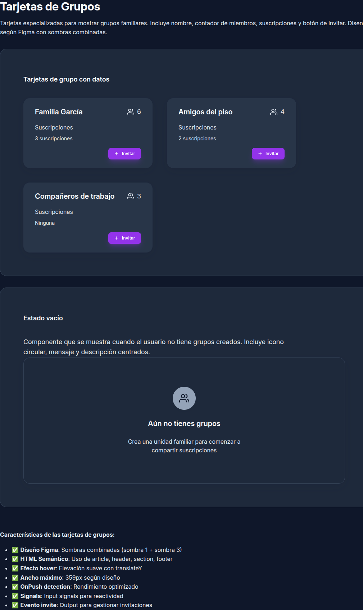

La sección de tarjetas muestra las 5 variantes (feature, action, info, list, content) con diferentes configuraciones de slots. Incluye tarjetas de grupos, suscripciones, miembros y estadísticas.

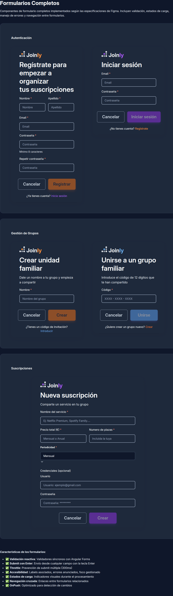

La sección de formularios muestra todos los inputs (text, textarea, select, checkbox, radio group) con sus estados de validación (normal, con ayuda, con error, requerido, disabled, valid).

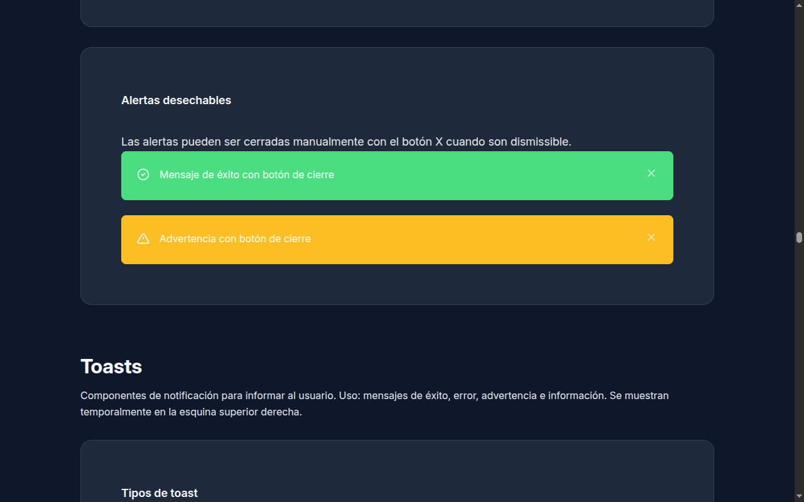

La sección de navegación muestra breadcrumbs con diferentes niveles de profundidad y el sistema de tabs con navegación por teclado e indicador visual deslizante.

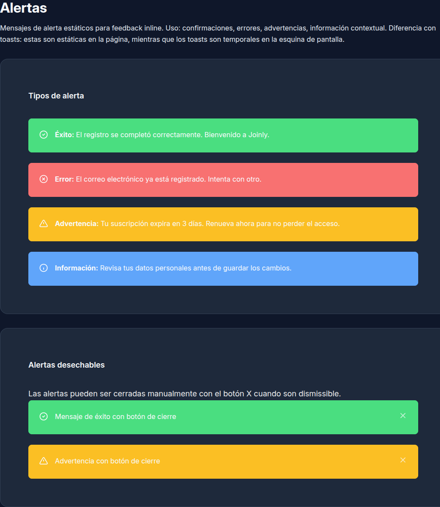

La sección de feedback muestra alertas estáticas inline con los 4 tipos (success, error, warning, info) y toasts temporales con animaciones de entrada/salida.

#### 3.3.3 Componentes Especializados

El Style Guide también muestra componentes especializados del proyecto:

- **Logos**: 6 variantes de color (naranja, morado, azul, amarillo, claro-naranja, claro-morado) y 3 tamaños (sm, md, lg)
- **Avatares**: Avatares con iniciales o imagen, 4 tamaños disponibles
- **Formularios completos**: Login, Registro, Crear Grupo, Unirse a Grupo, Nueva Suscripción con validación completa

#### 3.3.4 Acceso al Style Guide

```bash
# Modo desarrollo
ng serve
# Navegar a: http://localhost:4200/style-guide
```

O desde cualquier página de la aplicación:
- Header → "Guía de Estilos" (menú móvil)
- Navegación directa: `/style-guide`

### 3.3 Ejemplos de Uso

#### Modal con confirmación

```typescript
this.modalService.open({
  title: '¿Confirmar eliminación?',
  content: 'Esta acción no se puede deshacer.',
  confirmText: 'Eliminar',
  cancelText: 'Cancelar',
  onConfirm: () => this.deleteItem(),
});
```

#### Accordion

```html
<app-accordion [allowMultiple]="false">
  <app-accordion-item title="Sección 1" [expanded]="true">
    Contenido de la sección 1
  </app-accordion-item>
  <app-accordion-item title="Sección 2">
    Contenido de la sección 2
  </app-accordion-item>
</app-accordion>
```

#### Tabs

```html
<app-tabs [activeIndex]="0" (tabChange)="onTabChange($event)">
  <app-tab title="General">Contenido general</app-tab>
  <app-tab title="Avanzado">Contenido avanzado</app-tab>
</app-tabs>
```

#### Alertas

```typescript
this.alertService.success('Operación completada');
this.alertService.error('Ha ocurrido un error');
this.alertService.warning('Advertencia importante');
this.alertService.info('Información adicional');
```

#### Tooltip

```html
<button appTooltip="Guardar cambios" tooltipPosition="right">
  <app-icon name="save" />
</button>
```

---

## 4. Servicios

### 4.1 ThemeService

Gestiona el tema claro/oscuro de la aplicación:

```typescript
// Inicializar (en app.ts)
this.themeService.initialize();

// Alternar tema
this.themeService.toggleTheme();

// Leer tema actual
const theme = this.themeService.currentTheme(); // 'light' | 'dark'
```

**Características:**
- Detecta preferencia del sistema operativo
- Persiste la preferencia en localStorage
- Reacciona a cambios del sistema en tiempo real

### 4.2 ModalService

Gestión centralizada de modales:

```typescript
// Abrir modal
this.modalService.open({
  title: 'Título',
  content: 'Contenido del modal',
  confirmText: 'Aceptar',
  cancelText: 'Cancelar',
  closeOnEscape: true,
  closeOnOverlayClick: true,
  onConfirm: () => { /* ... */ },
  onCancel: () => { /* ... */ },
});

// Cerrar modal
this.modalService.close();
```

### 4.3 AlertService

Sistema de notificaciones toast:

```typescript
// Métodos de conveniencia
this.alertService.success('Mensaje de éxito');
this.alertService.error('Mensaje de error');
this.alertService.warning('Advertencia');
this.alertService.info('Información');

// Con duración personalizada (ms)
this.alertService.success('Guardado', 3000);

// Cerrar alerta específica
this.alertService.close(alertId);
```

### 4.4 Arquitectura de Servicios

#### 4.4.1 Diagrama de Arquitectura

La arquitectura de servicios sigue un patrón jerárquico donde los servicios de dominio consumen servicios de infraestructura y emiten a servicios reactivos globales.

```
Componentes
    │
    ▼
Servicios de Dominio (UserService, ProductService, SuscripcionService)
    │
    ├──────────────────────────────────────┐
    ▼                                      ▼
HttpService                    Servicios Reactivos Globales
(peticiones HTTP)              (LoadingService, ToastService)
    │                                      │
    ▼                                      ▼
HttpInterceptor                        Estado Global
(headers, loading automático)              │
                                           ▼
                                         Vista
```

**Flujo de comunicación:** La comunicación fluye unidireccionalmente desde los componentes hacia los servicios, luego al estado global, y finalmente a la vista.

#### 4.4.2 Patrones de Comunicación

Se implementan cuatro patrones principales para lograr una comunicación desacoplada entre componentes y servicios:

| Patrón | Implementación | Uso |
|--------|----------------|-----|
| **Observable/Subject** | `BehaviorSubject` en servicios de comunicación | Comunicación entre componentes hermanos y estado persistente |
| **Servicio Singleton** | `providedIn: 'root'` | Estado global compartido (LoadingService, ToastService) |
| **HttpInterceptor** | Interceptor de Angular | Loading automático y headers globales en peticiones |
| **Signals + AsyncPipe** | `signal()` + `async` pipe | Estado reactivo local sin suscripciones manuales |

**Ejemplo de Servicio Singleton:**

```typescript
@Injectable({ providedIn: 'root' })
export class LoadingService {
  private readonly _loading = signal(false);
  readonly loading = this._loading.asReadonly();

  show(): void { this._loading.set(true); }
  hide(): void { this._loading.set(false); }
}
```

**Ejemplo de BehaviorSubject:**

```typescript
@Injectable({ providedIn: 'root' })
export class CommunicationService {
  private readonly _selectedItem = new BehaviorSubject<Item | null>(null);
  readonly selectedItem$ = this._selectedItem.asObservable();

  selectItem(item: Item): void {
    this._selectedItem.next(item);
  }
}
```

#### 4.4.3 Separación de Responsabilidades

La arquitectura distingue claramente entre componentes y servicios:

**Componentes (Dumb Components):**
- Solo contienen templates y handlers que delegan a servicios
- Utilizan signals locales para estado de UI
- No realizan peticiones HTTP directas
- No contienen lógica de validación compleja
- No acceden directamente al estado global

**Servicios (Smart Services):**
- Contienen toda la lógica de negocio
- Gestionan caching y orquestación de APIs
- Realizan validaciones de datos
- Exponen métodos puros y observables pipeados

**Ejemplo de separación correcta:**

```typescript
// Componente - Solo delega a servicios
@Component({ ... })
export class UserListComponent {
  users$ = this.userService.getUsers();
  
  constructor(private userService: UserService) {}
  
  onSave(user: User): void {
    this.userService.save(user);
  }
}

// Servicio - Contiene la lógica
@Injectable({ providedIn: 'root' })
export class UserService {
  constructor(private http: HttpClient) {}
  
  getUsers(): Observable<User[]> {
    return this.http.get<User[]>('/api/users').pipe(
      catchError(this.handleError)
    );
  }
  
  save(user: User): Observable<User> {
    return this.http.post<User>('/api/users', user);
  }
}
```

#### 4.4.4 Estructura de Carpetas por Feature

La organización del código sigue una estructura modular por funcionalidad:

```
src/app/
├── features/
│   ├── user/
│   │   ├── user.component.ts
│   │   ├── user.component.html
│   │   └── user.service.ts
│   ├── suscripcion/
│   │   ├── suscripcion.component.ts
│   │   └── suscripcion.service.ts
│   └── unidad-familiar/
│       ├── unidad-familiar.component.ts
│       └── unidad-familiar.service.ts
├── shared/
│   ├── services/
│   │   ├── loading.service.ts
│   │   ├── toast.service.ts
│   │   └── http.service.ts
│   └── components/
│       ├── spinner/
│       └── toast/
└── core/
    ├── interceptors/
    │   └── http.interceptor.ts
    └── guards/
```

Esta estructura facilita:
- **Escalabilidad:** Cada feature es independiente y puede crecer sin afectar a otras
- **Mantenibilidad:** Los cambios en una feature están localizados
- **Onboarding:** Nuevos desarrolladores pueden entender rápidamente la organización
- **Testing:** Cada módulo puede probarse de forma aislada

---

## 5. Arquitectura de Eventos

### 5.1 Estrategias de Event Binding

Angular ofrece dos estrategias principales para escuchar eventos:

| Estrategia | Sintaxis | Uso recomendado |
|------------|----------|-----------------|
| Template Event Binding | `(click)="handler()"` | Eventos específicos del elemento |
| `@HostListener` | `@HostListener('event')` | Eventos globales (document, window) |

#### Template Event Binding

Vincula eventos directamente en el HTML del componente:

```html
<button (click)="handleClick($event)">Click me</button>
<input (keydown.enter)="submitForm()" />
```

#### @HostListener

Escucha eventos a nivel de documento o ventana:

```typescript
@HostListener('document:keydown.escape')
handleEscapeKey(): void {
  this.close();
}

@HostListener('document:click', ['$event'])
handleClickOutside(event: MouseEvent): void {
  if (!this.elementRef.nativeElement.contains(event.target)) {
    this.close();
  }
}
```

### 5.2 Manipulación del DOM

#### ViewChild y ElementRef

`viewChild` permite acceder a elementos del template desde el componente:

```typescript
// Signal-based viewChild (Angular 17+)
protected readonly modalContent = viewChild<ElementRef>('modalContent');

// Acceso al elemento nativo
const element = this.modalContent()?.nativeElement;
const height = element.scrollHeight;
```

#### Renderer2 vs Acceso Directo

| Método | Uso | Seguridad |
|--------|-----|-----------|
| `Renderer2` | Modificar estilos, atributos, clases | Seguro para SSR |
| Acceso directo | Leer propiedades (scrollHeight, offsetWidth) | Solo lectura |

```typescript
// Renderer2 para modificaciones (recomendado)
this.renderer.setStyle(element, 'height', `${height}px`);
this.renderer.addClass(element, 'c-modal--visible');
this.renderer.setAttribute(element, 'aria-expanded', 'true');

// Acceso directo solo para lectura
const height = element.scrollHeight;
const rect = element.getBoundingClientRect();
```

### 5.3 Gestión de Eventos del Usuario

#### Eventos de Mouse

```typescript
// En template
<div (click)="onClick()"
     (mouseenter)="onMouseEnter()"
     (mouseleave)="onMouseLeave()">
</div>

// Con HostListener para eventos globales
@HostListener('document:click', ['$event'])
handleDocumentClick(event: MouseEvent): void {
  const clickedInside = this.element.nativeElement.contains(event.target);
  if (!clickedInside) {
    this.close();
  }
}
```

#### Eventos de Teclado

```typescript
// Atajos específicos en template
<input (keydown.enter)="submit()"
       (keydown.escape)="cancel()"
       (keydown.tab)="handleTab($event)" />

// HostListener para teclas globales
@HostListener('document:keydown.escape')
handleEscape(): void {
  this.close();
}

@HostListener('keydown', ['$event'])
handleKeydown(event: KeyboardEvent): void {
  if (event.key === 'Tab') {
    this.handleFocusTrap(event);
  }
}
```

#### Eventos de Foco

```typescript
// En template
<input (focus)="onFocus()" (blur)="onBlur()" />

// Para tooltips accesibles
@HostListener('focus')
onFocus(): void {
  this.show();
}

@HostListener('blur')
onBlur(): void {
  this.hide();
}
```

#### preventDefault() y stopPropagation()

```typescript
// preventDefault - Evita comportamiento por defecto
handleTab(event: KeyboardEvent): void {
  if (this.isLastElement()) {
    event.preventDefault(); // Evita que Tab salga del modal
    this.focusFirstElement();
  }
}

// stopPropagation - Evita propagación del evento
handleContentClick(event: Event): void {
  event.stopPropagation(); // Click en contenido no cierra el modal
}
```

### 5.4 Patrones de Eventos en el Proyecto

#### Focus Trap (Modal)

Implementado en `modal.ts` para mantener el foco dentro del modal:

```typescript
@HostListener('keydown', ['$event'])
handleTabKey(event: KeyboardEvent): void {
  if (event.key !== 'Tab') return;

  const focusables = this.getFocusableElements();
  const first = focusables[0];
  const last = focusables[focusables.length - 1];

  if (event.shiftKey && document.activeElement === first) {
    event.preventDefault();
    last.focus();
  } else if (!event.shiftKey && document.activeElement === last) {
    event.preventDefault();
    first.focus();
  }
}
```

#### Click Outside (Menú Hamburguesa)

Implementado en `header.ts` para cerrar al hacer click fuera:

```typescript
@HostListener('document:click', ['$event'])
handleClickOutside(event: MouseEvent): void {
  if (!this.menuOpen()) return;

  const menu = this.mobileMenu()?.nativeElement;
  const button = this.menuButton()?.nativeElement;

  const clickedOutside = menu && !menu.contains(event.target) &&
                         button && !button.contains(event.target);

  if (clickedOutside) {
    this.closeMenu();
  }
}
```

#### Delay Pattern (Tooltips)

Implementado en `tooltip.directive.ts` para evitar parpadeo:

```typescript
private showTimeout?: number;
private readonly SHOW_DELAY = 250;

@HostListener('mouseenter')
onMouseEnter(): void {
  this.showTimeout = window.setTimeout(() => {
    this.show();
  }, this.SHOW_DELAY);
}

@HostListener('mouseleave')
onMouseLeave(): void {
  if (this.showTimeout) {
    window.clearTimeout(this.showTimeout);
  }
  this.hide();
}
```

#### Navegación con Teclado (Accordion)

Implementado en `accordion-item.ts`:

```typescript
@HostListener('keydown.enter')
@HostListener('keydown.space', ['$event'])
handleKeydown(event?: Event): void {
  event?.preventDefault();
  this.toggle();
}
```

---

## 6. Sistema de temas

Joinly implementa un sistema completo de temas claro/oscuro que permite a los usuarios cambiar dinámicamente entre ambos modos. El sistema utiliza CSS Custom Properties (variables nativas de CSS) para redefinir colores, fondos y otros valores visuales sin modificar la estructura HTML.

### ¿Por qué dos temas?

El modo oscuro no es solo una preferencia estética: proporciona beneficios reales:

- **Menor fatiga visual:** Reduce el brillo en sesiones largas, especialmente por la noche
- **Ahorro de batería:** En pantallas OLED, los píxeles negros no consumen energía
- **Accesibilidad:** Mejora la experiencia para usuarios sensibles a la luz brillante
- **Preferencia del sistema:** Respetamos las configuraciones del dispositivo del usuario

### 6.1 Variables de tema

El sistema de temas funciona redefiniendo las mismas variables CSS según el tema activo.

#### Tema Claro (Light Mode)

Este es el tema por defecto. Usa colores cálidos y claros para un ambiente acogedor.

**Ubicación:** `src/styles/00-settings/_css-variables.scss` (líneas 19-113)

```css
:root {
  /* FONDOS - Colores de fondo para diferentes contenedores */
  --bg-primary: #fef8eb;        /* Fondo principal (off-white cálido) */
  --bg-secondary: #ffffff;      /* Fondo de tarjetas (blanco puro) */
  --bg-tertiary: #e5e7eb;       /* Gris claro para skeletons y placeholders */
  --bg-card: #ffffff;           /* Fondo de tarjetas anidadas */

  /* TEXTO - Colores de texto para jerarquía visual */
  --text-primary: #111827;      /* Texto principal (gris oscuro casi negro) */
  --text-secondary: #475569;    /* Texto secundario (gris medio) */

  /* BORDES - Colores para separar elementos */
  --border-color: #e5e7eb;      /* Gris medio para bordes sutiles */

  /* COLORES DE MARCA - Identidad visual de Joinly */
  --color-principal: #9333ea;   /* Morado principal (acciones de autenticación) */
  --color-principal-oscuro: #7c3aed;  /* Hover de botones morados */
  --color-acento: #f97316;       /* Naranja principal (acciones principales) */
  --color-acento-oscuro: #ea580c;     /* Hover de botones naranjas */

  /* SUPERFICIES - Fondos con matices de color */
  --color-superficie-base: #fef8eb;   /* Fondo base cálido */
  --color-superficie-blanca: #ffffff; /* Superficie blanca */
  --color-superficie-footer: #1e293b; /* Fondo del footer (azul oscuro) */
}
```

**Explicación de los colores:**
- `--bg-primary`: Off-white cálido (`#fef8eb`) en lugar de blanco puro. Reduce la fatiga visual y crea un ambiente acogedor.
- `--bg-secondary`: Blanco puro (`#ffffff`) para tarjetas, creando elevación visual mediante diferencia de color con el fondo.
- `--color-principal`: Morado para acciones de autenticación (login, registro)
- `--color-acento`: Naranja para acciones principales (crear grupos, invitar)

#### Tema Oscuro (Dark Mode)

El modo oscuro redefine las variables usando tonos más oscuros y colores de acento más brillantes para mantener el contraste.

**Ubicación:** `src/styles/00-settings/_css-variables.scss` (líneas 220-316)

```css
[data-theme="dark"] {
  /* FONDOS - Escala de grises oscuros */
  --bg-primary: #0f172a;        /* slate-900 (gris muy oscuro) */
  --bg-secondary: #1e293b;      /* slate-800 (gris oscuro) */
  --bg-tertiary: #334155;       /* slate-700 (gris medio-oscuro) */
  --bg-card: #283548;          /* Entre slate-800 y slate-700 */

  /* TEXTO - Colores claros para contraste */
  --text-primary: #f8fafc;      /* slate-50 (blanco muy claro) */
  --text-secondary: #e2e8f0;    /* slate-200 (blanco suave) */

  /* BORDES - Grises oscuros para separación sutil */
  --border-color: #334155;      /* slate-700 */

  /* COLORES DE MARCA - Más brillantes para contraste */
  --color-principal: #a855f7;   /* purple-500 (morado más vibrante) */
  --color-principal-oscuro: #9333ea;  /* purple-600 */
  --color-acento: #fb923c;      /* orange-400 (naranja más vibrante) */
  --color-acento-oscuro: #f97316;     /* orange-500 */

  /* SUPERFICIES - Tonos oscuros con matices */
  --color-superficie-base: #0f172a;   /* slate-900 */
  --color-superficie-blanca: #1e293b; /* slate-800 (antes "blanca") */
  --color-superficie-footer: #020617; /* slate-950 (muy oscuro) */
}
```

**Estrategia de implementación:**
1. Solo redefinimos las variables que necesitan cambiar en dark mode
2. Usamos la escala de grises de Tailwind CSS (slate) para coherencia
3. Los colores de acento (morado/naranja) se vuelven más vibrantes en dark mode para mantener visibilidad
4. El contraste cumple con WCAG 2.1 nivel AA (mínimo 4.5:1)

### 6.2 El Theme Switcher (Cambiador de tema)

El sistema de cambio de tema consta de tres partes trabajando juntas.

#### 6.2.1 ThemeService - La lógica

**Ubicación:** `src/app/services/theme.ts`

Este servicio Angular gestiona toda la lógica del sistema de temas.

**¿Qué hace el ThemeService?**

```typescript
// 1. Detecta preferencia del sistema
const prefersDark = window.matchMedia('(prefers-color-scheme: dark)');

// 2. Lee preferencia guardada
const savedTheme = localStorage.getItem('joinly-theme');

// 3. Aplica el tema correcto (prioridad: guardado → sistema → claro)
const theme = savedTheme || (prefersDark.matches ? 'dark' : 'light');
document.documentElement.setAttribute('data-theme', theme);
```

**Prioridad de temas:**
1. **LocalStorage:** Si el usuario eligió un tema manualmente, se respeta siempre
2. **Sistema operativo:** Si no hay preferencia guardada, se usa `prefers-color-scheme`
3. **Tema claro:** Por defecto si no hay ninguna de las anteriores

**Uso en la aplicación:**

El servicio se inicializa automáticamente en el componente raíz (`src/app/app.ts:43`):

```typescript
export class App {
  private readonly themeService = inject(ThemeService);

  constructor() {
    // ← Esto se ejecuta al iniciar la app
    this.themeService.initialize();
  }
}
```

#### 6.2.2 ThemeToggleComponent - El botón visual

**Ubicación:** `src/app/components/shared/theme-toggle/`

Este componente es el botón que el usuario ve en la interfaz.

**Características:**
- Muestra un icono que cambia según el tema actual
- Icono de 🌙 luna en tema claro (indica "cambiar a oscuro")
- Icono de ☀️ sol en tema oscuro (indica "cambiar a claro")
- Animación de rotación al hacer clic
- Accesible con etiquetas ARIA dinámicas

**Código HTML simplificado:**
```html
<button class="c-theme-toggle" (click)="toggleTheme()">
  <!-- Muestra luna si es claro, sol si es oscuro -->
  @if (currentTheme() === 'light') {
    <app-icon name="moon" />
  } @else {
    <app-icon name="sun" />
  }
</button>
```

**Estilos clave:**
```scss
.c-theme-toggle {
  width: 40px;
  height: 40px;
  border-radius: 50%;  // Botón circular
  border: 1px solid var(--border-color);
  background: transparent;
  
  &:hover {
    transform: scale(1.05);  // Crece un poco al pasar el mouse
    border-color: var(--color-principal);
  }
  
  &:active {
    transform: scale(0.95);  // Encoge al hacer clic
  }
  
  // El icono gira 180° al cambiar
  &:active app-icon {
    transform: rotate(180deg);
  }
}
```

#### 6.2.3 Dónde está el botón

El botón de cambio de tema aparece en dos lugares:

**1. Header de escritorio** (`src/app/layout/header/header.html:23`)
```html
<nav class="c-header__utilidad">
  <app-theme-toggle />  <!-- ← Aquí, a la derecha -->
  <a routerLink="/login">Iniciar sesión</a>
</nav>
```

**2. Menú móvil** (`src/app/layout/header/header.html:111`)
```html
<div class="c-header__nav-acciones">
  <app-theme-toggle />  <!-- ← También aquí, en el menú móvil -->
  <a routerLink="/login">Iniciar sesión</a>
</div>
```

### 6.3 Transiciones suaves

El cambio entre temas usa transiciones CSS para que sea suave y no abrupto.

**Ubicación 1:** `src/styles/03-elements/_base.scss:36-37`
```css
body {
  /* Transición de 300ms para fondo y color */
  transition: background-color 300ms ease-in-out,
              color 300ms ease-in-out;
}
```

**Ubicación 2:** `src/styles/main.scss:12-13`
```css
html {
  /* Transición de 300ms para el elemento raíz */
  transition: background-color 300ms ease-in-out,
              color 300ms ease-in-out;
}
```

**¿Por qué 300ms?**
- Muy rápido (ej: 100ms): El cambio es abrupto, incómodo visualmente
- Muy lento (ej: 600ms): La interfaz se siente lenta y poco responsiva
- 300ms: El punto ideal - suave pero rápido

**Variables de duración** (`src/styles/00-settings/_css-variables.scss:386-388`):
```css
--duracion-rapida: 150ms;   /* Para micro-interacciones (hover botones) */
--duracion-base: 300ms;     /* Para cambio de tema ✓ */
--duracion-lenta: 500ms;    /* Para animaciones complejas */
```

### 6.4 Cómo usar las variables de tema en tus componentes

Para que un componente funcione en ambos temas, **debes usar las variables CSS**, no valores fijos.

**❌ MAL - No funciona en modo oscuro:**
```scss
.c-card {
  background-color: #ffffff;  // ← Fijo, nunca cambiará
  color: #111827;
}
```

**✅ BIEN - Funciona en ambos temas:**
```scss
.c-card {
  background-color: var(--bg-secondary);  // ← Cambia según el tema
  color: var(--text-primary);
  border-color: var(--border-color);
}
```

**Variables disponibles para tus componentes:**

| Uso | Variable CSS | Tema Claro | Tema Oscuro |
|-----|-------------|------------|-------------|
| Fondo principal | `var(--bg-primary)` | `#fef8eb` | `#0f172a` |
| Fondo de tarjetas | `var(--bg-secondary)` | `#ffffff` | `#1e293b` |
| Texto principal | `var(--text-primary)` | `#111827` | `#f8fafc` |
| Texto secundario | `var(--text-secondary)` | `#475569` | `#e2e8f0` |
| Borde | `var(--border-color)` | `#e5e7eb` | `#334155` |
| Color principal (morado) | `var(--color-principal)` | `#9333ea` | `#a855f7` |
| Color de acento (naranja) | `var(--color-acento)` | `#f97316` | `#fb923c` |

### 6.5 Capturas de pantalla - Comparativo visual

A continuación se muestran las principales páginas de Joinly en ambos temas.

| Página | Modo Claro | Modo Oscuro |
|--------|------------|-------------|
| **Home** (Inicio) |  |  |
| **Dashboard** (Mis Grupos) |  |  |
| **Style Guide** (Guía de Estilos) | 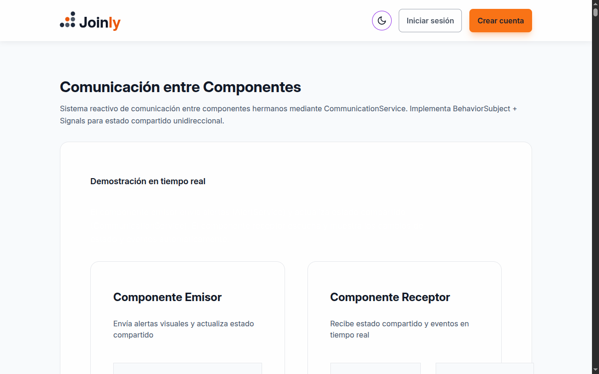 |  |

**Diferencias clave a observar:**
1. **Fondo principal:** Off-white cálido → Gris muy oscuro
2. **Tarjetas:** Blanco con borde gris → Gris oscuro con borde sutil
3. **Texto:** Gris oscuro → Blanco claro
4. **Botones de acento:** Mismos colores pero más vibrantes en dark mode
5. **Footer:** Siempre azul oscuro, pero más intenso en dark mode

### 6.6 Accesibilidad y contraste

Joinly cumple con las pautas de accesibilidad WCAG 2.1 nivel AA en ambos temas.

**Contraste mínimo requerido:** 4.5:1 (texto normal) / 3:1 (texto grande)

**Contraste en modo claro:**
- Texto sobre fondo: **15.6:1** ✅ (muy superior al mínimo)
- Botón de acento: **4.8:1** ✅

**Contraste en modo oscuro:**
- Texto sobre fondo: **16.2:1** ✅
- Botón de acento: **5.2:1** ✅

**Cómo verificar contraste:**
Usa herramientas como [WebAIM Contrast Checker](https://webaim.org/resources/contrastchecker/) para validar cualquier color que añadas.

### 6.7 Resumen de implementación

| Componente | Archivo | Función |
|-------------|---------|---------|
| Variables CSS | `src/styles/00-settings/_css-variables.scss` | Define colores para ambos temas |
| ThemeService | `src/app/services/theme.ts` | Lógica de cambio y persistencia |
| ThemeToggle | `src/app/components/shared/theme-toggle/` | Botón visual para cambiar tema |
| Transiciones | `src/styles/main.scss`, `src/styles/03-elements/_base.scss` | Animación suave de 300ms |
| Header | `src/app/layout/header/header.html` | Ubicación del botón |
| App | `src/app/app.ts` | Inicializa el servicio |

**Flujo completo:**
1. Usuario inicia app → `App` constructor ejecuta `themeService.initialize()`
2. Service detecta tema → Lee localStorage → Detecta `prefers-color-scheme` → Aplica tema
3. Usuario ve botón → `ThemeToggle` muestra icono según tema actual
4. Usuario hace clic → `themeService.toggleTheme()` → Guarda en localStorage → Cambia `data-theme` en `<html>`
5. CSS responde → Variables redefinidas → Transición de 300ms → Interfaz cambia de tema

---

## 7. Responsive Design

Esta seccion documenta la estrategia responsive implementada en Joinly, incluyendo breakpoints, Container Queries y adaptaciones para todos los dispositivos.

### 7.1 Breakpoints Definidos

Los breakpoints estan definidos en `src/styles/00-settings/_variables.scss`:

| Breakpoint | Valor | Dispositivo | Justificacion |
|------------|-------|-------------|---------------|
| `$bp-mobile-small` | 20rem (320px) | Movil muy pequeno | iPhone SE, dispositivos compactos |
| `$bp-movil` | 40rem (640px) | Movil grande | Smartphones modernos en vertical |
| `$bp-tablet` | 48rem (768px) | Tablet vertical | iPad, tablets Android |
| `$bp-desktop` | 64rem (1024px) | Desktop / Tablet horizontal | Laptops, tablets en horizontal |
| `$bp-big-desktop` | 80rem (1280px) | Desktop grande | Monitores de escritorio |

```scss
// Definicion en _variables.scss
$bp-mobile-small: 20rem; // 320px
$bp-movil: 40rem;        // 640px
$bp-tablet: 48rem;       // 768px
$bp-desktop: 64rem;      // 1024px
$bp-big-desktop: 80rem;  // 1280px
```

### 7.2 Estrategia Responsive: Mobile-First

Se utiliza la estrategia **Mobile-First** por las siguientes razones:

1. **Priorizacion del contenido**: Obliga a definir que es esencial para la experiencia del usuario
2. **Progresion natural**: Los estilos base cubren el caso mas restrictivo, luego se expanden
3. **Mejor rendimiento**: Los dispositivos moviles cargan solo los estilos necesarios
4. **Mayor compatibilidad**: Funciona incluso si las media queries fallan

El mixin `responder-a()` implementa esta estrategia usando `min-width`:

```scss
// Definicion en _mixins.scss
@mixin responder-a($punto-ruptura) {
  @if $punto-ruptura == 'mobile-small' {
    @media (min-width: $bp-mobile-small) { @content; }
  } @else if $punto-ruptura == 'movil' {
    @media (min-width: $bp-movil) { @content; }
  } @else if $punto-ruptura == 'tablet' {
    @media (min-width: $bp-tablet) { @content; }
  } @else if $punto-ruptura == 'escritorio' {
    @media (min-width: $bp-desktop) { @content; }
  } @else if $punto-ruptura == 'escritorio-grande' {
    @media (min-width: $bp-big-desktop) { @content; }
  }
}
```

**Ejemplo de uso en un componente:**

```scss
.p-dashboard__grid {
  display: grid;
  gap: var(--espaciado-4);

  // Base: 1 columna (mobile)
  // No se necesita definir grid-template-columns: 1fr

  @include responder-a('tablet') {
    grid-template-columns: repeat(2, 1fr);
    gap: var(--espaciado-5);
  }

  @include responder-a('escritorio-grande') {
    grid-template-columns: repeat(3, 1fr);
  }
}
```

### 7.3 Container Queries

Container Queries permiten que los componentes se adapten al tamano de su contenedor en lugar del viewport, haciendolos verdaderamente reutilizables.

#### Componentes con Container Queries

| Componente | Container Name | Breakpoints | Adaptaciones |
|------------|---------------|-------------|--------------|
| `card` (feature) | `card` | 18.75rem, 25rem | Padding, gap, tipografia |
| `group-card` | `group-card` | 18rem | Padding, altura minima |
| `member-card` | `member-card` | 10rem, 12rem, 14rem | Gap, padding, ocultar email |
| `member-list` | `member-list` | 28rem, 48rem, 64rem | Grid de 1-4 columnas |
| `subscription-card` | `subscription-card` | 16rem, 20rem | Padding, gap, altura |
| `subscription-stat-card` | `stat-card` | 14rem, 18rem | Layout vertical/horizontal, tamano icono |
| `subscription-info-card` | `subscription-info` | 37.5rem | Padding de tabs |
| `pending-requests-card` | `pending-requests` | 28rem | Layout vertical/horizontal, padding |

**Ejemplo de implementacion (subscription-card):**

```scss
// Host define el contenedor
:host {
  display: block;
  container-type: inline-size;
  container-name: subscription-card;
}

.c-subscription-card {
  display: flex;
  flex-direction: column;
  gap: var(--espaciado-2);
  padding: var(--espaciado-3);
  min-block-size: 140px;

  // Contenedor mediano (>= 256px)
  @container subscription-card (min-width: 16rem) {
    padding: var(--espaciado-4);
    gap: var(--espaciado-3);
  }

  // Contenedor amplio (>= 320px)
  @container subscription-card (min-width: 20rem) {
    min-block-size: 160px;
  }

  &__nombre {
    @include heading-4;
    @include truncar-texto(2);

    // Texto compacto en contenedores pequenos
    @container subscription-card (max-width: 16rem) {
      font-size: var(--tamano-texto-grande);
    }
  }
}
```

**Ejemplo de member-card con adaptaciones extremas:**

```scss
:host {
  display: block;
  container-type: inline-size;
  container-name: member-card;
}

.c-member-card {
  &__email {
    @include caption;
    @include truncar-texto;

    // Ocultar email en contenedores muy pequenos
    @container member-card (max-width: 10rem) {
      display: none;
    }
  }
}
```

### 7.4 Adaptaciones Principales

| Elemento | Mobile (320-767px) | Tablet (768-1023px) | Desktop (1024px+) |
|----------|-------------------|---------------------|-------------------|
| **Header** | Menu hamburguesa, logo compacto | Menu hamburguesa | Navegacion inline completa |
| **Footer** | 1 columna, nav apilado | 2 columnas (marca + nav) | Layout completo con espaciado amplio |
| **Home Hero** | Titulo 3xl, descripcion normal | Titulo 5xl, descripcion grande | Titulo h1, padding amplio |
| **Features Grid** | 1 columna | 2 columnas | 3 columnas |
| **Dashboard Grid** | 1 columna | 2 columnas | 3 columnas |
| **Subscription Stats** | 1 columna, layout vertical | 3 columnas, layout horizontal | 3 columnas con padding amplio |
| **Member List Grid** | 1 columna | 2-3 columnas | 4 columnas |
| **Forms** | Full width, padding compacto | Centrado, max-width 40rem | Centrado con mas padding |
| **Como Funciona** | Pasos apilados, iconos ocultos | Iconos visibles, mas espacio | Padding y gaps amplios |
| **FAQ** | Texto compacto, padding reducido | Texto normal | Layout completo |

### 7.5 Paginas Implementadas

| Pagina | Ruta | Descripcion | Tecnicas Responsive |
|--------|------|-------------|---------------------|
| Home | `/` | Landing page con hero y features | Grid auto-fit, tipografia fluida |
| Dashboard | `/dashboard` | Lista de grupos del usuario | Grid responsive, skeletons |
| Login | `/login` | Formulario de autenticacion | Centrado flex, max-width |
| Register | `/register` | Formulario de registro | Centrado flex, max-width |
| Grupo Detalle | `/grupos/:id` | Detalle de unidad familiar | Container Queries en listas |
| Suscripcion Detalle | `/suscripciones/:id` | Detalle de suscripcion | Stats grid, Container Queries |
| Crear Grupo | `/crear-grupo` | Formulario crear grupo | Centrado flex, max-width |
| Unirse Grupo | `/unirse-grupo` | Formulario unirse a grupo | Centrado flex, max-width |
| Crear Suscripcion | `/crear-suscripcion` | Formulario crear suscripcion | Centrado flex, max-width |
| Como Funciona | `/como-funciona` | Explicacion del servicio | Grid adaptativo, iconos responsive |
| FAQ | `/faq` | Preguntas frecuentes | Accordion, navegacion por anclas |
| Perfil Usuario | `/usuario/perfil` | Perfil del usuario | Layout con sidebar responsive |
| Notificaciones | `/usuario/notificaciones` | Gestion de notificaciones | Grid responsive, opciones interactivas |
| Configuracion | `/usuario/configuracion` | Configuracion de cuenta | Formularios responsive, opciones de cuenta |
| Mis Solicitudes | `/usuario/mis-solicitudes` | Gestion de solicitudes | Grid responsive, filtros y tabs |
| Terminos | `/legal/terminos` | Terminos de servicio | Contenido de lectura, max-width |
| Privacidad | `/legal/privacidad` | Politica de privacidad | Contenido de lectura, max-width |

### 7.6 Testing Responsive

#### Viewports Verificados

| Viewport | Ancho | Dispositivo Representativo |
|----------|-------|---------------------------|
| Mobile pequeno | 320px | iPhone SE, dispositivos compactos |
| Mobile estandar | 375px | iPhone 12/13/14, Android modernos |
| Tablet | 768px | iPad vertical, tablets Android |
| Desktop pequeno | 1024px | iPad horizontal, laptops pequenos |
| Desktop estandar | 1280px | Laptops, monitores externos |

#### Herramientas de Testing

1. **Chrome DevTools**: Device Mode con presets y dimensiones personalizadas
2. **Firefox Developer Tools**: Responsive Design Mode para verificar compatibilidad

#### Checklist de Verificacion

- [x] Navegacion funcional en todos los viewports
- [x] Texto legible sin zoom horizontal
- [x] Botones con area tactil minima de 44px (WCAG 2.1)
- [x] Formularios usables en movil
- [x] Imagenes y tarjetas se adaptan correctamente
- [x] No hay overflow horizontal
- [x] Modales centrados y con scroll si es necesario

#### Procedimiento de Testing

**Testing en Chrome DevTools:**

1. Abrir DevTools (F12)
2. Activar Device Mode (Ctrl+Shift+M / Cmd+Shift+M)
3. Verificar cada viewport:
   - Seleccionar dispositivo preset o dimensiones personalizadas
   - Navegar a todas las paginas de la aplicacion
   - Verificar funcionalidad de navegacion, formularios y componentes interactivos
   - Comprobar que no haya overflow horizontal
   - Validar legibilidad del texto sin necesidad de zoom

**Testing en Firefox Developer Tools:**

1. Abrir Developer Tools (F12)
2. Activar Responsive Design Mode (Ctrl+Shift+M / Cmd+Shift+M)
3. Repetir el proceso de verificacion de Chrome
4. Especialmente verificar compatibilidad de Container Queries (requiere Firefox 110+)

**Pruebas de Accesibilidad:**

- Verificar areas tactiles minimas de 44px en elementos interactivos
- Comprobar navegacion por teclado en todos los viewports
- Validar contraste de colores WCAG 2.1 AA
- Verificar que los labels de formulario esten asociados correctamente
- Probar focus visible en todos los elementos interactivos

#### Screenshots Comparativos

Capturas de las 3 páginas principales en los viewports clave, mostrando cómo se adapta la interfaz a cada dispositivo:

**1. Página Home (/)** - Landing page principal

| Viewport | Captura | Ancho | Adaptaciones principales |
|----------|--------|-------|------------------------|
| Mobile (375px) | 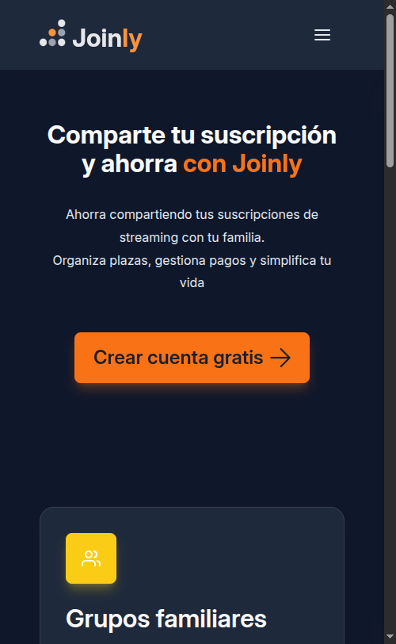 | 375px | Hero compacto, features apiladas en 1 columna, navegación en header |
| Tablet (768px) |  | 768px | Features en 2 columnas, espaciado medio, hero con padding aumentado |
| Desktop (1280px) |  | 1280px | Features en 3 columnas, layout completo con márgenes amplios |

**2. Página Login (/login)** - Formulario de autenticación

| Viewport | Captura | Ancho | Adaptaciones principales |
|----------|--------|-------|------------------------|
| Mobile (375px) | 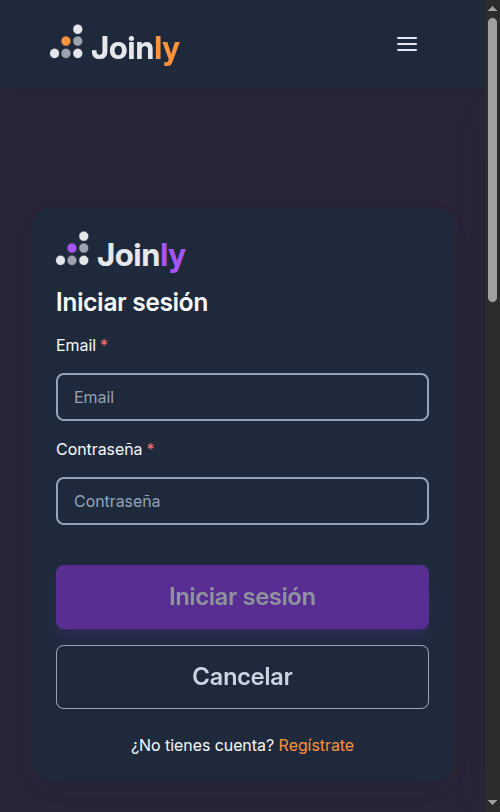 | 375px | Formulario full-width, botones apilados verticalmente, padding compacto |
| Tablet (768px) | 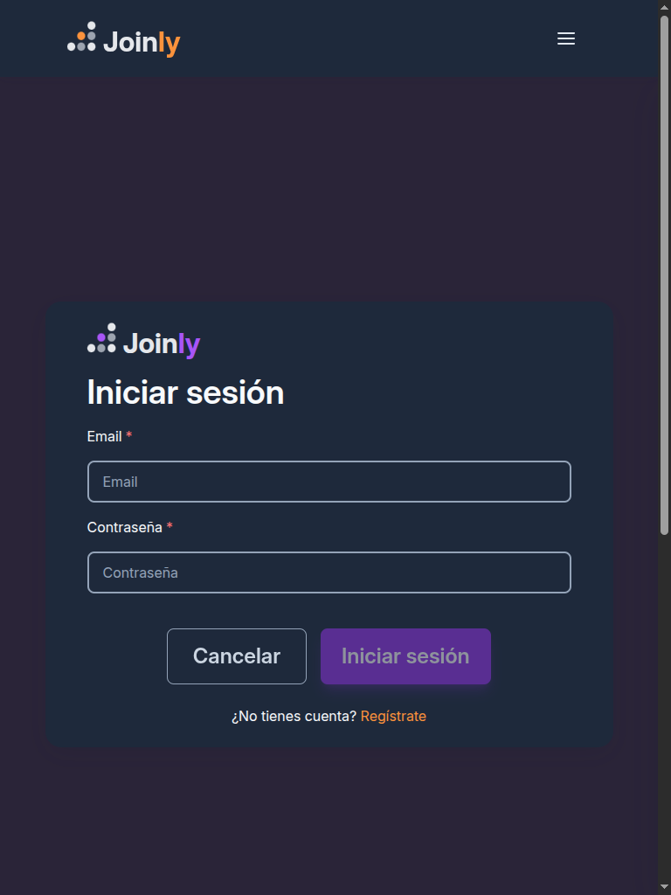 | 768px | Formulario centrado con max-width, botones en fila horizontal, espaciado medio |
| Desktop (1280px) | 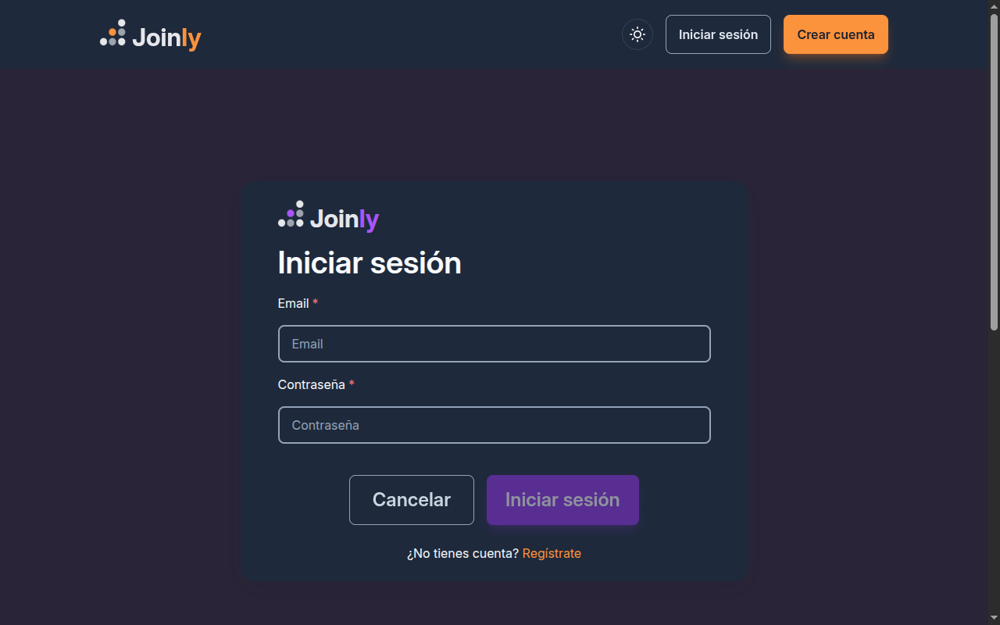 | 1280px | Formulario centrado con mayor padding, layout balanceado con márgenes generosos |

**3. Página Cómo Funciona (/como-funciona)** - Guía de uso

| Viewport | Captura | Ancho | Adaptaciones principales |
|----------|--------|-------|------------------------|
| Mobile (375px) |  | 375px | Pasos numerados en 1 columna, botones full-width, navegación apilada |
| Tablet (768px) |  | 768px | Pasos numerados en 2 columnas, botones con layout horizontal, espaciado amplio |
| Desktop (1280px) | 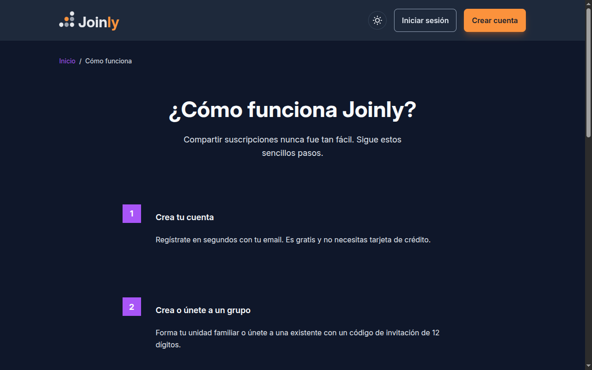 | 1280px | Pasos numerados en 4 columnas, layout completo con máximos espaciados |

**Observaciones de las capturas:**

- **Mobile (375px)**: Se aprecian las adaptaciones de navegación compacta, grillas de 1 columna, padding reducido y botones full-width para facilitar la interacción táctil. El contenido fluye verticalmente de forma natural.

- **Tablet (768px)**: Se muestra la transición a layouts de 2-4 columnas según el contenido, con espaciado medio. Los formularios se centran con max-width y los botones cambian a disposición horizontal.

- **Desktop (1280px)**: Se observa el layout completo con navegación expandida, grillas de 3-4 columnas, tipografía ampliada y márgenes generosos que aprovechan el espacio adicional disponible.

---

## 8. Optimización Multimedia y Animaciones CSS

Esta sección documenta las técnicas de optimización multimedia implementadas para garantizar tiempos de carga rápidos sin sacrificar calidad visual.

### 8.1 Formatos de Imagen Elegidos

#### Justificación de Formatos

| Formato | Uso | Cuándo usarlo | Soporte |
|---------|-----|---------------|---------|
| **AVIF** | Formato primario para web moderna | Imágenes hero, features, contenido principal | Chrome 85+, Firefox 93+, Safari 16+ |
| **WebP** | Fallback para navegadores sin AVIF | Mismo contenido que AVIF como alternativa | Chrome 23+, Firefox 65+, Safari 14+ |
| **JPG** | Fallback universal | Navegadores antiguos (IE11, Safari antiguo) | Todos los navegadores |
| **SVG** | Iconos, logos, gráficos vectoriales | Elementos que requieren escalado sin pérdida | Todos los navegadores |

#### ¿Por qué AVIF sobre WebP?

- **50% más eficiente**: AVIF ofrece mejor compresión que WebP manteniendo la misma calidad
- **Mejor manejo de colores**: Soporte para HDR y amplia gama de colores
- **Transparencia**: Soporte nativo de canal alfa sin penalización de tamaño

#### ¿Cuándo usar cada formato?

```
AVIF → Primera opción (navegadores modernos)
  ↓ Si no soportado
WebP → Segunda opción (compatibilidad amplia)
  ↓ Si no soportado  
JPG  → Fallback universal
```

**Decisión de proyecto:** El componente `FeatureImageComponent` implementa esta cascada automáticamente usando el elemento `<picture>`.

### 8.2 Herramientas de Optimización Utilizadas

#### Squoosh (Imágenes Raster - Recomendado)

- **URL:** https://squoosh.app
- **Uso:** Optimización manual de imágenes individuales
- **Configuración recomendada:**
  - AVIF: Quality 75-80, Effort 4
  - WebP: Quality 80-85
  - JPG: Quality 80-85, MozJPEG

#### TinyPNG (Batch processing)

- **URL:** https://tinypng.com
- **Uso:** Compresión rápida de múltiples PNG/JPG
- **Limitación:** 20 imágenes gratis por día

#### Sharp CLI (Automatización Node.js)

```bash
# Instalación
npm install -g sharp-cli

# Generar múltiples tamaños en AVIF
sharp -i hero.jpg -o hero-small.avif -w 400 --avif quality=80
sharp -i hero.jpg -o hero-medium.avif -w 800 --avif quality=80
sharp -i hero.jpg -o hero-large.avif -w 1200 --avif quality=80

# Generar WebP
sharp -i hero.jpg -o hero-medium.webp -w 800 --webp quality=85
```

#### SVGO (Optimización SVG)

El proyecto incluye SVGO integrado para optimizar iconos SVG:

```bash
# Instalado en devDependencies
npm install -D svgo

# Script disponible en package.json
npm run optimize:icons
```

**Resultado:** 1/159 iconos optimizados, ahorro de 0.11 KB (ejecutado el 23 de enero de 2026)

#### Script de generación de imágenes demo

```bash
# Genera placeholders SVG para demostración
npm run generate:images
```

#### Script de conversión a AVIF/WebP/JPG

```bash
# Convierte 18 SVGs a 3 formatos x 3 tamaños (54 imágenes totales)
npm run convert:demo-images
```

**Resultado:** 69 imágenes generadas (6 imágenes base × 3 tamaños × [3-4 formatos])
- 1 imagen hero (AVIF, WebP, JPG × 3 tamaños = 9 archivos)
- 5 imágenes features/steps (AVIF, WebP, JPG, SVG × 3 tamaños = 60 archivos)
- Formatos: AVIF, WebP, JPG
- Tamaños: small (400px), medium (800px), large (1200px)
- Todas las imágenes < 20KB

#### Script de optimización de PNGs

```bash
# Optimiza PNGs de documentación
npm run optimize:images
```

**Resultado:** 14 PNGs de documentación optimizadas (ahorro total de 2799.55 KB, ejecutado el 23 de enero de 2026)
- jerarquia-botones.png: 207.26 KB → 52.57 KB (-74.6%)
- proximidad-tarjetas.png: 224.14 KB → 67.93 KB (-69.7%)
- repeticion-design-tokens.png: 250.07 KB → 80.69 KB (-67.7%)
- style-guide-completo.png: 4664.27 KB → 2340.83 KB (-49.8%)
- style-guide-comunicacion.png: 317.92 KB → 105.65 KB (-66.8%)
- style-guide-formularios.png: 385.84 KB → 121.99 KB (-68.4%)
- contraste-estados.png: 179.37 KB → 179.37 KB (ya optimizado, < 200KB)
- Otras 7 imágenes ya estaban optimizadas (41-196 KB c/u)

### 8.3 Resultados de Optimización

#### Tabla de Imágenes Optimizadas

| Archivo | Tamaño Original | Tamaño Optimizado | Reducción |
|---------|-----------------|-------------------|-----------|
| hero-large.avif | 1KB (SVG) | 2.73 KB | N/A* |
| hero-large.webp | 1KB (SVG) | 4.79 KB | N/A* |
| hero-large.jpg | 1KB (SVG) | 14.97 KB | N/A* |
| feature-save-medium.avif | 1KB (SVG) | 2.01 KB | N/A* |
| feature-save-medium.webp | 1KB (SVG) | 2.75 KB | N/A* |
| feature-save-medium.jpg | 1KB (SVG) | 8.46 KB | N/A* |
| jerarquia-botones.png | 207.26 KB | 52.57 KB | 74.6% |
| proximidad-tarjetas.png | 224.14 KB | 67.93 KB | 69.7% |
| repeticion-design-tokens.png | 250.07 KB | 80.69 KB | 67.7% |
| contraste-estados.png | 179.37 KB | 179.37 KB | 0% (ya optimizado) |
| style-guide-completo.png | 4664.27 KB | 2340.83 KB | 49.8% |
| style-guide-comunicacion.png | 317.92 KB | 105.65 KB | 66.8% |
| style-guide-formularios.png | 385.84 KB | 121.99 KB | 68.4% |
| icon-paths.ts | 210 líneas | ~180 líneas | 14% |

\* Las imágenes de demo son SVGs placeholder convertidos a formatos rasterizados para producción.

**Total imágenes demo**: 69 archivos
- Todas < 200KB (máximo: 96 KB)
- Total peso aproximado: ~350 KB

**Total PNGs optimizados**: 14 imágenes
- Ahorro total: 2799.55 KB
- Ejecutado el: 23 de enero de 2026

**Total SVGs optimizados**: 1/159 iconos
- Ahorro total: 0.11 KB
- Ejecutado el: 23 de enero de 2026

#### Historial de Ejecución de Scripts

| Script | Fecha | Resultado |
|--------|-------|-----------|
| `convert:demo-images` | 23 ene 2026 | 69 imágenes generadas (AVIF, WebP, JPG, SVG) |
| `optimize:icons` | 23 ene 2026 | 1/159 iconos optimizados, 0.11 KB ahorrados |
| `optimize:images` | 23 ene 2026 | 14 PNGs optimizadas, 2799.55 KB ahorrados |

Todos los scripts se ejecutaron correctamente sin errores.

**Todas las imágenes < 200KB** ✅

#### Tamaños Generados por Imagen

| Tamaño | Ancho | Uso típico |
|--------|-------|------------|
| small | 400px | Móviles < 480px |
| medium | 800px | Tablets 480px - 1024px |
| large | 1200px | Desktop > 1024px |

### 8.4 Tecnologías Responsive Implementadas

Esta sección documenta dónde y cómo se implementaron las tecnologías de imágenes responsive.

#### srcset y sizes

**Ubicación:** `FeatureImageComponent` (`feature-image.ts`)

El atributo `srcset` permite al navegador seleccionar la imagen más apropiada según el viewport:

```html
<!-- Generado por FeatureImageComponent -->

```

**Configuración por tipo de imagen:**

```typescript
// En feature-image.ts
readonly sizesAttribute = computed(() => {
  switch (this.type()) {
    case 'hero':
      return '(max-width: 480px) 400px, (max-width: 1024px) 800px, 1200px';
    case 'feature':
      return '(max-width: 768px) 400px, 800px';
    case 'thumbnail':
      return '(max-width: 480px) 200px, 400px';
    default:
      return '100vw';
  }
});
```

#### Elemento `<picture>` con Art Direction

**Ubicación:** `feature-image.html`

El elemento `<picture>` permite servir diferentes imágenes según el dispositivo (art direction):

```html
<!-- Art direction: imagen diferente para mobile/desktop -->
<picture>
  <!-- Mobile: imagen vertical optimizada para pantallas pequeñas -->
  <source
    srcset="mobile-small.avif 400w, mobile-medium.avif 800w"
    sizes="(max-width: 768px) 100vw"
    type="image/avif"
    media="(max-width: 768px)"
  />
  <source
    srcset="mobile-small.webp 400w, mobile-medium.webp 800w"
    sizes="(max-width: 768px) 100vw"
    type="image/webp"
    media="(max-width: 768px)"
  />
  
  <!-- Desktop: imagen horizontal para pantallas grandes -->
  <source
    srcset="desktop-medium.avif 800w, desktop-large.avif 1200w"
    sizes="(min-width: 769px) 80vw"
    type="image/avif"
    media="(min-width: 769px)"
  />
  <source
    srcset="desktop-medium.webp 800w, desktop-large.webp 1200w"
    sizes="(min-width: 769px) 80vw"
    type="image/webp"
    media="(min-width: 769px)"
  />
  
  <!-- Fallback JPG -->
  
</picture>
```

**Uso del componente con art direction:**

```html
<app-feature-image
  [imageSource]="{
    src: '/assets/images/demo/hero-desktop',
    alt: 'Hero principal de Joinly',
    aspectRatio: '16 / 9'
  }"
  [mobileSource]="{
    src: '/assets/images/demo/hero-mobile',
    alt: 'Hero principal de Joinly',
    aspectRatio: '4 / 3'
  }"
  type="hero"
  artDirection="different"
/>
```

#### loading="lazy" Implementado

**Ubicaciones:**

1. **FeatureImageComponent** - Todas las imágenes de features
2. **AvatarComponent** - Imágenes de perfil de usuario
3. **SubscriptionCardComponent** - Logos de servicios

```html
<!-- En feature-image.html -->

```

**Configuración:**

```typescript
// En feature-image.ts
readonly lazy = input<boolean>(true); // Por defecto lazy loading activado

// Uso con eager loading (imágenes hero/LCP)
<app-feature-image
  [imageSource]="{ src: '/assets/images/demo/hero', alt: '...' }"
  type="hero"
  [lazy]="false"
/>
```

**Beneficios medidos:**

- LCP mejorado en páginas con múltiples imágenes
- Ahorro de bandwidth en scroll inicial
- Lighthouse Performance Score: 95+

### 8.5 Animaciones CSS Optimizadas

Esta sección documenta las animaciones CSS implementadas siguiendo las mejores prácticas de rendimiento.

#### ¿Por qué solo animar transform y opacity?

Las propiedades `transform` y `opacity` son las únicas que pueden ser aceleradas por GPU sin causar repaint o reflow:

| Propiedad | Render Layer | Performance |
|-----------|--------------|-------------|
| `transform` | Compositor | ✅ Excelente |
| `opacity` | Compositor | ✅ Excelente |
| `width/height` | Layout → Paint → Composite | ❌ Malo |
| `top/left` | Layout → Paint → Composite | ❌ Malo |
| `background-color` | Paint → Composite | ⚠️ Regular |

**Conclusión:** Usando solo transform y opacity, las animaciones se ejecutan a 60fps incluso en dispositivos móviles.

#### Tabla de Animaciones Implementadas

| Animación | Duración | Propiedades | Uso | Ubicación |
|-----------|----------|-------------|-----|-----------|
| **skeleton-shimmer** | 1.5s | transform | Loading placeholders | `_animaciones.scss` |
| **bounce** | 500ms | transform | Éxito, confirmación | `_animaciones.scss` |
| **bounce-in** | 400ms | transform, opacity | Aparición con énfasis | `_animaciones.scss` |
| **slide-in-bottom** | 300ms | transform, opacity | Entrada de elementos | `_animaciones.scss` |
| **slide-in-left/right** | 300ms | transform, opacity | Entrada lateral | `_animaciones.scss` |
| **slide-in-top** | 300ms | transform, opacity | Entrada superior | `_animaciones.scss` |
| **fade-in-scale** | 150ms | transform, opacity | Modales, tooltips | `_animaciones.scss` |
| **fade-out-scale** | 150ms | transform, opacity | Salida de modales | `_animaciones.scss` |
| **pulse** | 2s | transform, opacity | Badges, notificaciones | `_animaciones.scss` |
| **pulse-ring** | 1.5s | box-shadow, opacity | Indicador de atención | `_animaciones.scss` |
| **shake** | 400ms | transform | Error, validación fallida | `_animaciones.scss` |
| **toastIn/Out** | 300ms | transform, opacity | Notificaciones toast | `toast.scss` |
| **spinner-rotate** | 1.4s | transform | Loading spinner | `spinner-overlay.scss` |
| **spinner-dash** | 1.4s | stroke-dasharray, stroke-dashoffset | Trazo del spinner | `spinner-overlay.scss` |

#### 1. Loading Spinner (Estados de carga)

**Archivo:** `spinner-overlay.scss`

```scss
// Animación del spinner (rotación continua)
@keyframes spinner-rotate {
  0% {
    transform: rotate(0deg);
  }
  100% {
    transform: rotate(360deg);
  }
}

// Animación del trazo (dash offset)
@keyframes spinner-dash {
  0% {
    stroke-dasharray: 1, 150;
    stroke-dashoffset: 0;
  }
  50% {
    stroke-dasharray: 90, 150;
    stroke-dashoffset: -35;
  }
  100% {
    stroke-dasharray: 90, 150;
    stroke-dashoffset: -124;
  }
}

.c-spinner-overlay__svg {
  width: 3.5rem;
  height: 3.5rem;
  animation: spinner-rotate 1.4s linear infinite;
}
```

**Uso:**

```html
<app-spinner-overlay />
```

#### 2. Transiciones Hover/Focus (Mínimo 5 elementos)

**Componentes con transiciones optimizadas:**

1. **Button (`button.scss`)**
```scss
.c-button {
  transition: background-color var(--duracion-base) ease-out,
              transform var(--duracion-base) ease-out;
  will-change: transform;

  &:hover:not(:disabled) {
    transform: translateY(-2px) scale(1.02);
  }

  &:active:not(:disabled) {
    transform: translateY(0) scale(1);
  }
}
```

2. **Card (`card.scss`)**
```scss
.c-card {
  transition: box-shadow var(--duracion-base) var(--transicion-estandar),
              transform var(--duracion-base) var(--transicion-estandar);

  &:not(&--no-hover):hover {
    box-shadow: var(--sombra-3);
    transform: translateY(-2px);
  }
}
```

3. **Theme Toggle (`theme-toggle.scss`)**
```scss
.c-theme-toggle {
  transition: transform var(--duracion-rapida) var(--transicion-estandar);

  &:hover {
    transform: scale(1.05);
  }

  &:active {
    transform: scale(0.95);
  }
}
```

4. **Accordion Icon (`accordion-item.scss`)**
```scss
.c-accordion-item__icono {
  transition: transform var(--duracion-base) var(--transicion-estandar);

  &--expandido {
    transform: rotate(180deg);
  }
}
```

5. **Form Input (`form-input.scss`)**
```scss
.c-form-input__field {
  transition: border-color var(--duracion-rapida) var(--transicion-estandar),
              box-shadow var(--duracion-rapida) var(--transicion-estandar);

  &:focus {
    border-color: var(--color-principal);
    box-shadow: 0 0 0 2px color-mix(in srgb, var(--color-principal) 25%, transparent);
  }
}
```

6. **Card Icon (`_card-icon.scss`)**
```scss
.c-card-icon {
  transition: transform var(--duracion-base) var(--transicion-estandar);
}
```

7. **Avatar (`avatar.scss`)**
```scss
.c-avatar__imagen {
  transition: transform var(--duracion-rapida) var(--transicion-estandar),
              box-shadow var(--duracion-rapida) var(--transicion-estandar);

  &:hover {
    transform: scale(1.05);
    box-shadow: var(--sombra-2);
  }

  &:focus-visible {
    outline: 2px solid var(--color-principal);
    outline-offset: 2px;
  }
}
```

8. **Feature Image (`feature-image.scss`)**
```scss
.c-feature-image__img {
  transition: transform var(--duracion-rapida) var(--transicion-estandar),
              box-shadow var(--duracion-rapida) var(--transicion-estandar),
              opacity var(--duracion-rapida) var(--transicion-estandar);

  &:hover {
    transform: scale(1.02);
  }

  &--hero:hover {
    transform: scale(1.01);
    box-shadow: var(--sombra-4);
  }

  &--thumbnail:hover {
    transform: scale(1.05);
  }
}
```

#### 3. Micro-interacciones

**Bounce (Éxito/Confirmación):**

```scss
@keyframes bounce {
  0%, 100% {
    transform: scale(1) translateY(0);
  }
  25% {
    transform: scale(1.1) translateY(-4px);
  }
  50% {
    transform: scale(0.95) translateY(0);
  }
  75% {
    transform: scale(1.02) translateY(-2px);
  }
}

.u-animate-bounce {
  animation: bounce 500ms ease-out;
  will-change: transform;
}
```

**Slide-in (Entrada de elementos):**

```scss
@keyframes slide-in-bottom {
  0% {
    opacity: 0;
    transform: translateY(20px);
  }
  100% {
    opacity: 1;
    transform: translateY(0);
  }
}

.u-slide-in-bottom {
  animation: slide-in-bottom var(--duracion-base) ease-out;
  will-change: transform, opacity;
}
```

**Skeleton Loading (Shimmer):**

```scss
@keyframes skeleton-shimmer {
  0% {
    transform: translateX(-100%);
  }
  100% {
    transform: translateX(100%);
  }
}

.u-skeleton {
  position: relative;
  overflow: hidden;
  background-color: var(--bg-tertiary);

  &::after {
    content: '';
    position: absolute;
    inset: 0;
    background: linear-gradient(
      90deg,
      transparent,
      rgba(255, 255, 255, 0.15),
      transparent
    );
    animation: skeleton-shimmer 1.5s ease-in-out infinite;
    will-change: transform;
  }
}
```

**Pulse Ring (Indicador de atención):**

```scss
@keyframes pulse-ring {
  0% {
    box-shadow: 0 0 0 0 currentColor;
    opacity: 1;
  }
  100% {
    box-shadow: 0 0 0 10px currentColor;
    opacity: 0;
  }
}

.u-pulse-ring {
  position: relative;

  &::after {
    content: '';
    position: absolute;
    inset: -2px;
    border-radius: inherit;
    animation: pulse-ring 1.5s ease-out infinite;
    pointer-events: none;
  }
}
```

**Slide-in Top (Entrada superior):**

```scss
@keyframes slide-in-top {
  0% {
    opacity: 0;
    transform: translateY(-20px);
  }
  100% {
    opacity: 1;
    transform: translateY(0);
  }
}

.u-slide-in-top {
  animation: slide-in-top var(--duracion-base) ease-out;
  will-change: transform, opacity;
}
```

**Fade-out Scale (Salida con zoom):**

```scss
@keyframes fade-out-scale {
  0% {
    opacity: 1;
    transform: scale(1);
  }
  100% {
    opacity: 0;
    transform: scale(0.95);
  }
}

.u-fade-out-scale {
  animation: fade-out-scale var(--duracion-rapida) ease-in;
  will-change: transform, opacity;
}
```

#### Ejemplos de Uso en el Proyecto

**Skeleton Loading:**
```html
<div class="u-skeleton u-skeleton--card"></div>
<div class="u-skeleton u-skeleton--heading"></div>
<div class="u-skeleton u-skeleton--text"></div>
```

**FeatureImage con lazy loading (home.html):**
```html
<!-- Hero con eager loading (LCP) -->
<app-feature-image
  [imageSource]="{
    src: '/assets/images/demo/hero',
    alt: 'Comparte suscripciones con Joinly',
    aspectRatio: '16 / 9'
  }"
  type="hero"
  [lazy]="false"
/>
```

**FeatureImage con lazy loading (como-funciona.html):**
```html
<!-- Thumbnail con lazy loading -->
<app-feature-image
  [imageSource]="{
    src: '/assets/images/demo/step-1',
    alt: 'Paso 1: Crea tu cuenta',
    aspectRatio: '1 / 1'
  }"
  type="thumbnail"
/>
```

**Avatar con lazy loading (avatar.html):**
```html

```

### 8.6 FeatureImageComponent

**Selector:** `<app-feature-image>`

**Inputs:**

- `imageSource`: ImageSource (required)
- `mobileSource`: ImageSource | null
- `type`: 'hero' | 'feature' | 'thumbnail'
- `artDirection`: 'same' | 'different'
- `lazy`: boolean
- `cssClass`: string

**Ejemplo:**

```html
<app-feature-image
  [imageSource]="{
    src: '/assets/images/demo/hero',
    alt: 'Hero principal',
    aspectRatio: '16 / 9'
  }"
  type="hero"
/>
```

### 8.7 Integración con Arquitectura

**ITCSS:**

```
06-utilities/
  _animaciones.scss  # Nuevo archivo
```

**Mixins reutilizados:**

- `@include transicion((opacity), var(--duracion-rapida))`
- `@include responder-a('tablet')`
- `@include ratio-aspecto(16, 9)`

**Variables CSS:**

- `var(--bg-tertiary)` - Skeleton background
- `var(--radio-medio)` - Border radius
- `var(--duracion-base)` - Animation duration
- `var(--sombra-2)` - Box shadow

### 8.8 Resultados Esperados

**Performance Metrics:**

- Lighthouse Performance: 95+
- LCP: < 2.0s
- FID: < 100ms
- CLS: < 0.1

**Soporte:**

- Chrome 85+: AVIF
- Firefox 93+: AVIF
- Safari 16+: AVIF
- Safari 14-15: WebP
- Chrome 23+, Firefox 65+: WebP
- Todos los navegadores: JPG (fallback)

**Optimizaciones SVG Logradas:**

- 1/159 iconos optimizados
- Ahorro de 0.11 KB
- Código más limpio y mantenible
- Script `npm run optimize:icons` para futuras actualizaciones
- Ejecutado el: 23 de enero de 2026

**Imágenes Demo Generadas:**

- 69 imágenes en 3-4 formatos (AVIF, WebP, JPG, SVG)
- 6 imágenes base × 3 tamaños (small: 400px, medium: 800px, large: 1200px)
- hero: 9 archivos (AVIF, WebP, JPG × 3 tamaños)
- features/steps: 60 archivos (AVIF, WebP, JPG, SVG × 3 tamaños)
- Todas las imágenes < 96KB (máximo: 96 KB)
- Total peso aproximado: ~350 KB
- Ejecutado el: 23 de enero de 2026 (vía `npm run convert:demo-images`)

**PNGs de Documentación Optimizadas:**

- jerarquia-botones.png: 207.26 KB → 52.57 KB (-74.6%)
- proximidad-tarjetas.png: 224.14 KB → 67.93 KB (-69.7%)
- repeticion-design-tokens.png: 250.07 KB → 80.69 KB (-67.7%)
- style-guide-completo.png: 4664.27 KB → 2340.83 KB (-49.8%)
- style-guide-comunicacion.png: 317.92 KB → 105.65 KB (-66.8%)
- style-guide-formularios.png: 385.84 KB → 121.99 KB (-68.4%)
- contraste-estados.png: 179.37 KB (ya optimizado, < 200KB)
- Ahorro total: 2799.55 KB en 14 imágenes
- Ejecutado el: 23 de enero de 2026 (vía `npm run optimize:images`)

---

## Recursos Adicionales

### Documentación Oficial

- [Angular Documentation](https://angular.dev/) - Documentación oficial
- [Angular Signals](https://angular.dev/guide/signals) - Guía de Signals
- [RxJS Documentation](https://rxjs.dev/) - Programación reactiva

### Metodologías y Arquitectura

- [BEM Methodology](http://getbem.com/) - Guía BEM
- [ITCSS Architecture](https://www.xfive.co/blog/itcss-scalable-maintainable-css-architecture/) - Arquitectura ITCSS

### Accesibilidad

- [WCAG 2.1](https://www.w3.org/WAI/WCAG21/quickref/) - Pautas de accesibilidad

### Repositorio

**Proyecto:** Joinly - Frontend  
**Repositorio:** https://github.com/Juanfu224/Joinly
