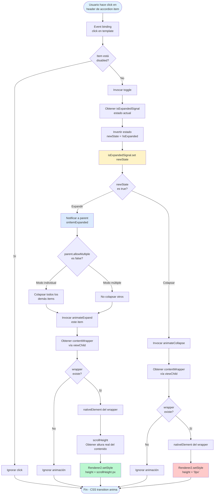

# Arquitectura de Eventos - Joinly Frontend

> Documentación técnica de los flujos de eventos en los componentes interactivos del proyecto.

**Última actualización:** 18 de diciembre de 2025  
**Framework:** Angular 21 con Signals y Standalone Components

---

## Tabla de Contenidos

1. [Modal: Apertura y Gestión](#1-modal-apertura-y-gestión)
2. [Modal: Focus Trap](#2-modal-focus-trap)
3. [Menú Hamburguesa](#3-menú-hamburguesa)
4. [Tooltip](#4-tooltip)
5. [Accordion](#5-accordion)
6. [Referencias](#referencias)

---

## 1. Modal: Apertura y Gestión

### Descripción
El modal es un componente controlado por el servicio `ModalService` que proporciona una ventana emergente accesible. Utiliza signals para gestionar el estado y previene el scroll del body cuando está abierto.

### Diagrama de Flujo

```mermaid
flowchart TD
    Start([Usuario hace click en botón]) --> InvokeService[Componente invoca ModalService.open]
    
    InvokeService --> SaveFocus[Guardar elemento activo actual<br/>previousActiveElement]
    SaveFocus --> PreventScroll[Prevenir scroll del body<br/>document.body.style.overflow = 'hidden']
    PreventScroll --> SetState[Actualizar signal modalState<br/>con configuración + defaults]
    
    SetState --> ComputedCheck{Signal computed<br/>isOpen detecta cambio}
    ComputedCheck -->|true| RenderModal[Template renderiza modal<br/>@if modalService.isOpen]
    
    RenderModal --> RenderOverlay[Renderizar overlay oscuro]
    RenderOverlay --> RenderContent[Renderizar contenido modal]
    RenderContent --> SetupListeners[Setup event listeners]
    
    SetupListeners --> EscListener[@HostListener document:keydown.escape]
    SetupListeners --> ClickListener[Click en overlay si closeOnOverlayClick]
    SetupListeners --> TabListener[@HostListener keydown para Tab trap]
    
    RenderContent --> CallbackOpen[Llamar onModalOpened después de renderizado]
    CallbackOpen --> WaitDOM[setTimeout 100ms<br/>Esperar animación]
    WaitDOM --> UpdateFocusable[updateFocusableElements<br/>Detectar elementos focusables]
    UpdateFocusable --> FocusFirst[Focus en primer elemento]
    
    EscListener --> CheckEsc{closeOnEscape<br/>es true?}
    CheckEsc -->|Sí| CloseModal[ModalService.close]
    CheckEsc -->|No| NoAction1[No hacer nada]
    
    ClickListener --> CheckOverlay{closeOnOverlayClick<br/>es true?}
    CheckOverlay -->|Sí| CloseModal
    CheckOverlay -->|No| NoAction2[No hacer nada]
    
    CloseModal --> RestoreScroll[Restaurar scroll<br/>document.body.style.overflow = '']
    RestoreScroll --> ClearState[Limpiar modalState signal<br/>set null]
    ClearState --> DelayFocus[setTimeout 150ms<br/>Permitir animación salida]
    DelayFocus --> RestoreFocus[Restaurar foco a<br/>previousActiveElement]
    RestoreFocus --> End([Fin])
    
    style Start fill:#e0f2fe
    style InvokeService fill:#dbeafe
    style SetState fill:#fef3c7
    style RenderModal fill:#dbeafe
    style FocusFirst fill:#bbf7d0
    style CloseModal fill:#fecaca
    style End fill:#e0f2fe
```

### Notas Técnicas

**Archivos involucrados:**
- [`frontend/src/app/services/modal.ts`](../../frontend/src/app/services/modal.ts) - Servicio centralizador
- [`frontend/src/app/components/shared/modal/modal.ts`](../../frontend/src/app/components/shared/modal/modal.ts) - Componente visual

**Conceptos clave:**
- **Signals**: Sistema reactivo de Angular 21 para gestión de estado
- **Computed signals**: `isOpen()` se recalcula automáticamente cuando cambia `modalState`
- **ViewChild**: Acceso al elemento DOM del contenido para gestión de foco
- **@HostListener**: Captura eventos globales (ESC, Tab) sin contaminar el template

**Prevención de propagación:**
- El contenido del modal tiene `(click)="$event.stopPropagation()"` para evitar que el click cierre el modal al hacer click dentro

---

## 2. Modal: Focus Trap

### Descripción
El focus trap asegura que la navegación con Tab permanezca dentro del modal, cumpliendo con WCAG 2.1 AA. Detecta elementos focusables dinámicamente y cicla el foco entre el primero y el último.

### Diagrama de Flujo

```mermaid
flowchart TD
    Start([Usuario presiona Tab<br/>dentro del modal]) --> ListenTab[@HostListener keydown<br/>Capturar evento]
    
    ListenTab --> CheckKey{event.key<br/>es 'Tab'?}
    CheckKey -->|No| IgnoreEvent[Ignorar evento]
    CheckKey -->|Sí| CheckOpen{Modal está<br/>abierto?}
    
    CheckOpen -->|No| IgnoreEvent
    CheckOpen -->|Sí| GetModalEl[Obtener modalContent<br/>vía viewChild]
    
    GetModalEl --> CheckExists{modalEl<br/>existe?}
    CheckExists -->|No| IgnoreEvent
    CheckExists -->|Sí| UpdateFocusable[updateFocusableElements<br/>Buscar elementos focusables]
    
    UpdateFocusable --> QuerySelector[querySelectorAll con selector:<br/>a href, button:not disabled,<br/>input, textarea, select, tabindex]
    QuerySelector --> CreateArray[Convertir NodeList a Array<br/>focusableElements]
    
    CreateArray --> CheckLength{Hay elementos<br/>focusables?}
    CheckLength -->|No| IgnoreEvent
    CheckLength -->|Sí| GetFirstLast[Obtener primer y último<br/>elemento del array]
    
    GetFirstLast --> GetActive[Obtener elemento activo<br/>document.activeElement]
    GetActive --> CheckShift{event.shiftKey<br/>Shift + Tab?}
    
    CheckShift -->|Sí| CheckFirst{Foco está en<br/>primer elemento?}
    CheckShift -->|No| CheckLast{Foco está en<br/>último elemento?}
    
    CheckFirst -->|Sí| PreventDef1[event.preventDefault]
    PreventDef1 --> FocusLast[lastElement.focus<br/>Mover al último]
    CheckFirst -->|No| AllowDefault1[Permitir navegación normal]
    
    CheckLast -->|Sí| PreventDef2[event.preventDefault]
    PreventDef2 --> FocusFirst[firstElement.focus<br/>Mover al primero]
    CheckLast -->|No| AllowDefault2[Permitir navegación normal]
    
    FocusLast --> End([Fin - Focus atrapado])
    FocusFirst --> End
    AllowDefault1 --> End
    AllowDefault2 --> End
    IgnoreEvent --> End
    
    style Start fill:#e0f2fe
    style UpdateFocusable fill:#fef3c7
    style PreventDef1 fill:#fecaca
    style PreventDef2 fill:#fecaca
    style FocusLast fill:#bbf7d0
    style FocusFirst fill:#bbf7d0
    style End fill:#e0f2fe
```

### Notas Técnicas

**Selector de elementos focusables:**
```typescript
const selector = 
  'a[href], button:not([disabled]), textarea:not([disabled]), ' +
  'input:not([disabled]), select:not([disabled]), [tabindex]:not([tabindex="-1"])';
```

**Conceptos clave:**
- **preventDefault()**: Evita el comportamiento por defecto del navegador (salir del modal)
- **document.activeElement**: Elemento que actualmente tiene el foco
- **scrollHeight**: Calcula la altura real del contenido aunque esté oculto

**Accesibilidad:**
- Atributos ARIA: `role="dialog"`, `aria-modal="true"`, `aria-labelledby`, `aria-describedby`
- Restauración del foco al cerrar al elemento que abrió el modal

---

## 3. Menú Hamburguesa

### Descripción
El menú hamburguesa del header proporciona navegación móvil (< 1024px) con overlay y múltiples métodos de cierre. Se integra con el Router de Angular para cerrarse automáticamente al navegar.

### Diagrama de Flujo

```mermaid
flowchart TD
    Start([Usuario hace click en<br/>botón hamburguesa]) --> ToggleMenu[Invocar toggleMenu]
    
    ToggleMenu --> GetState[Obtener estado actual<br/>menuOpen signal]
    GetState --> InvertState[Invertir estado<br/>newState = !menuOpen]
    InvertState --> SetSignal[Actualizar menuOpen.set newState]
    
    SetSignal --> CheckState{newState<br/>es true?}
    CheckState -->|Abierto| BlockScroll[Bloquear scroll<br/>document.body.style.overflow = 'hidden']
    CheckState -->|Cerrado| AllowScroll[Permitir scroll<br/>document.body.style.overflow = '']
    
    BlockScroll --> RenderMenu[Template renderiza menú<br/>@if menuOpen]
    RenderMenu --> ShowOverlay[Mostrar overlay oscuro]
    ShowOverlay --> ShowNav[Mostrar navegación móvil]
    ShowNav --> SetupListeners[Setup event listeners]
    
    SetupListeners --> EscListener[@HostListener document:keydown.escape]
    SetupListeners --> ClickListener[@HostListener document:click]
    SetupListeners --> ResizeListener[@HostListener window:resize]
    SetupListeners --> RouterListener[Router.events subscription<br/>NavigationStart]
    
    EscListener --> CloseMenu[Invocar closeMenu]
    
    ClickListener --> GetTarget[Obtener event.target<br/>elemento clickeado]
    GetTarget --> GetRefs[Obtener refs de ViewChild<br/>mobileMenu y menuButton]
    GetRefs --> CheckContains{Click fue fuera<br/>del menú y botón?}
    CheckContains -->|Sí| CloseMenu
    CheckContains -->|No| IgnoreClick[Ignorar click]
    
    ResizeListener --> CheckWidth{window.innerWidth<br/>>= 1024px?}
    CheckWidth -->|Sí Desktop| CloseMenu
    CheckWidth -->|No| IgnoreMobile[Ignorar resize]
    
    RouterListener --> NavStart{NavigationStart<br/>evento?}
    NavStart -->|Sí| CloseMenu
    NavStart -->|No| IgnoreNav[Ignorar evento]
    
    CloseMenu --> CheckOpen{menuOpen<br/>es true?}
    CheckOpen -->|Sí| SetFalse[menuOpen.set false]
    CheckOpen -->|No| NoAction[No hacer nada]
    SetFalse --> AllowScroll
    
    AllowScroll --> End([Fin])
    IgnoreClick --> End
    IgnoreMobile --> End
    IgnoreNav --> End
    NoAction --> End
    
    style Start fill:#e0f2fe
    style SetSignal fill:#fef3c7
    style BlockScroll fill:#fecaca
    style CloseMenu fill:#bbf7d0
    style AllowScroll fill:#bbf7d0
    style End fill:#e0f2fe
```

### Notas Técnicas

**Archivos involucrados:**
- [`frontend/src/app/layout/header/header.ts`](../../frontend/src/app/layout/header/header.ts)
- [`frontend/src/app/layout/header/header.html`](../../frontend/src/app/layout/header/header.html)

**Conceptos clave:**
- **ViewChild**: Referencias a `mobileMenu` y `menuButton` para detectar clicks fuera
- **contains()**: Método DOM para verificar si un elemento contiene otro
- **Router events**: Observable que emite eventos de navegación
- **RxJS filter**: Filtra solo eventos de tipo `NavigationStart`

**Patrones implementados:**
- **Click outside**: Verifica que el click no sea en el menú ni en el botón
- **Responsive closure**: Cierra automáticamente al cambiar a desktop
- **Navigation closure**: Cierra al navegar a otra ruta

**Breakpoint:**
- Móvil/Tablet: < 1024px (menú visible)
- Desktop: >= 1024px (menú oculto, navegación en header)

---

## 4. Tooltip

### Descripción
Directiva que muestra tooltips informativos con posicionamiento dinámico. Utiliza Renderer2 para manipular el DOM de forma segura y calcula la mejor posición según el espacio disponible en el viewport.

### Diagrama de Flujo

```mermaid
flowchart TD
    Start([Usuario hace mouseenter<br/>sobre elemento con tooltip]) --> HostListener[@HostListener mouseenter]
    
    HostListener --> StartTimeout[window.setTimeout<br/>SHOW_DELAY = 250ms]
    StartTimeout --> WaitDelay{Usuario mantiene<br/>mouse sobre elemento?}
    
    WaitDelay -->|Sí espera 250ms| CallShow[Invocar show]
    WaitDelay -->|No mouseleave| CancelTimeout[clearTimeout<br/>Cancelar muestra]
    
    CallShow --> CheckExists{tooltipElement<br/>ya existe?}
    CheckExists -->|Sí| IgnoreShow[No hacer nada]
    CheckExists -->|No| CreateElement[Renderer2.createElement<br/>div con clase c-tooltip]
    
    CreateElement --> SetRole[setAttribute<br/>role='tooltip']
    SetRole --> SetId[setAttribute id único<br/>crypto.randomUUID]
    SetId --> CreateText[Renderer2.createText<br/>con texto del input]
    CreateText --> AppendText[appendChild texto al tooltip]
    
    AppendText --> CreateArrow[createElement<br/>span con clase c-tooltip__flecha]
    CreateArrow --> AppendArrow[appendChild flecha al tooltip]
    AppendArrow --> AppendBody[appendChild tooltip al body]
    
    AppendBody --> SetAria[setAttribute en host<br/>aria-describedby = tooltipId]
    SetAria --> Position[Invocar positionTooltip]
    
    Position --> GetRects[getBoundingClientRect<br/>host y tooltip]
    GetRects --> GetViewport[window.innerWidth<br/>window.innerHeight]
    GetViewport --> TryPositions[Iterar posiciones<br/>preferida, top, bottom, left, right]
    
    TryPositions --> CalcPos[calculatePosition para<br/>posición actual]
    CalcPos --> CheckFits{fitsInViewport?}
    
    CheckFits -->|Sí| ApplyPos[setStyle top y left<br/>con coordenadas + scroll]
    CheckFits -->|No| NextPos{Más posiciones<br/>por probar?}
    
    NextPos -->|Sí| TryPositions
    NextPos -->|No| Fallback[Fallback: centrar arriba]
    
    ApplyPos --> AddPosClass[addClass<br/>c-tooltip--top/bottom/left/right]
    Fallback --> AddPosClass
    AddPosClass --> DelayVisible[setTimeout 10ms<br/>Permitir render]
    DelayVisible --> AddVisible[addClass<br/>c-tooltip--visible]
    
    AddVisible --> WaitLeave[Esperar mouseleave<br/>o blur]
    
    WaitLeave --> HideEvent[@HostListener<br/>mouseleave o blur]
    HideEvent --> RemoveVisible[removeClass<br/>c-tooltip--visible]
    RemoveVisible --> WaitFade[setTimeout 150ms<br/>Esperar animación fade-out]
    WaitFade --> Destroy[destroyTooltip]
    
    Destroy --> RemoveChild[Renderer2.removeChild<br/>del body]
    RemoveChild --> RemoveAria[removeAttribute<br/>aria-describedby del host]
    RemoveAria --> End([Fin])
    
    CancelTimeout --> End
    IgnoreShow --> End
    
    style Start fill:#e0f2fe
    style StartTimeout fill:#fef3c7
    style CreateElement fill:#dbeafe
    style Position fill:#fef3c7
    style ApplyPos fill:#bbf7d0
    style AddVisible fill:#bbf7d0
    style Destroy fill:#fecaca
    style End fill:#e0f2fe
```

### Notas Técnicas

**Archivos involucrados:**
- [`frontend/src/app/components/shared/tooltip/tooltip.directive.ts`](../../frontend/src/app/components/shared/tooltip/tooltip.directive.ts)

**Conceptos clave:**
- **Renderer2**: Manipulación segura del DOM sin acceso directo a elementos nativos
- **getBoundingClientRect()**: Obtiene posición y dimensiones exactas del elemento
- **Delay pattern**: Timeout de 250ms previene tooltips molestos en movimientos rápidos
- **Posicionamiento dinámico**: Prueba múltiples posiciones hasta encontrar una que quepa

**Orden de prioridad de posiciones:**
1. Posición preferida (input `tooltipPosition`)
2. Top (por defecto)
3. Bottom
4. Left
5. Right
6. Fallback: Centrado arriba

**Accesibilidad:**
- `role="tooltip"`: Identifica el elemento como tooltip
- `aria-describedby`: Vincula tooltip con el elemento host
- Soporte para teclado: Se muestra con `focus` y oculta con `blur`

**Constantes:**
- `SHOW_DELAY`: 250ms
- `TOOLTIP_OFFSET`: 12px (espaciado desde el elemento)
- `viewport margin`: 8px (margen mínimo desde bordes)

---

## 5. Accordion

### Descripción
Componente de acordeón con items expandibles/colapsables. Soporta modo múltiple (varios items abiertos) o individual (solo uno abierto). Utiliza ViewChild y Renderer2 para animaciones de altura dinámica.

### Diagrama de Flujo



### Diagrama: Navegación con Teclado

```mermaid
flowchart TD
    StartKey([Usuario presiona tecla<br/>en header del item]) --> HostListener[@HostListener keydown]
    
    HostListener --> CheckKey{event.key}
    CheckKey -->|'Enter'| CallToggle[Invocar toggle]
    CheckKey -->|' ' Space| PreventDefault[event.preventDefault]
    CheckKey -->|Otra tecla| IgnoreKey[Ignorar evento]
    
    PreventDefault --> CallToggle
    CallToggle --> ToggleFlow[Flujo de toggle<br/>ver diagrama principal]
    
    ToggleFlow --> EndKey([Fin])
    IgnoreKey --> EndKey
    
    style StartKey fill:#e0f2fe
    style PreventDefault fill:#fef3c7
    style CallToggle fill:#bbf7d0
    style EndKey fill:#e0f2fe
```

### Notas Técnicas

**Archivos involucrados:**
- [`frontend/src/app/components/shared/accordion/accordion.ts`](../../frontend/src/app/components/shared/accordion/accordion.ts) - Contenedor padre
- [`frontend/src/app/components/shared/accordion/accordion-item.ts`](../../frontend/src/app/components/shared/accordion/accordion-item.ts) - Item individual

**Conceptos clave:**
- **ContentChildren**: Detecta automáticamente items hijos en el contenedor padre
- **Parent-child communication**: Items notifican al padre cuando se expanden
- **scrollHeight**: Calcula la altura real del contenido aunque esté con `height: 0`
- **Renderer2.setStyle**: Aplica estilos inline de forma segura para animaciones

**Animación:**
- Estado colapsado: `height: 0` + `overflow: hidden`
- Estado expandido: `height: [scrollHeight]px`
- CSS transition: `transition: height 0.3s ease-in-out`

**Accesibilidad:**
- `role="region"`: Define cada item como región
- `aria-expanded`: Indica estado expandido/colapsado
- `aria-controls`: Vincula header con contenido
- IDs únicos: Generados con `crypto.randomUUID()`

**Navegación:**
- Click en header: Toggle
- Enter: Toggle
- Space: Toggle (con preventDefault para evitar scroll)
- Tab: Navegación entre headers

---

## Referencias

### Documentación Angular
- [Signals](https://angular.dev/guide/signals)
- [ViewChild & ElementRef](https://angular.dev/api/core/ViewChild)
- [Renderer2](https://angular.dev/api/core/Renderer2)
- [@HostListener](https://angular.dev/api/core/HostListener)

### Web APIs
- [getBoundingClientRect](https://developer.mozilla.org/es/docs/Web/API/Element/getBoundingClientRect)
- [crypto.randomUUID](https://developer.mozilla.org/es/docs/Web/API/Crypto/randomUUID)
- [document.activeElement](https://developer.mozilla.org/es/docs/Web/API/Document/activeElement)

### Accesibilidad
- [WCAG 2.1 AA](https://www.w3.org/WAI/WCAG21/quickref/)
- [ARIA Authoring Practices](https://www.w3.org/WAI/ARIA/apg/)
- [Modal Dialog Pattern](https://www.w3.org/WAI/ARIA/apg/patterns/dialog-modal/)

### Archivos del Proyecto
- [TODO - Joinly Frontend](../TODO.md)
- [Buenas Prácticas CSS](../buenas_practicas/css-moderno-arquitectura-y-organizacion.md)
- [HTML5 Semántico](../buenas_practicas/HTML5-semantico-la-base-de-todo.md)

---

**Notas:**
- Todos los diagramas están en formato Mermaid.js para fácil integración en Markdown
- Los colores distinguen tipos de operaciones: azul (eventos), amarillo (signals), verde (acciones exitosas), rojo (cancelaciones)
- Las rutas de archivos son relativas a la raíz del proyecto
