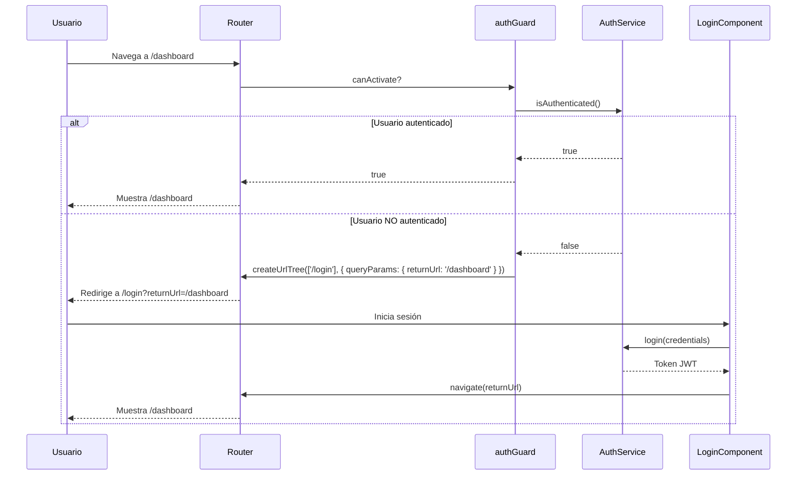
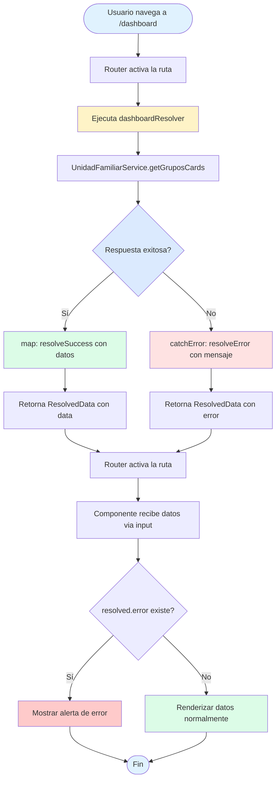
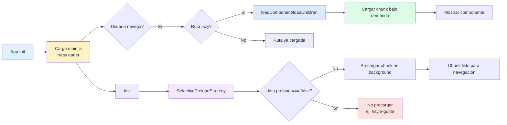

# Navegación y Enrutamiento - Joinly Frontend

Documentación completa del sistema de rutas, guards, resolvers y estrategias de carga de la aplicación Joinly.

**Framework:** Angular 21 con Standalone Components  
**Última actualización:** 14 de enero de 2026

---

## Índice

1. [Introducción](#introducción)
2. [Mapa completo de rutas](#mapa-completo-de-rutas)
3. [Estrategia de lazy loading](#estrategia-de-lazy-loading)
4. [Guards implementados](#guards-implementados)
5. [Resolvers implementados](#resolvers-implementados)
6. [Características avanzadas](#características-avanzadas)
7. [Diagramas de arquitectura](#diagramas-de-arquitectura)
8. [Mejores prácticas](#mejores-prácticas)
9. [Troubleshooting](#troubleshooting)

---

## Introducción

El sistema de enrutamiento de Joinly está construido sobre las últimas capacidades de Angular 21, utilizando:

- **Standalone Components**: Arquitectura sin módulos NgModule
- **Functional Guards**: `CanActivateFn` y `CanDeactivateFn` para protección de rutas
- **Functional Resolvers**: `ResolveFn` para precarga de datos
- **Lazy Loading**: Carga diferida con `loadComponent` y `loadChildren`
- **Selective Preloading**: Precarga inteligente excluyendo rutas de desarrollo
- **Router Inputs**: Parámetros de ruta como inputs de componentes
- **View Transitions**: Transiciones suaves entre vistas
- **Breadcrumbs dinámicos**: Navegación contextual basada en datos resueltos

### Archivos principales

| Archivo | Propósito |
|---------|-----------|
| [`app.routes.ts`](../../frontend/src/app/app.routes.ts) | Configuración central de rutas |
| [`app.config.ts`](../../frontend/src/app/app.config.ts) | Configuración del router |
| [`guards/`](../../frontend/src/app/guards/) | Guards de protección de rutas |
| [`resolvers/`](../../frontend/src/app/resolvers/) | Resolvers de precarga de datos |
| [`strategies/`](../../frontend/src/app/strategies/) | Estrategia de precarga personalizada |

---

## Mapa completo de rutas

### Rutas públicas

Accesibles sin autenticación. No requieren guards ni resolvers.

| Ruta | Descripción | Lazy | Features |
|------|-------------|------|----------|
| `/` | Página de inicio | ✅ | - |
| `/como-funciona` | Información de la aplicación | ✅ | Breadcrumbs |
| `/faq` | Centro de ayuda | ✅ | Breadcrumbs |
| `**` | Página 404 | ✅ | - |

### Rutas de autenticación

Gestionan el acceso de usuarios. Agrupadas en `auth.routes.ts`.

| Ruta | Descripción | Lazy | Features |
|------|-------------|------|----------|
| `/login` | Inicio de sesión | ✅ | Query param `returnUrl` |
| `/register` | Registro de usuario | ✅ | - |

**Implementación:**

```typescript
// routes/auth.routes.ts
export const AUTH_ROUTES: Routes = [
  {
    path: 'login',
    loadComponent: () => import('../pages/auth/login').then(m => m.LoginComponent),
    title: 'Iniciar sesión - Joinly'
  },
  // ...
];
```

Ver implementación completa en [`routes/auth.routes.ts`](../../frontend/src/app/routes/auth.routes.ts)

### Rutas protegidas

Requieren autenticación mediante `authGuard`. Incluyen precarga de datos con resolvers.

| Ruta | Descripción | Lazy | Guards | Resolvers | Features |
|------|-------------|------|--------|-----------|----------|
| `/dashboard` | Panel de grupos del usuario | ✅ | `authGuard` | `dashboardResolver` | Breadcrumbs |
| `/crear-grupo` | Formulario de creación de grupo | ✅ | `authGuard`, `pendingChangesGuard` | - | Breadcrumbs |
| `/unirse-grupo` | Unirse a grupo existente | ✅ | `authGuard` | - | Breadcrumbs |
| `/grupos/:id` | Detalle de grupo específico | ✅ | `authGuard` | `grupoDetalleResolver` | Breadcrumbs dinámicos |
| `/grupos/:id/crear-suscripcion` | Nueva suscripción en grupo | ✅ | `authGuard`, `pendingChangesGuard` | - | Breadcrumbs |

**Ejemplo de ruta protegida:**

```typescript
{
  path: 'dashboard',
  canActivate: [authGuard],
  resolve: { dashboardData: dashboardResolver },
  loadComponent: () => import('./pages/dashboard').then(m => m.DashboardComponent),
  title: 'Mis Grupos - Joinly',
  data: { breadcrumb: 'Mis Grupos' }
}
```

### Área de usuario

Sección con layout compartido (`UsuarioLayoutComponent`) y rutas hijas.

| Ruta | Descripción | Lazy | Guards | Parent |
|------|-------------|------|--------|--------|
| `/usuario` | Layout del área de usuario | ✅ | `authGuard` | - |
| `/usuario/perfil` | Perfil del usuario | ✅ | `authGuard` | `/usuario` |
| `/usuario/configuracion` | Ajustes de cuenta | ✅ | `authGuard` | `/usuario` |
| `/usuario/notificaciones` | Centro de notificaciones | ✅ | `authGuard` | `/usuario` |

**Implementación con rutas hijas:**

```typescript
{
  path: 'usuario',
  canActivate: [authGuard],
  loadComponent: () => import('./pages/usuario').then(m => m.UsuarioLayoutComponent),
  data: { breadcrumb: 'Mi Cuenta' },
  children: [
    { path: '', pathMatch: 'full', redirectTo: 'perfil' },
    {
      path: 'perfil',
      loadComponent: () => import('./pages/usuario/perfil').then(m => m.PerfilComponent),
      data: { breadcrumb: 'Perfil' }
    },
    // ...
  ]
}
```

Ver implementación completa en [`app.routes.ts`](../../frontend/src/app/app.routes.ts#L100-L130)

### Rutas legales

Páginas institucionales. Agrupadas en `legal.routes.ts`.

| Ruta | Descripción | Lazy |
|------|-------------|------|
| `/terminos` | Términos y condiciones | ✅ |
| `/privacidad` | Política de privacidad | ✅ |

### Rutas de desarrollo

Solo disponibles en modo desarrollo. Marcadas con `data.preload: false` para excluirlas de la precarga.

| Ruta | Descripción | Lazy | Preload |
|------|-------------|------|---------|
| `/style-guide` | Guía de estilos | ✅ | ❌ |
| `/style-guide/responsive-test` | Testing responsive | ✅ | ❌ |
| `/style-guide/navigation-guide` | Guía de navegación | ✅ | ❌ |

**Configuración:**

```typescript
{
  path: 'style-guide',
  loadChildren: () => import('./routes/dev.routes').then(m => m.DEV_ROUTES),
  data: { preload: false } // Excluir de precarga
}
```

---

## Estrategia de lazy loading

### Configuración del router

El router se configura en `app.config.ts` con tres características clave:

```typescript
export const appConfig: ApplicationConfig = {
  providers: [
    provideRouter(
      routes,
      withComponentInputBinding(),      // Router inputs
      withViewTransitions(),            // Transiciones suaves
      withPreloading(SelectivePreloadStrategy) // Precarga selectiva
    ),
    // ...
  ]
};
```

Ver implementación completa en [`app.config.ts`](../../frontend/src/app/app.config.ts)

### Tipos de carga lazy

#### loadComponent

Carga individual de componentes standalone:

```typescript
{
  path: 'dashboard',
  loadComponent: () => import('./pages/dashboard').then(m => m.DashboardComponent)
}
```

**Ventajas:**
- Bundle separado por componente
- Ideal para rutas independientes
- Menor complejidad que módulos

#### loadChildren

Carga de grupos de rutas relacionadas:

```typescript
{
  path: '',
  loadChildren: () => import('./routes/auth.routes').then(m => m.AUTH_ROUTES)
}
```

**Ventajas:**
- Agrupa rutas relacionadas (login, register)
- Organización modular
- Chunk compartido entre rutas del grupo

### Precarga selectiva

Implementada mediante `SelectivePreloadStrategy` personalizada:

```typescript
@Injectable({ providedIn: 'root' })
export class SelectivePreloadStrategy implements PreloadingStrategy {
  preload(route: Route, load: () => Observable<unknown>): Observable<unknown> {
    return route.data?.['preload'] === false ? of(null) : load();
  }
}
```

Ver implementación completa en [`strategies/selective-preload.strategy.ts`](../../frontend/src/app/strategies/selective-preload.strategy.ts)

**Comportamiento:**

1. **Carga inicial**: Solo el bundle principal (`main.js`) con rutas eager
2. **Navegación explícita**: Se cargan chunks lazy bajo demanda
3. **Precarga en background**: Después de la carga inicial, se precargan todos los chunks lazy
4. **Exclusión condicional**: Rutas con `data.preload: false` nunca se precargan

**Rutas excluidas de precarga:**
- `/style-guide/**` - Rutas de desarrollo

### Análisis de chunks en producción

Para verificar la estrategia de lazy loading en build de producción:

```bash
# Build con análisis
ng build --configuration production --stats-json

# Visualizar chunks
npx webpack-bundle-analyzer dist/frontend/browser/stats.json
```

**Chunks esperados:**
- `main.*.js` - Bundle principal (rutas eager)
- `chunk-*.js` - Cada feature lazy (dashboard, grupos, usuario, auth, etc.)

**Métricas objetivo:**
- Bundle inicial: < 200 KB (gzipped)
- Lazy chunks: < 100 KB cada uno
- Time to Interactive: < 3s

---

## Guards implementados

Los guards protegen rutas contra acceso no autorizado o pérdida de datos.

### authGuard

**Propósito:** Proteger rutas privadas que requieren autenticación.

**Tipo:** `CanActivateFn` (functional guard)

**Comportamiento:**
1. Verifica si el usuario está autenticado mediante `AuthService.isAuthenticated()`
2. Si está autenticado, permite el acceso (`true`)
3. Si no está autenticado, redirige a `/login` con `returnUrl` en query params

**Implementación:**

```typescript
export const authGuard: CanActivateFn = (route, state) => {
  const authService = inject(AuthService);
  const router = inject(Router);

  if (authService.isAuthenticated()) {
    return true;
  }

  // Redirige a login guardando la URL de destino
  return router.createUrlTree(['/login'], {
    queryParams: { returnUrl: state.url }
  });
};
```

Ver implementación completa en [`guards/auth.guard.ts`](../../frontend/src/app/guards/auth.guard.ts)

**Rutas protegidas:**
- `/dashboard`
- `/crear-grupo`
- `/unirse-grupo`
- `/grupos/**`
- `/usuario/**`

**Flujo de redirección:**

```
Usuario no autenticado accede a /dashboard
  ↓
authGuard detecta falta de autenticación
  ↓
Redirige a /login?returnUrl=/dashboard
  ↓
Después del login exitoso → Redirige a /dashboard
```

### pendingChangesGuard

**Propósito:** Prevenir navegación cuando hay cambios sin guardar en formularios.

**Tipo:** `CanDeactivateFn<CanComponentDeactivate>` (functional guard)

**Comportamiento:**
1. Invoca `component.canDeactivate()` del componente actual
2. Si retorna `true`, permite la navegación
3. Si retorna `false`, muestra confirmación al usuario

**Interfaz requerida:**

```typescript
export interface CanComponentDeactivate {
  canDeactivate(): boolean;
}
```

Ver definición completa en [`guards/can-component-deactivate.ts`](../../frontend/src/app/guards/can-component-deactivate.ts)

**Implementación del guard:**

```typescript
export const pendingChangesGuard: CanDeactivateFn<CanComponentDeactivate> = (component) => {
  if (!component?.canDeactivate || component.canDeactivate()) {
    return true;
  }

  return confirm('Hay cambios sin guardar. ¿Seguro que quieres salir?');
};
```

Ver implementación completa en [`guards/pending-changes.guard.ts`](../../frontend/src/app/guards/pending-changes.guard.ts)

**Uso en componentes:**

```typescript
export class CrearGrupoComponent implements CanComponentDeactivate {
  form = this.fb.group({ /* ... */ });

  canDeactivate(): boolean {
    // Permitir salir si el formulario no tiene cambios o está enviándose
    return !this.form.dirty || this.isSubmitting();
  }
}
```

**Rutas protegidas:**
- `/crear-grupo`
- `/grupos/:id/crear-suscripcion`

---

## Resolvers implementados

Los resolvers precargan datos antes de activar las rutas, mejorando la UX al evitar componentes vacíos durante la carga.

### Patrón ResolvedData<T>

Wrapper genérico para distinguir entre éxito y error en resolvers:

```typescript
export interface ResolvedData<T> {
  data: T | null;
  error: string | null;
}

export function resolveSuccess<T>(data: T): ResolvedData<T> {
  return { data, error: null };
}

export function resolveError<T>(message: string): ResolvedData<T> {
  return { data: null, error: message };
}
```

Ver definición completa en [`resolvers/types.ts`](../../frontend/src/app/resolvers/types.ts)

**Ventajas:**
- Type-safe: El componente sabe qué esperar
- Manejo de errores consistente
- Sin excepciones no capturadas
- El componente decide cómo mostrar errores

### dashboardResolver

**Propósito:** Precargar la lista de grupos del usuario antes de activar `/dashboard`.

**Tipo:** `ResolveFn<ResolvedData<DashboardData>>`

**Datos resueltos:**

```typescript
export interface DashboardData {
  grupos: GrupoCardData[];
  totalElements: number;
}
```

**Implementación:**

```typescript
export const dashboardResolver: ResolveFn<ResolvedData<DashboardData>> = () => {
  const unidadService = inject(UnidadFamiliarService);

  return unidadService.getGruposCards().pipe(
    map((page: Page<GrupoCardData>) =>
      resolveSuccess<DashboardData>({
        grupos: page.content,
        totalElements: page.totalElements
      })
    ),
    catchError((err) =>
      of(resolveError<DashboardData>(
        err.error?.message || 'No se pudieron cargar los grupos. Intenta de nuevo.'
      ))
    )
  );
};
```

Ver implementación completa en [`resolvers/dashboard.resolver.ts`](../../frontend/src/app/resolvers/dashboard.resolver.ts)

**Uso en el componente:**

```typescript
export class DashboardComponent {
  dashboardData = input.required<ResolvedData<DashboardData>>();

  ngOnInit() {
    const resolved = this.dashboardData();
    if (resolved.error) {
      this.alertService.error(resolved.error);
      return;
    }
    this.grupos = resolved.data!.grupos;
  }
}
```

**Ruta asociada:**

```typescript
{
  path: 'dashboard',
  canActivate: [authGuard],
  resolve: { dashboardData: dashboardResolver },
  loadComponent: () => import('./pages/dashboard').then(m => m.DashboardComponent)
}
```

### grupoDetalleResolver

**Propósito:** Precargar grupo, miembros y suscripciones antes de activar `/grupos/:id`.

**Tipo:** `ResolveFn<ResolvedData<GrupoDetalleData>>`

**Datos resueltos:**

```typescript
export interface GrupoDetalleData {
  grupo: UnidadFamiliar;
  miembros: MiembroUnidadResponse[];
  suscripciones: SuscripcionSummary[];
}
```

**Implementación con forkJoin:**

```typescript
export const grupoDetalleResolver: ResolveFn<ResolvedData<GrupoDetalleData>> = (route) => {
  const unidadService = inject(UnidadFamiliarService);
  const suscripcionService = inject(SuscripcionService);

  const id = Number(route.paramMap.get('id'));

  if (!id || isNaN(id)) {
    return of(resolveError<GrupoDetalleData>('ID de grupo inválido'));
  }

  return forkJoin({
    grupo: unidadService.getGrupoById(id),
    miembros: unidadService.getMiembrosGrupo(id),
    // Suscripciones falla graciosamente - no bloquea la vista
    suscripciones: suscripcionService.getSuscripcionesGrupo(id).pipe(
      map((page) => page.content),
      catchError(() => of([] as SuscripcionSummary[]))
    )
  }).pipe(
    map((data) => resolveSuccess<GrupoDetalleData>(data)),
    catchError((err) => {
      const status = err.status;
      let message: string;

      if (status === 404) {
        message = 'El grupo no existe o ha sido eliminado';
      } else if (status === 403) {
        message = 'No tienes acceso a este grupo';
      } else {
        message = err.error?.message || 'No se pudo cargar el grupo. Intenta de nuevo.';
      }

      return of(resolveError<GrupoDetalleData>(message));
    })
  );
};
```

Ver implementación completa en [`resolvers/grupo-detalle.resolver.ts`](../../frontend/src/app/resolvers/grupo-detalle.resolver.ts)

**Características:**
- **Llamadas paralelas**: `forkJoin` ejecuta todas las peticiones simultáneamente
- **Fallo gracioso**: Suscripciones retorna array vacío si falla, no bloquea la vista
- **Validación de parámetros**: Verifica que el ID sea válido antes de hacer peticiones
- **Manejo de errores específico**: Mensajes diferentes según el código HTTP (404, 403, etc.)

**Ruta asociada:**

```typescript
{
  path: 'grupos/:id',
  canActivate: [authGuard],
  resolve: { grupoData: grupoDetalleResolver },
  loadComponent: () => import('./pages/grupo-detalle').then(m => m.GrupoDetalleComponent)
}
```

---

## Características avanzadas

### Breadcrumbs dinámicos

Los breadcrumbs se generan automáticamente basándose en `data.breadcrumb` de cada ruta.

**Tipos de breadcrumbs:**

#### Estáticos

```typescript
{
  path: 'dashboard',
  data: { breadcrumb: 'Mis Grupos' }
}
```

#### Dinámicos con función

```typescript
{
  path: 'grupos/:id',
  resolve: { grupoData: grupoDetalleResolver },
  data: {
    breadcrumb: (data: Data) => {
      const resolved = data['grupoData'] as ResolvedData<GrupoDetalleData> | undefined;
      return resolved?.data?.grupo?.nombre ?? 'Grupo';
    }
  }
}
```

**Ventajas:**
- Se adaptan a los datos resueltos
- Proporcionan contexto al usuario
- Mejoran la navegación

### Router Inputs

Habilitado mediante `withComponentInputBinding()`, permite recibir parámetros de ruta como inputs:

```typescript
export class GrupoDetalleComponent {
  // Parámetro de ruta inyectado automáticamente
  id = input.required<string>();

  // Datos del resolver inyectados automáticamente
  grupoData = input.required<ResolvedData<GrupoDetalleData>>();
}
```

**Ventajas sobre ActivatedRoute:**
- Más declarativo y type-safe
- Funciona con OnPush change detection
- Menos boilerplate
- Mejor testabilidad

### View Transitions

Habilitado mediante `withViewTransitions()`, proporciona transiciones suaves entre vistas.

```typescript
provideRouter(routes, withViewTransitions())
```

**Comportamiento:**
- Transiciones automáticas entre rutas
- Animaciones nativas del navegador
- Requiere soporte del navegador (Chrome 111+, Edge 111+)
- Fallback gracioso en navegadores sin soporte

### Títulos dinámicos

Cada ruta define su título mediante la propiedad `title`:

```typescript
{
  path: 'dashboard',
  title: 'Mis Grupos - Joinly',
  loadComponent: () => import('./pages/dashboard').then(m => m.DashboardComponent)
}
```

**Beneficios:**
- SEO mejorado
- Mejor UX (título visible en pestaña)
- Accesibilidad (lectores de pantalla)

---

## Diagramas de arquitectura

### Árbol de rutas de la aplicación

```mermaid
graph TD
    Root[/] --> Home[Página de Inicio]
    Root --> Public[Rutas Públicas]
    Root --> Auth[Autenticación]
    Root --> Protected[Rutas Protegidas]
    Root --> Legal[Rutas Legales]
    Root --> Dev[Desarrollo]
    Root --> NotFound[404]

    Public --> ComoFunciona[/como-funciona]
    Public --> FAQ[/faq]

    Auth --> Login[/login]
    Auth --> Register[/register]

    Protected --> Dashboard[/dashboard]
    Protected --> CrearGrupo[/crear-grupo]
    Protected --> UnirseGrupo[/unirse-grupo]
    Protected --> Grupos[/grupos/:id]
    Protected --> Usuario[/usuario]

    Grupos --> CrearSub[/grupos/:id/crear-suscripcion]

    Usuario --> Perfil[/usuario/perfil]
    Usuario --> Config[/usuario/configuracion]
    Usuario --> Notif[/usuario/notificaciones]

    Legal --> Terminos[/terminos]
    Legal --> Privacidad[/privacidad]

    Dev --> StyleGuide[/style-guide/**]

    style Protected fill:#dcfce7
    style Auth fill:#fef3c7
    style Public fill:#dbeafe
    style Legal fill:#f3e8ff
    style Dev fill:#fee2e2
```

### Flujo de autenticación con authGuard



### Flujo de resolver con manejo de errores



### Estrategia de lazy loading y precarga



---

## Mejores prácticas

### Organización de rutas

**Separar rutas por contexto:**

```
routes/
  auth.routes.ts      → Login, register
  legal.routes.ts     → Términos, privacidad
  dev.routes.ts       → Style guide, testing
app.routes.ts         → Rutas principales
```

**Ventajas:**
- Mantiene `app.routes.ts` legible
- Agrupa rutas relacionadas
- Facilita mantenimiento

### Naming conventions

**Rutas:**
- Kebab-case: `/crear-grupo`, `/unirse-grupo`
- Singular para recursos individuales: `/grupos/:id`
- Plural para colecciones: `/grupos`

**Parámetros:**
- Descriptivos: `:id`, `:grupoId` (no `:x`, `:param1`)

**Guards y resolvers:**
- Sufijo explícito: `authGuard`, `dashboardResolver`
- camelCase para nombres de archivos: `auth.guard.ts`

### Lazy loading

**Cuándo usar loadComponent:**
- Rutas independientes sin hijos
- Componentes grandes que no se usan frecuentemente
- Páginas con lógica compleja

**Cuándo usar loadChildren:**
- Grupos de rutas relacionadas
- Secciones con múltiples páginas
- Features modulares

**Evitar:**
- Lazy loading en rutas críticas (home)
- Chunks demasiado pequeños (< 10 KB)
- Lazy loading excesivo que fragmenta el bundle

### Guards

**Orden de guards:**
```typescript
canActivate: [authGuard, roleGuard, permissionGuard]
```
Orden de ejecución: izquierda a derecha

**Reutilización:**
- Crear guards genéricos y configurables
- Evitar lógica de negocio en guards
- Delegar validaciones a servicios

**Manejo de redirecciones:**
```typescript
return router.createUrlTree(['/login'], {
  queryParams: { returnUrl: state.url }
});
```
Siempre usar `createUrlTree` en lugar de `router.navigate` dentro de guards.

### Resolvers

**Manejo de errores:**
- Nunca lanzar excepciones sin capturar
- Usar patrón `ResolvedData<T>` para distinguir éxito/error
- Permitir que el componente decida cómo mostrar errores

**Optimización:**
- Usar `forkJoin` para peticiones paralelas
- Implementar caché cuando sea apropiado
- Considerar fallo gracioso para datos no críticos

**Evitar:**
- Resolvers que tardan > 2 segundos
- Cargar datos no necesarios en la vista inicial
- Resolver datos que pueden cargarse después (paginación)

### Performance

**Métricas objetivo:**
- First Contentful Paint: < 1.5s
- Time to Interactive: < 3s
- Bundle inicial: < 200 KB (gzipped)

**Estrategias:**
- Precargar rutas críticas
- Diferir rutas de desarrollo
- Code splitting agresivo
- Tree shaking habilitado

---

## Troubleshooting

### Error: NG04014 - Invalid configuration

**Problema:** Ruta mal configurada o conflicto de paths.

**Solución:**
```typescript
// Mal: Ruta específica después de comodín
{ path: '**', component: NotFoundComponent },
{ path: 'dashboard', component: DashboardComponent } // ❌ Nunca se alcanza

// Bien: Ruta específica primero
{ path: 'dashboard', component: DashboardComponent },
{ path: '**', component: NotFoundComponent } // ✅ Al final
```

### Error: Cannot match any routes

**Problema:** Ruta no existe o falta configuración.

**Solución:**
1. Verificar que la ruta está en `app.routes.ts`
2. Verificar orden de rutas (específicas antes de genéricas)
3. Verificar `redirectTo` tiene `pathMatch: 'full'` si es necesario

```typescript
// Redireccionamiento correcto
{ path: '', pathMatch: 'full', redirectTo: 'home' }
```

### Guard no se ejecuta

**Problema:** Guard mal configurado o no inyectado.

**Solución:**
1. Verificar importación en `app.routes.ts`
2. Verificar que es `CanActivateFn` o `CanDeactivateFn`
3. Verificar orden de guards

```typescript
import { authGuard } from './guards'; // ✅ Correcto
canActivate: [authGuard] // ✅ Correcto
```

### Resolver no precarga datos

**Problema:** Resolver no está configurado correctamente.

**Solución:**
1. Verificar que el resolver está en `resolve`
2. Verificar que retorna `Observable` o `Promise`
3. Verificar nombre del resolver coincide con el input del componente

```typescript
// Ruta
resolve: { dashboardData: dashboardResolver }

// Componente
dashboardData = input.required<ResolvedData<DashboardData>>(); // ✅ Nombre coincide
```

### Lazy chunk no se carga

**Problema:** Path incorrecto en `loadComponent` o `loadChildren`.

**Solución:**
1. Verificar path relativo: `./pages/dashboard` (no `pages/dashboard`)
2. Verificar que el archivo exporta el componente/rutas
3. Verificar build de producción genera el chunk

```bash
ng build --configuration production
# Verificar dist/frontend/browser/chunk-*.js
```

### Precarga no funciona

**Problema:** `SelectivePreloadStrategy` no está configurada.

**Solución:**
1. Verificar importación en `app.config.ts`
2. Verificar `withPreloading(SelectivePreloadStrategy)`
3. Verificar que la ruta no tiene `data.preload: false`

### Breadcrumbs no se muestran

**Problema:** Falta `data.breadcrumb` en la ruta.

**Solución:**
```typescript
{
  path: 'dashboard',
  data: { breadcrumb: 'Mis Grupos' } // ✅ Agregar breadcrumb
}
```

### Router Inputs no funcionan

**Problema:** `withComponentInputBinding()` no está habilitado.

**Solución:**
```typescript
provideRouter(
  routes,
  withComponentInputBinding() // ✅ Habilitar router inputs
)
```

---

## Referencias

### Documentación oficial

- [Angular Router Documentation](https://angular.dev/guide/routing)
- [Lazy Loading Feature Modules](https://angular.dev/guide/lazy-loading-ngmodules)
- [Functional Guards](https://angular.dev/guide/router#preventing-unauthorized-access)
- [Route Resolvers](https://angular.dev/api/router/Resolve)
- [Router Inputs](https://angular.dev/guide/components/inputs#input-transforms)

### Archivos del proyecto

- [`app.routes.ts`](../../frontend/src/app/app.routes.ts)
- [`app.config.ts`](../../frontend/src/app/app.config.ts)
- [`guards/auth.guard.ts`](../../frontend/src/app/guards/auth.guard.ts)
- [`guards/pending-changes.guard.ts`](../../frontend/src/app/guards/pending-changes.guard.ts)
- [`resolvers/dashboard.resolver.ts`](../../frontend/src/app/resolvers/dashboard.resolver.ts)
- [`resolvers/grupo-detalle.resolver.ts`](../../frontend/src/app/resolvers/grupo-detalle.resolver.ts)
- [`strategies/selective-preload.strategy.ts`](../../frontend/src/app/strategies/selective-preload.strategy.ts)

### Documentación relacionada

- [Arquitectura de Eventos](../design/event-architecture.md)
- [Documentación Técnica Frontend](../design/DOCUMENTACION.md)
- [Buenas Prácticas CSS](../buenas_practicas/css-moderno-arquitectura-y-organizacion.md)
- [HTML5 Semántico](../buenas_practicas/HTML5-semantico-la-base-de-todo.md)
